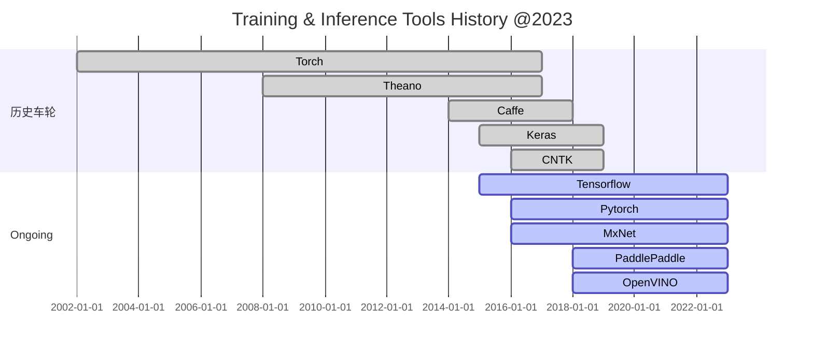

---
Title | Tools TIHistory
-- | --
Created @ | `2021-08-31T08:43:50Z`
Updated @| `2023-02-02T14:16:15Z`
Labels | ``
Edit @| [here](https://github.com/junxnone/aiwiki/issues/5)

---

# Training & Inference Tools History

Name | Description
-- | --
[Tensorflow](/Tensorflow ) | Google 主导开发的开源训练工具
[Pytorch](/Pytorch) | Facebook 主导开发的开源训练工具
Paddle | Baidu 主导开发的开源训练工具
MXNet | Appache 主导开发的开源训练工具
ONNX  | Microsoft 主导，多家支持开发的开源训练工具
[Darknet](/Darknet) | YOLO Model Tools

## Inference Only Tools
Name | Description
-- | --
[OpenVINO](/OpenVINO) | Intel 主导开发的Inference工具

