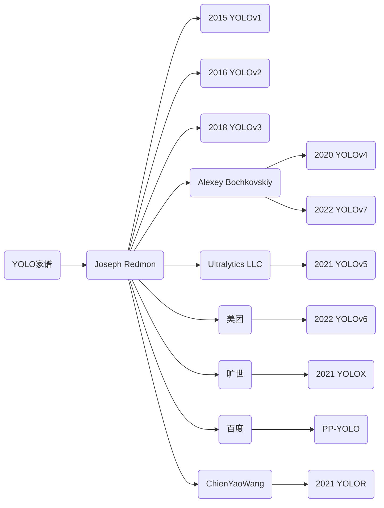

---
Title | ML Tasks Image Detection YOLO
-- | --
Created @ | `2018-12-09T09:33:49Z`
Updated @| `2023-02-08T13:23:18Z`
Labels | ``
Edit @| [here](https://github.com/junxnone/aiwiki/issues/53)

---

# YOLO 系列

- **YOLO**  - `You Only Look Once`

## Papers

- 2015 **YOLO V1** You Only Look Once: Unified, Real-Time Object Detection [[paper](https://arxiv.org/pdf/1506.02640.pdf)] [[netscope](http://ethereon.github.io/netscope/#/gist/96209c6940e02b17c34009f6c3fee75e)] [[Code](https://pjreddie.com/darknet/yolo/)] [[Code2 - AlexeyAB](https://github.com/AlexeyAB/darknet)] [[docs](https://pjreddie.com/darknet/yolov1/)]
- 2016 **YOLO V2** YOLO9000: Better, Faster, Stronger [[paper](https://arxiv.org/pdf/1612.08242.pdf)] [[netscope](http://ethereon.github.io/netscope/#/gist/8826fef24ed0b5086affdb6e65db26b7)]  [[Code](https://pjreddie.com/darknet/yolo/)] [[docs](https://pjreddie.com/darknet/yolov2/)]  [[YOLO 9000](https://pjreddie.com/publications/yolo9000/)]
- 2018 **YOLOv3**  An Incremental Improvement [[paper](https://pjreddie.com/media/files/papers/YOLOv3.pdf)] **[[YOLOv3 netscope](http://ethereon.github.io/netscope/#/gist/a9badc1fd4eefb7463c99e33d046af9e)]** [[Code](https://pjreddie.com/darknet/yolo/)] [docs](https://pjreddie.com/darknet/yolo/) [[docs](https://pjreddie.com/darknet/yolo/)]
- 2021 **YOLOv4** YOLOv4: Optimal Speed and Accuracy of Object Detection [[paper](https://arxiv.org/abs/2004.10934)]
- 2021 **YOLOR** You Only Learn One Representation: Unified Network for Multiple Tasks [[paper](https://arxiv.org/abs/2105.04206)]
- 2021 **YOLOX** YOLOX: Exceeding YOLO Series in 2021 [[paper](https://arxiv.org/abs/2107.08430)]
- 2022 **YOLOv6** YOLOv6: A Single-Stage Object Detection Framework for Industrial Applications [[paper](https://arxiv.org/abs/2209.02976)]
- 2022 **YOLOv7** YOLOv7: Trainable bag-of-freebies sets new state-of-the-art for real-time object detectors [[paper](https://arxiv.org/abs/2207.02696)]

## 提升变化

Date | Name | Tech + Improvement | Comment
-- | -- | -- | --
2015 | YOLO v1 | <li>定位问题 -> 回归问题</li>
2016 | YOLO v2 - 9000 | <li>Darknet19</li><li>使用 BN Layers</li><li>高分辨率分类器</li><li>使用聚类获取 Anchor Box</li><li>特征融合</li><li>多尺度训练</li><li>分类检测数据集联合训练</li>
2018 | YOLO v3 |<li>Darknet53</li><li>引入 FPN</li>
2019 | YOLO SPP | <li>Dense Connection Block</li><li>Spatial Pyramid Pooling Block</li>

