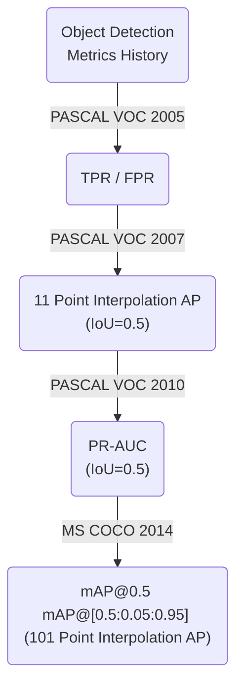

---
Title | ML Metrics Detection
-- | --
Created @ | `2019-01-16T03:46:56Z`
Updated @| `2023-02-20T02:53:39Z`
Labels | ``
Edit @| [here](https://github.com/junxnone/aiwiki/issues/230)

---

## Metrics
- TPR - `True Positive Rate`
- FPR - `False Positive Rate`
- Accuracy
- Precision
- Recall
- AP - `Average Precision`
- mAP - `Mean Average Precison` 
- AR - `Average Recall`
- IoU - `Intersection over Union`
- GIoU
- Image/Object Level

## Object Detection Metrics History

## TP/FP/FN

- 根据 IoU 的值确定 TP/FP/FN

## Precision

$\huge Precision = \frac{TP}{TP+FP} = \frac{TP}{\text{Total Predictions}}$

- 识别为正例的样例中，识别正确的比例

## Recall

$\huge Recall = \frac{TP}{TP+FN} = \frac{TP}{\text{Total Ground Truths}}$

- 样本所有正例中，识别正确的比例
- 也被称作`查全率`， 即检测出来的样本/实际应该检测出的样本。

