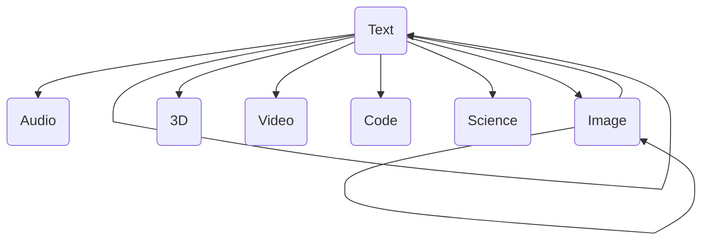
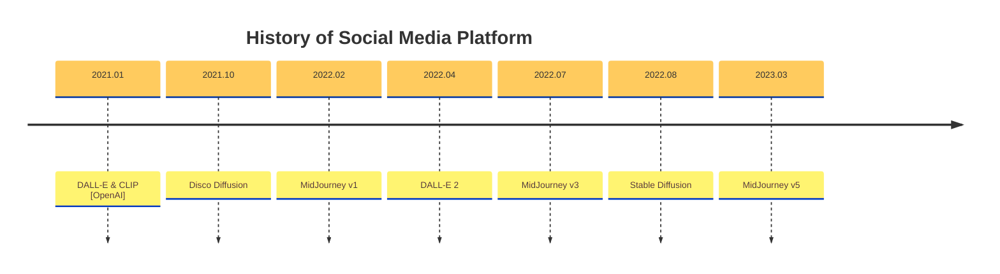

---
Title | Hot AIGC
-- | --
Created @ | `2023-02-03T07:46:02Z`
Updated @| `2023-05-22T13:48:33Z`
Labels | ``
Edit @| [here](https://github.com/junxnone/aiwiki/issues/374)

---
# AIGC

- AIGC: `AI Generated Content` 利用 AI 生成内容 - 绘画/写作/...
  - PGC: `Professional Generated Content` 专业平台或组织生成的内容， 电视/电影/海报/网剧/...
  - UGC: `User Generated Content` 用户个体生成的内容，个人vlog/blog/...

## 相关工具

- DALL-E (V1/V2)
- Disco Diffusion
- MidJourney
- Stable Diffusion (V1/V2)

## Reference
- [人工智能系列深度报告：AIGC行业综述篇](https://github.com/junxnone/aiwiki/files/11518064/AIGC.pdf)

