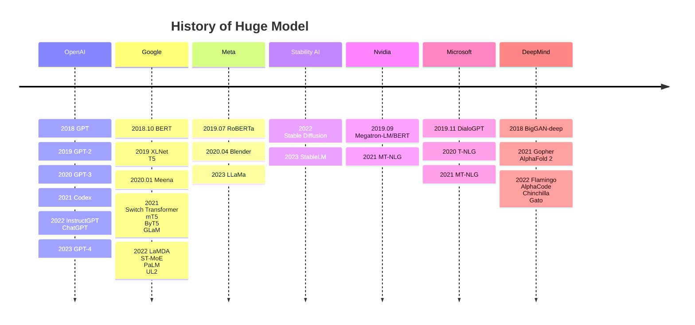

---
Title | Hot HugeModel
-- | --
Created @ | `2023-06-03T16:08:24Z`
Updated @| `2023-06-03T16:08:24Z`
Labels | ``
Edit @| [here](https://github.com/junxnone/aiwiki/issues/408)

---
# 大模型
- Language Model
- Vision Model
- RL Model
- Speech
- Science

## Reference
- [awesome-huge-models](https://github.com/zhengzangw/awesome-huge-models)
