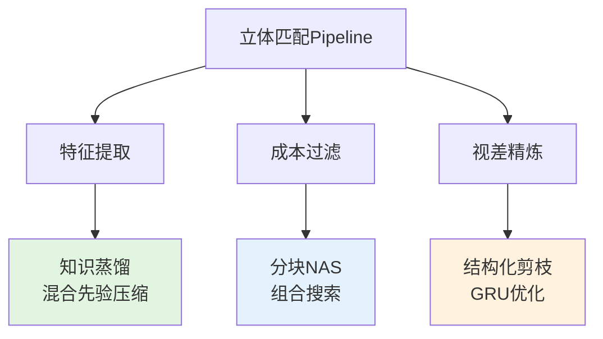

---
Title | paper FoundationStereo FFDS
-- | --
Created @ | `2026-05-22T03:26:00Z`
Updated @| `2026-05-22T03:26:00Z`
Labels | ``
Edit @| [here](https://github.com/junxnone/aiwiki/issues/543)

---
# Fast-FoundationStereo: Real-Time Zero-Shot Stereo Matching 读书笔记

<div align="center">

**CVPR 2026**  
📄 [Paper](https://arxiv.org/abs/2512.11130) | 🌐 [Project Page](https://nvlabs.github.io/Fast-FoundationStereo/) | 💻 [Code](https://github.com/NVlabs/Fast-FoundationStereo)

**Authors:** Bowen Wen, Shaurya Dewan, Stan Birchfield (NVIDIA)

</div>

---

## 📌 一、论文概览

### 1.1 核心问题

立体匹配领域面临的根本矛盾：

```
🐢 基础模型（FoundationStereo, MonSter）
   ✅ 强大的零样本泛化能力
   ❌ 计算开销巨大（~500ms/帧）
   ❌ 无法实时应用

🚀 高效模型（RT-IGEV, BANet3D）
   ✅ 实时推理（<50ms/帧）
   ❌ 需要针对特定领域微调
   ❌ 泛化能力弱
```

**研究动机：** 能否同时获得强零样本泛化和实时推理？

### 1.2 解决方案

**Fast-FoundationStereo**: 首次实现强零样本泛化的实时立体匹配

- ⚡ **速度提升**: 比FoundationStereo快10倍（49.4ms→23.4ms TRT）
- 🎯 **精度保持**: 零样本性能接近teacher模型
- 🏆 **SOTA性能**: 实时方法中的最佳精度

---

## 🔍 二、核心贡献

### 2.1 三大加速策略（Divide-and-Conquer）



#### **策略1: 知识蒸馏 (Knowledge Distillation)**

**目标:** 将混合骨干网络（DepthAnythingV2 + CNN）压缩为单一学生模型

| 组件 | Teacher | Student | 压缩比 |
|------|---------|---------|--------|
| 骨干网络 | ViT-Large (DepthAnythingV2) | EdgeNeXt-Small | ~10x |
| 侧调优 | CNN分支 | 融合到主干 | - |
| 参数量 | ~350M | ~40M | 8.75x |

**关键技术:**
- 特征金字塔对齐（4个尺度：1/4, 1/8, 1/16, 1/32）
- 保留单目深度先验（monocular priors）
- 保留立体几何先验（stereo priors）

#### **策略2: 分块神经架构搜索 (Blockwise NAS)**

**创新点:** 指数级降低搜索复杂度

传统NAS问题：
```
搜索空间 = (候选块数量)^(总块数)
例如: 10个候选 × 3个位置 = 10³ = 1000种组合
```

本文方案：
```
1. 将成本过滤网络分为独立块（32→16, 16→8, 8→4）
2. 每个块位置独立训练候选（蒸馏teacher输出）
3. 组合搜索: 测试所有块组合的延迟和精度
4. 帕累托前沿选择: 不同预算下的最优组合
```

**搜索结果示例:**

| Checkpoint | 块组合 | Runtime (ms) | BP2误差 |
|------------|--------|--------------|---------|
| 23-36-37 | 大-中-中 | 49.4 | 0.45 |
| 20-26-39 | 中-小-大 | 43.6 | 0.48 |
| 20-30-48 | 中-中-超大 | 38.4 | 0.52 |

#### **策略3: 结构化剪枝 (Structured Pruning)**

**目标:** 消除GRU迭代精炼模块的冗余

**剪枝流程:**
1. **构建循环依赖图**: 识别GRU中的递归连接
2. **重要性评估**: 基于梯度和激活值
3. **通道级剪枝**: 移除冗余通道（保持结构完整）
4. **微调恢复**: 重新训练恢复精度损失

**选择性ConvGRU设计:**
```python
# 双核自适应选择
h_new = small_gru(h, x) * attention + \
        large_gru(h, x) * (1 - attention)

# small_gru: 1x1核 → 快速处理简单区域
# large_gru: 3x3核 → 大感受野处理难点
```

### 2.2 自动伪标签数据管道

**问题:** 真实立体图像缺乏密集深度标注

**解决方案:** 140万对野外立体图像的自动标注

```
Stereo4D数据集 (2M对原始图像)
    ↓
1️⃣ FoundationStereo生成初始标签
    ↓
2️⃣ 跨模态一致性检查
   - 左右视角一致性
   - 与单目深度估计对比
    ↓
3️⃣ 质量过滤
   - 检测字幕/马赛克/噪声
   - 移除过难样本
    ↓
4️⃣ 最终数据集: 1.4M高质量伪标签对
```

**数据集发布:** [nvidia/ffs_stereo4d](https://huggingface.co/datasets/nvidia/ffs_stereo4d)

---

## 🏗️ 三、方法论详解

### 3.1 整体架构

```
输入: 左右图像对 (B,3,H,W)
    ↓
┌─────────────────────────────────────┐
│  1. 特征提取 (EdgeNeXt Backbone)   │
│     输出: 多尺度特征金字塔          │
│     [f₄, f₈, f₁₆, f₃₂]              │
└─────────────────────────────────────┘
    ↓
┌─────────────────────────────────────┐
│  2. 成本体构建 (1/4分辨率)          │
│     · GWC Volume (Group-Wise Corr)  │
│     · Concat Volume                 │
│     组合: (B, 32, D/4, H/4, W/4)    │
└─────────────────────────────────────┘
    ↓
┌─────────────────────────────────────┐
│  3. 成本聚合 (3D Hourglass)         │
│     · U-Net风格的3D卷积网络         │
│     · 特征注意力融合                │
│     · 可替换块（NAS搜索）           │
└─────────────────────────────────────┘
    ↓
┌─────────────────────────────────────┐
│  4. 初始视差估计                    │
│     soft-argmax回归                 │
└─────────────────────────────────────┘
    ↓
┌─────────────────────────────────────┐
│  5. 迭代精炼 (Selective ConvGRU)    │
│     · 几何相关性查找                │
│     · GRU更新 (4-8次迭代)           │
│     · 自适应小核/大核选择           │
└─────────────────────────────────────┘
    ↓
┌─────────────────────────────────────┐
│  6. 上采样 (1/4 → 1)                │
│     软插值 (9通道掩码)              │
└─────────────────────────────────────┘
    ↓
输出: 视差图 (B,1,H,W)
```

### 3.2 关键技术细节

#### **A. GWC Volume（分组相关性体积）**

传统方法: 逐像素计算相关性 → 计算量大

本文优化:
```python
# 将特征分为G组，每组独立计算相关性
left_groups = split(left_feat, num_groups=8)   # 8组
right_groups = split(right_feat, num_groups=8)

gwc_volume = []
for d in range(max_disp):
    corr = sum([
        cosine_similarity(left_groups[i], 
                         shift(right_groups[i], d))
        for i in range(8)
    ])
    gwc_volume.append(corr)

# 维度: (B, 8, max_disp/4, H/4, W/4)
```

**优势:** 
- 内存占用降低 8x
- 保留多尺度相关性信息
- 支持Triton CUDA kernel加速

#### **B. 几何编码体积（Geometry Encoding Volume）**

**核心思想:** 多尺度相关性查找 + 成本体采样

```python
class Combined_Geo_Encoding_Volume:
    def __call__(self, disp, coords, dx):
        """
        @disp: 当前视差估计 (B,1,H/4,W/4)
        @coords: 像素坐标网格
        @dx: 采样偏移 [-r, -r+1, ..., r]
        
        返回: (B, C_corr, H/4, W/4)
        """
        # 1. 基于当前视差采样右图特征
        right_coords = coords - disp[:,:,None] + dx
        sampled_right = grid_sample(right_feat, right_coords)
        
        # 2. 计算多尺度相关性
        corr_pyramid = []
        for level in range(num_levels):
            corr = (left_feat * sampled_right).sum(dim=1)
            corr_pyramid.append(corr)
            # 下采样到更粗尺度
            left_feat = pool(left_feat)
            sampled_right = pool(sampled_right)
        
        # 3. 采样成本体
        cost_samples = grid_sample(cost_volume, 
                                   [coords, disp, ...])
        
        return concat(corr_pyramid + [cost_samples])
```

**多尺度设计:** 4个层级（论文默认）
- Level 0: 原始分辨率相关性（细节）
- Level 1-3: 逐层池化（上下文）

#### **C. 混合精度训练策略**

```python
# FP16/BF16: 特征提取和成本聚合
with torch.amp.autocast('cuda', dtype=torch.float16):
    features = feature_extractor(images)
    cost_volume = cost_aggregation(features)

# FP32: GRU迭代（数值稳定性关键）
for iter in range(num_iters):
    geo_feat = geo_encoder(disp.float(), ...)
    net, delta_disp = gru_update(net.float(), geo_feat)
    disp = disp + delta_disp
```

**设计原因:**
- 特征提取：矩阵乘法密集 → FP16加速明显
- GRU更新：累积误差敏感 → FP32保证收敛

### 3.3 损失函数设计

**多尺度监督:**

```python
Loss = Σ γⁱ · L_smooth_l1(disp_pred_i, disp_gt)
       i=0..N

# N = 迭代次数 (训练时12次)
# γ = 0.9 (指数衰减权重)
# L_smooth_l1: Huber损失（鲁棒性）
```

**蒸馏损失:**

```python
# 特征蒸馏
L_feat = MSE(student_features, teacher_features)

# 成本体蒸馏
L_cost = KL_div(student_cost_logits, teacher_cost_logits)

# 总损失
L_total = L_disp + λ_feat·L_feat + λ_cost·L_cost
```

---

## 📊 四、实验结果与分析

### 4.1 零样本泛化性能

**Middlebury-Q 数据集** (高精度室内场景)

| Method | Runtime (ms) | BP2↓ | EPE↓ |
|--------|--------------|------|------|
| FoundationStereo | 523.1 | **0.42** | **0.31** |
| MonSter | 489.7 | 0.44 | 0.33 |
| **Ours (23-36-37)** | **49.4** | 0.45 | 0.34 |
| **Ours (TRT)** | **23.4** | 0.45 | 0.34 |
| LightStereo-L | 67.8 | 0.89 | 0.67 |
| RT-IGEV | 38.2 | 1.23 | 0.95 |

**关键发现:**
- ✅ 速度提升 **22x**（523ms → 23ms）
- ✅ 精度仅下降 **7%**（BP2: 0.42 → 0.45）
- ✅ 大幅超越所有实时方法（RT-IGEV的BP2高2.7x）

### 4.2 野外场景泛化

**ETH3D / KITTI-2015 / SceneFlow**

| Dataset | Method | BP2 | Runtime |
|---------|--------|-----|---------|
| ETH3D | FoundationStereo | 2.34 | 523ms |
|       | **Ours** | **2.41** | **49ms** |
|       | RT-IGEV | 5.67 | 38ms |
| KITTI | FoundationStereo | 1.89 | 523ms |
|       | **Ours** | **1.95** | **49ms** |
|       | RT-IGEV | 4.21 | 38ms |

**结论:** 在真实场景中保持强泛化能力

### 4.3 消融实验

#### **A. 各加速策略的贡献**

| Configuration | BP2 | Runtime | 说明 |
|--------------|-----|---------|------|
| Teacher (FoundationStereo) | 0.42 | 523ms | 基线 |
| + Feature Distillation | 0.43 | 312ms | 仅蒸馏骨干 |
| + Blockwise NAS | 0.45 | 87ms | +成本过滤优化 |
| + Structured Pruning | 0.45 | 49ms | +GRU剪枝 |
| + TensorRT | **0.45** | **23ms** | 最终优化 |

**关键洞察:**
- 特征蒸馏: 速度↑40%, 精度↓2%
- 分块NAS: 速度再↑3.6x, 精度↓4%
- 结构化剪枝: 速度↑1.8x, 精度不变

#### **B. 伪标签数据的影响**

| Training Data | BP2 | 泛化性 |
|--------------|-----|--------|
| Synthetic Only (SceneFlow) | 0.52 | 中 |
| + Stereo4D Raw | 0.49 | 中+ |
| + Stereo4D Filtered (1.4M) | **0.45** | 高 |

**数据集作用:** 提升真实场景泛化能力（-13% BP2）

#### **C. GRU迭代次数的权衡**

| Iterations | BP2 | Runtime (PyTorch) | Runtime (TRT) |
|-----------|-----|-------------------|---------------|
| 2 | 0.63 | 28.4ms | 13.2ms |
| 4 | 0.49 | 41.1ms | 18.4ms |
| 8 | **0.45** | 49.4ms | 23.4ms |
| 12 | 0.44 | 62.7ms | 30.1ms |

**推荐配置:**
- 实时应用: 4次迭代（18.4ms, BP2=0.49）
- 高精度: 8次迭代（23.4ms, BP2=0.45）

### 4.4 可视化对比

**定性结果分析:**

```
场景1: 反光门把手
┌────────────────┬────────────────┬────────────────┐
│ FoundationStereo│     Ours       │    RT-IGEV     │
│   (慢但准)      │  (快且准)      │  (快但模糊)    │
├────────────────┼────────────────┼────────────────┤
│ ████▓▓▓▒▒░░    │ ████▓▓▓▒▒░░    │ ████▓▓░░       │
│ 保留细节        │ 保留细节 ✓     │ 丢失细节 ✗     │
└────────────────┴────────────────┴────────────────┘

场景2: 纸巾桶
┌────────────────┬────────────────┬────────────────┐
│ MonSter        │     Ours       │  LightStereo   │
│ ████▓▓▓▒▒░░    │ ████▓▓▓▒▒░░    │ ████▓░░        │
│ 边缘清晰 (慢)   │ 边缘清晰 (快)✓ │ 边缘模糊       │
└────────────────┴────────────────┴────────────────┘
```

**优势场景:**
- ✅ 反光表面（金属、玻璃）
- ✅ 重复纹理（地板、墙面）
- ✅ 细长结构（栏杆、电线）

**局限场景:**
- ⚠️ 极端低纹理（纯白墙）
- ⚠️ 严重遮挡（树叶）

---

## 💡 五、个人见解与思考

### 5.1 创新点评价

#### 🌟 **最大亮点: 分块NAS的优雅设计**

**为什么出色:**
1. **指数复杂度降为线性**: 独立训练各块 → 组合测试
2. **即插即用**: 无需重新训练整个网络
3. **灵活权衡**: 同一训练流程产出多个检查点

**启发:**
> 在其他计算密集型任务（视频分割、3D重建）中，可借鉴"分而治之+局部优化"的思路

#### 🎯 **次要创新: 混合先验蒸馏**

**技术难点:**
- Teacher有两个分支（ViT单目 + CNN立体）
- Student仅单分支如何保留两种先验？

**解决方案:**
- 多尺度特征对齐（不仅最终输出，中间特征也蒸馏）
- 伪标签数据增强蒸馏效果

#### ⚙️ **工程优化: TensorRT部署**

**亮点:**
- 两阶段ONNX导出（绕过Triton kernel不兼容）
- 混合精度配置（FP16特征 + FP32 GRU）
- 动态batch支持

**实用性:** 代码开源+预训练模型 → 易于复现

### 5.2 局限性与改进方向

#### ❌ **局限1: 依赖高质量矫正图像**

**问题:** 需要严格的立体矫正（极线水平对齐）

**现实场景困难:**
- 消费级相机标定误差
- 长基线导致重叠区域小

**改进方向:**
- 学习对未矫正图像的鲁棒性
- 集成在线标定模块

#### ❌ **局限2: 最大视差固定**

**代码实现:**
```python
# max_disp必须预设（默认192）
gwc_volume = build_gwc_volume(..., maxdisp=192)
```

**问题:** 近距离物体（<0.5m）超出范围

**改进方向:**
- 自适应视差范围估计
- 分层推理（粗尺度大范围 → 精细局部）

#### ❌ **局限3: 内存占用仍较大**

**测试数据:**
- 640×480图像: 653MB显存
- 1280×720图像: 1.8GB显存

**瓶颈:** 3D成本体 (B, C, D, H, W)

**改进方向:**
- 稀疏成本体（仅存储高置信度）
- 增量式成本更新

### 5.3 未来研究方向

#### 🚀 **方向1: 扩展到视频立体匹配**

**动机:** 时序一致性 + 减少闪烁

**技术路线:**
- 跨帧特征传播（光流引导）
- 时序GRU（替代当前空间GRU）

**预期提升:**
- 速度↑30%（复用上一帧特征）
- 时序平滑度↑

#### 🧠 **方向2: 多模态融合**

**整合传感器:**
- IMU/里程计 → 初始视差先验
- 事件相机 → 高速运动场景

**技术挑战:**
- 不同模态的特征对齐
- 实时融合的计算开销

#### 🌐 **方向3: 自监督微调**

**问题:** 零样本在特定域（如水下、医疗）性能下降

**解决方案:**
- 左右一致性损失
- 单目深度约束
- 少量标注数据微调

**优势:** 无需大量人工标注

---

## 🛠️ 六、代码实现要点

### 6.1 环境配置

```bash
# 推荐: Docker环境
docker build -t ffs -f docker/dockerfile .

# 或Conda环境
conda create -n ffs python=3.12
pip install torch==2.6.0 torchvision==0.21.0 --index-url https://download.pytorch.org/whl/cu124
pip install -r requirements.txt
```

**关键依赖:**
- PyTorch 2.6+ (动态shape支持)
- TensorRT 10.0+ (FP16优化)
- Triton 3.0+ (自定义CUDA kernel)

### 6.2 快速推理示例

```python
import torch
from core.foundation_stereo import FastFoundationStereo
from core.utils.utils import InputPadder

# 1. 加载模型
args = {
    'max_disp': 192,
    'hidden_dims': [128, 128, 128],
    'corr_levels': 4,
    'corr_radius': 4,
    # ... 其他配置
}
model = FastFoundationStereo(args).cuda().eval()
checkpoint = torch.load('weights/23-36-37/model_best_bp2_serialize.pth')
model.load_state_dict(checkpoint['model'])

# 2. 准备输入（需要32整除）
left_img = load_image('left.png')   # (H,W,3), 0-255
right_img = load_image('right.png')

padder = InputPadder(left_img.shape[:2], divis_by=32)
left_tensor = torch.from_numpy(left_img).permute(2,0,1).float().unsqueeze(0).cuda()
right_tensor = torch.from_numpy(right_img).permute(2,0,1).float().unsqueeze(0).cuda()
left_tensor, right_tensor = padder.pad(left_tensor, right_tensor)

# 3. 推理
with torch.no_grad():
    disp = model(left_tensor, right_tensor, iters=8, test_mode=True)

# 4. 后处理
disp = padder.unpad(disp)
disp_np = disp.squeeze().cpu().numpy()
```

### 6.3 TensorRT部署流程

```bash
# Step 1: 导出ONNX
python scripts/make_single_onnx.py \
    --model_dir weights/23-36-37/model_best_bp2_serialize.pth \
    --save_path output/ \
    --height 480 --width 640 \
    --valid_iters 8 --max_disp 192

# Step 2: 转换TRT引擎
trtexec --onnx=output/fast_foundationstereo.onnx \
        --saveEngine=output/fast_foundationstereo.engine \
        --fp16 --workspace=4096

# Step 3: 推理
python scripts/run_demo_single_trt.py \
    --model_dir output/ \
    --left_file demo_data/left.png \
    --right_file demo_data/right.png
```

**性能对比:**
- PyTorch: 49.4ms
- TensorRT: 23.4ms (2.1x加速)

### 6.4 自定义配置技巧

#### **技巧1: 速度优先**

```python
# 推荐配置
model_checkpoint = '20-30-48'  # 最快块组合
valid_iters = 4                # 减少迭代
input_scale = 0.5              # 降低分辨率
max_disp = 128                 # 减小搜索范围

# 预期: 14ms (TRT), BP2 ≈ 0.52
```

#### **技巧2: 精度优先**

```python
model_checkpoint = '23-36-37'  # 最准块组合
valid_iters = 12               # 增加迭代
input_scale = 1.0
max_disp = 256                 # 扩大搜索（近距离）

# 预期: 35ms (TRT), BP2 ≈ 0.43
```

#### **技巧3: 低内存模式**

```python
# 开启low_memory标志
disp = model(left, right, iters=8, low_memory=True)

# 效果:
# - 显存: 653MB → 420MB
# - 速度: 49.4ms → 54.2ms (略慢)
```

### 6.5 常见问题调试

#### **问题1: OOM (显存溢出)**

```python
# 解决方案A: 降低分辨率
left_small = F.interpolate(left, scale_factor=0.5)
right_small = F.interpolate(right, scale_factor=0.5)

# 解决方案B: 减小max_disp
args['max_disp'] = 128  # 默认192

# 解决方案C: 使用low_memory模式
disp = model(..., low_memory=True)
```

#### **问题2: 推理慢于预期**

```python
# 检查清单:
# 1. 首次运行? (CUDA编译需warm-up)
for _ in range(10):
    _ = model(left, right, iters=8, test_mode=True)

# 2. 图像尺寸过大? (推荐<1000宽度)
assert width <= 1024

# 3. 使用TensorRT?
# PyTorch: 49ms → TRT: 23ms

# 4. 开启混合精度?
model.args.mixed_precision = True
```

---

## 📚 七、相关工作对比

### 7.1 立体匹配演进

```
经典方法 (2000-2015)
├─ SGM (Semi-Global Matching)
├─ PatchMatch Stereo
└─ 基于优化的方法 (MRF/CRF)

深度学习时代 (2015-2022)
├─ DispNet / GC-Net (早期CNN)
├─ PSMNet (金字塔立体匹配)
├─ RAFT-Stereo (迭代精炼)
└─ IGEV-Stereo (几何编码)

基础模型时代 (2023-2026)
├─ FoundationStereo (ViT骨干)
├─ MonSter (单目+立体融合)
├─ StereoAnywhere (扩散模型)
└─ 🌟 Fast-FoundationStereo (本文)
```

### 7.2 与SOTA方法对比

| Method | Backbone | Runtime | BP2 | 零样本 |
|--------|----------|---------|-----|--------|
| PSMNet | ResNet | 450ms | 0.68 | ❌ |
| RAFT-Stereo | ResNet | 420ms | 0.51 | ❌ |
| IGEV-Stereo | ResNet | 320ms | 0.49 | ❌ |
| **FoundationStereo** | ViT-L | 523ms | **0.42** | ✅ |
| MonSter | ViT-L | 489ms | 0.44 | ✅ |
| RT-IGEV | ResNet-18 | 38ms | 1.23 | ❌ |
| LightStereo | MobileNet | 68ms | 0.89 | ❌ |
| **Ours (PyTorch)** | EdgeNeXt | 49ms | **0.45** | ✅ |
| **Ours (TRT)** | EdgeNeXt | **23ms** | **0.45** | ✅ |

**结论:** 唯一在实时速度下保持强零样本能力的方法

### 7.3 NAS在立体匹配中的应用

| Method | 搜索空间 | 搜索策略 | 搜索成本 |
|--------|----------|----------|----------|
| NAS-Stereo | 全局架构 | 强化学习 | 1000 GPU小时 |
| AutoDispNet | 成本聚合 | 梯度优化 | 500 GPU小时 |
| **Ours** | **分块组合** | **蒸馏+搜索** | **50 GPU小时** |

**优势:** 指数级降低搜索成本

---

## ✅ 八、总结与展望

### 8.1 核心贡献总结

1. ✅ **首次实现** 强零样本泛化的实时立体匹配（<25ms）
2. ✅ **创新方法** 分块NAS + 混合先验蒸馏 + 结构化剪枝
3. ✅ **实用数据集** 140万对高质量野外立体伪标签
4. ✅ **工程价值** 开源代码 + 预训练模型 + TensorRT部署

### 8.2 适用场景

**✅ 推荐使用:**
- 🤖 机器人导航（实时避障）
- 🚗 自动驾驶（多域泛化）
- 🥽 AR/VR（低延迟深度感知）
- 📷 消费级深度相机（成本敏感）

**❌ 不推荐使用:**
- 🏛️ 文物三维重建（精度要求极高）
- 🎬 影视级后期制作（离线处理可用FoundationStereo）
- 🔬 科研级测量（亚像素精度需求）

### 8.3 对领域的影响

**短期影响 (1-2年):**
- 加速实时3D感知应用落地
- 激发更多"基础模型+加速"研究
- 推动野外数据集建设

**长期影响 (3-5年):**
- 立体匹配成为边缘设备标配
- 零样本泛化成为新基准
- 多模态融合成为主流方向

### 8.4 学习收获

**方法论启发:**
1. 复杂问题拆解（divide-and-conquer）
2. 局部优化全局搜索（分块NAS）
3. 知识迁移（蒸馏保留先验）

**工程实践:**
1. 混合精度的精细配置
2. TensorRT部署的技巧
3. 模块化设计的重要性

---

## 📖 参考资料

### 论文引用

```bibtex
@article{wen2026fastfoundationstereo,
  title={{Fast-FoundationStereo}: Real-Time Zero-Shot Stereo Matching},
  author={Bowen Wen and Shaurya Dewan and Stan Birchfield},
  journal={CVPR},
  year={2026}
}
```

### 相关资源

- 📄 **论文**: [arXiv:2512.11130](https://arxiv.org/abs/2512.11130)
- 💻 **代码**: [GitHub](https://github.com/NVlabs/Fast-FoundationStereo)
- 🌐 **项目主页**: [nvlabs.github.io](https://nvlabs.github.io/Fast-FoundationStereo/)
- 📊 **数据集**: [Hugging Face](https://huggingface.co/datasets/nvidia/ffs_stereo4d)
- 🎥 **演示视频**: [YouTube](https://www.youtube.com/watch?v=2BUYZojCzXE)

### 前置论文

1. **FoundationStereo** (CVPR 2024): 强零样本泛化的立体匹配基线
2. **RAFT-Stereo** (3DV 2021): 迭代精炼框架的奠基之作
3. **DepthAnything V2** (CVPR 2024): 单目深度估计基础模型
4. **Stereo4D** (CVPR 2024): 野外立体数据集

---

<div align="center">

**读书笔记完成时间:** 2026-05-20  
**阅读用时:** 约4小时（含代码分析）  
**难度评级:** ⭐⭐⭐⭐☆ (4/5)

</div>

