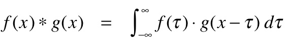
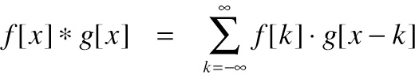
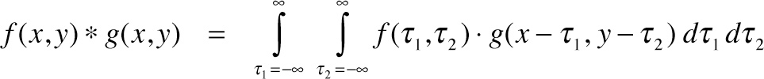
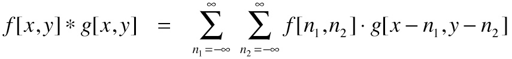
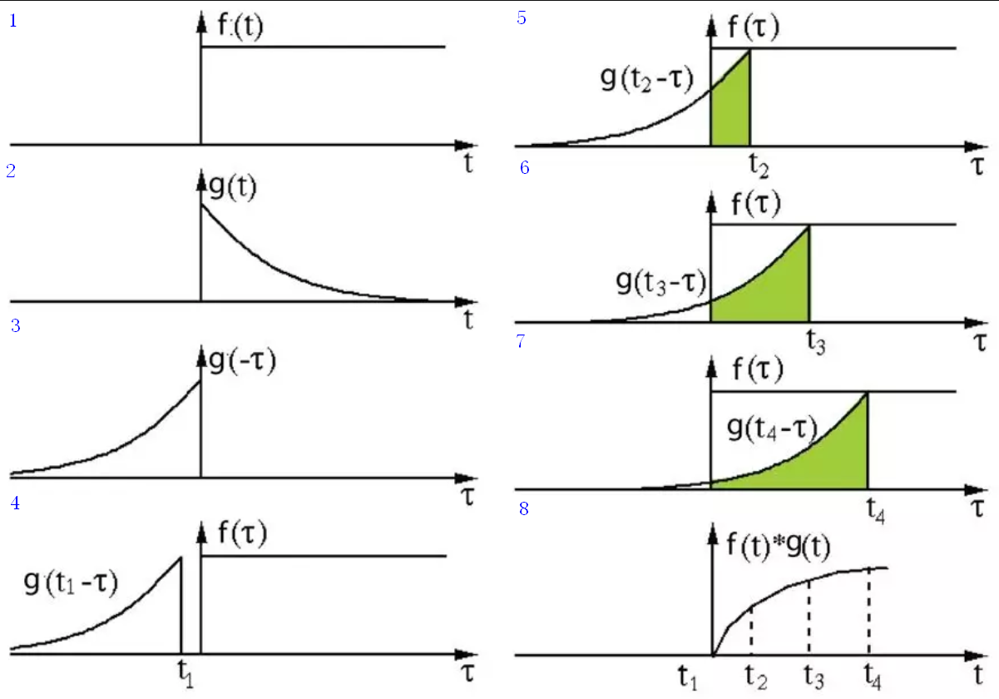
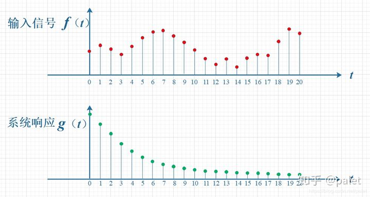
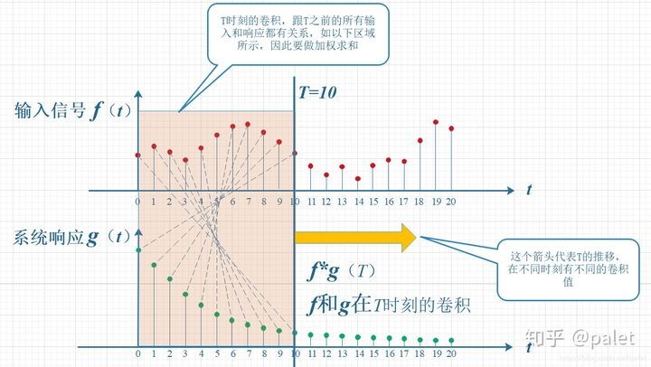
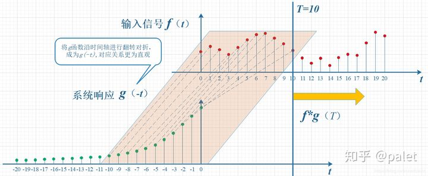
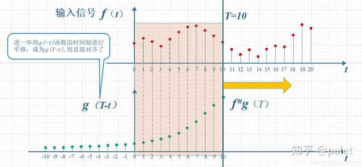
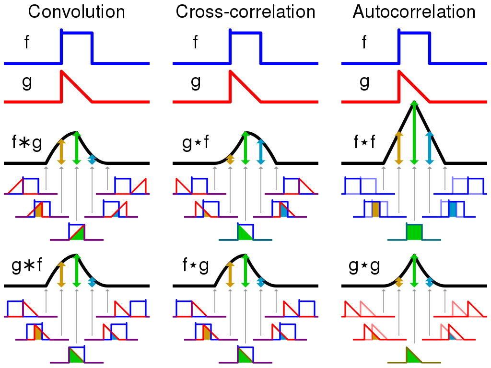

-----

| Title     | ML Op Convolution Math                               |
| --------- | ---------------------------------------------------- |
| Created @ | `2019-06-09T07:26:18Z`                               |
| Updated @ | `2023-02-02T09:00:38Z`                               |
| Labels    | \`\`                                                 |
| Edit @    | [here](https://github.com/junxnone/aiwiki/issues/10) |

-----

# 卷积 数学定义

## Reference

  - [Convolution - Wikipedia](https://en.wikipedia.org/wiki/Convolution)
  - [Spatial
    convolution](https://graphics.stanford.edu/courses/cs178/applets/convolution.html)
  - [如何通俗易懂地解释卷积？](https://www.zhihu.com/question/22298352)

## Brief

  - 两个函数 `f(x)` & `g(x)` 之间的数学操作产生一个新的函数: `f(x)*g(x)`
  - f & g 翻转平移后重叠部分乘积的积分

## 单变量 & 双变量的数学公式定义

| 函数       | 定义                                                           |
| -------- | ------------------------------------------------------------ |
| 单变量连续域函数 |  |
| 单变量离散域函数 |  |
| 双变量连续函数  |  |
| 双变量离散函数  |  |

## 一维卷积过程

  - 输入 f & g (1\~2)
  - g 翻转平移 (3\~4)
  - 求每个t点的值 (5\~7)
  - 得到新的函数 (8)

## 系统理解

  - f 为输入随时间 t 的变化
  - g 为输入随时间 t 的衰减
  - 输出 O 为 f & g 的综合结果

| Steps | f & g                                                        |
| ----- | ------------------------------------------------------------ |
| 1     |  |
| 2     |  |
| 3     |  |
| 4     |  |

## Convolution & Cross-correlation & Autocorrelation

  - Cross-correlation 互相关 - 两个变量的相似性度量
  - Autocorrelation 自相关 - 变量不同时间的相关性

