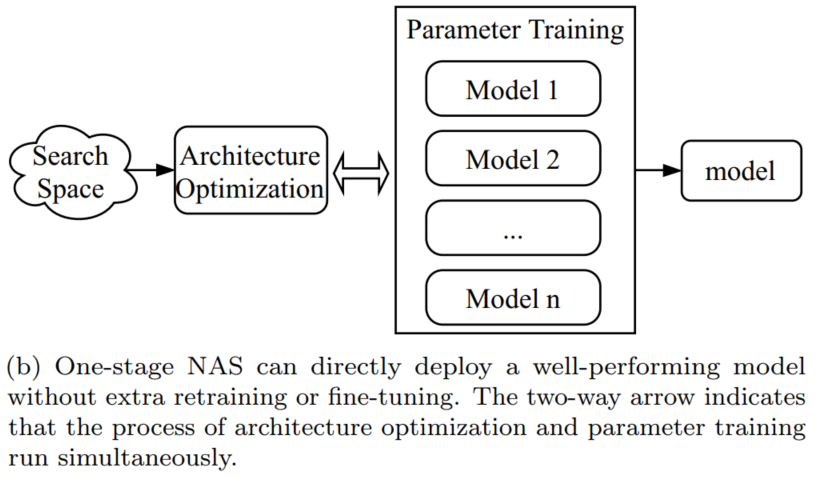
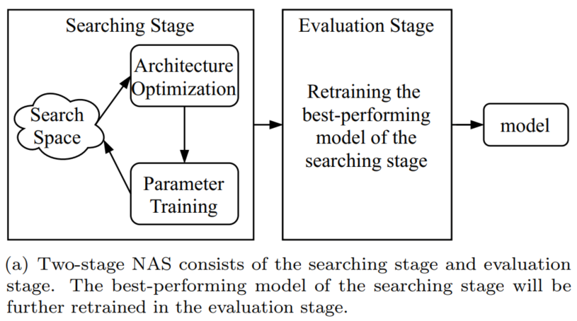
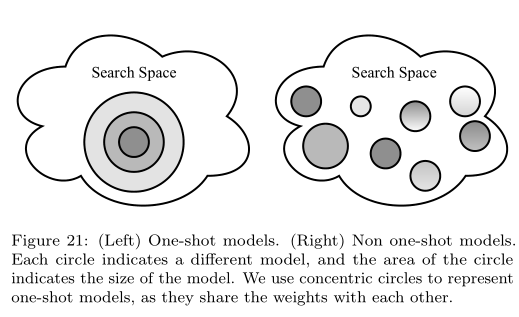

-----

| Title         | ML AutoML NAS                                        |
| ------------- | ---------------------------------------------------- |
| Created @     | `2021-09-06T09:24:10Z`                               |
| Last Modify @ | `2022-12-24T13:24:04Z`                               |
| Labels        | \`\`                                                 |
| Edit @        | [here](https://github.com/junxnone/aiwiki/issues/14) |

-----

## Reference

  - [paper - 2017 - Learning Transferable Architectures for Scalable
    Image Recognition](https://arxiv.org/abs/1707.07012)
  - [paper - 2017 - Progressive Neural Architecture
    Search](https://arxiv.org/abs/1712.00559)
  - [paper - 2018 - Efficient Neural Architecture Search via Parameter
    Sharing](https://arxiv.org/abs/1802.03268)
  - [paper - 2019 - Neural Architecture Search: A
    Survey](https://arxiv.org/pdf/1808.05377.pdf)
  - [paper - 2019 - A Survey on Neural Architecture
    Search](https://arxiv.org/pdf/1905.01392.pdf)
  - [paper - 2020 - A Comprehensive Survey of Neural Architecture
    Search: Challenges and
    Solutions](https://arxiv.org/pdf/2006.02903.pdf)
  - [Awesome-NAS - D-X-Y](https://github.com/D-X-Y/Awesome-NAS)
  - [Awesome-NAS-CV](https://github.com/LiuFG/Awesome-NAS-CV)
  - [Awesome-NAS - pzhren -
    History](https://github.com/pzhren/Awesome-NAS)
  - [NAS Mind
    Map](https://user-images.githubusercontent.com/2216970/87892595-1377fd00-ca70-11ea-830d-b65de51d4371.png)
  - [一文详解神经网络结构搜索（NAS）](https://www.jianshu.com/p/77e6d16e87c4)
  - [NAS Paper and
    Survey](https://www.cnblogs.com/chenbong/p/13380689.html)

## Brief

  - **按搜索 Pipeline 分类:** `One Stage`/`Two Stage`/`OneShot`
  - `Search Space` - \> `Search Strategy`( `Architecture Optimization`)
    -\> `Performance Estimation Strategy`
  - RL/EA -\> Blocks -\> GD -\> One-Shot

## One Stage vs Two Stage vs OneShot

| NAS-Type  | Description                                      | Flow                                                         |
| --------- | ------------------------------------------------ | ------------------------------------------------------------ |
| One-Stage | 搜索完之后模型可以直接使用                                    |  |
| Two-Stage | 搜索完之后要 `retrain & finetune`                      |  |
| One-Shot  | search space构造成一个SuperNet  share same weights |  |

## NAS Algos

| Algos            | Description                             |
| ---------------- | --------------------------------------- |
| ENAS             |                                         |
| DARTS            |                                         |
| P-DARTS          |                                         |
| CDARTS           |                                         |
| SPOS             |                                         |
| ProxylessNAS     |                                         |
| Network Morphism |                                         |
| TextNAS          |                                         |
| PPO              | Proximal Policy Optimization Algorithms |

## History - [Timeline](https://junxnone.github.io/wht/tech/nas/)

  - 11/2016 - NAS & RL - [Neural Architecture Search with Reinforcement
    Learning](https://arxiv.org/abs/1611.01578)
  - 03/2017 - [Large-Scale Evolution of Image
    Classifiers](https://arxiv.org/pdf/1703.01041.pdf)
  - 07/2017 - NASNet - [Learning Transferable Architectures for Scalable
    Image Recognition](https://arxiv.org/abs/1707.07012)
  - 08/2017 - [SMASH: One-Shot Model Architecture Search through
    HyperNetworks](https://arxiv.org/abs/1708.05344)
  - 12/2017 - PNAS - [Progressive Neural Architecture
    Search](https://arxiv.org/abs/1712.00559)
  - 02/2018 - ENAS - [Efficient Neural Architecture Search via Parameter
    Sharing](https://arxiv.org/abs/1802.03268)
  - 06/2018 - [DARTS: Differentiable Architecture
    Search](https://arxiv.org/pdf/1806.09055.pdf)
  - 12/2018 - [ProxylessNAS: Direct Neural Architecture Search on Target
    Task and Hardware](https://arxiv.org/pdf/1812.00332.pdf)
