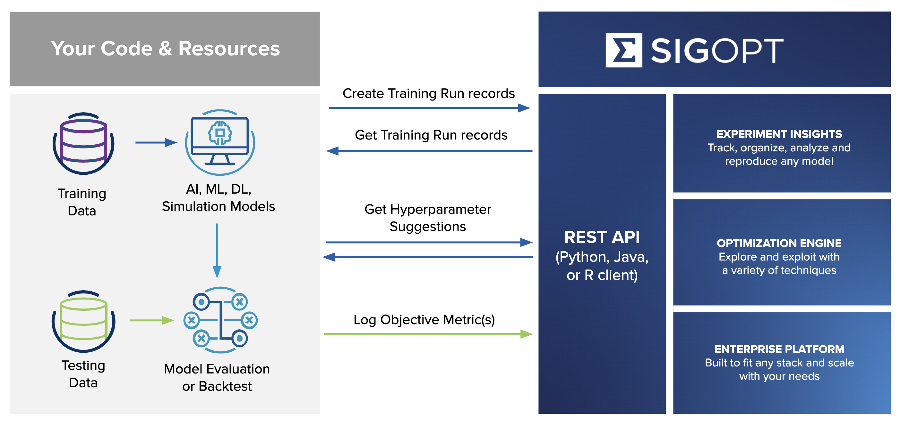

-----

| Title     | ML AutoML Tools SIGOPT                               |
| --------- | ---------------------------------------------------- |
| Created @ | `2021-09-01T09:01:43Z`                               |
| Updated @ | `2023-06-17T16:51:04Z`                               |
| Labels    | \`\`                                                 |
| Edit @    | [here](https://github.com/junxnone/aiwiki/issues/15) |

-----

# SIGOPT

  - Online Tools - 跟踪/分析/微调 `AI Model`
  - [sigopt UseCase](/HPO_SIGOPT_Usecase)
  - [sigopt Options - parameters/metrics](/HPO_SIGOPT_Options)
  - **参数类型支持** `浮点型/整型/Grid/Categorical`
  - **Multimetric** (用例: 优化 `accuracy` 的同时, 优化 `inference_time`)
  - **Support Optimization**: `Random/Grid/Bayesian/Constraint/Custom`
      - Custom Optimizer
          - [Hyperopt](https://hyperopt.github.io/hyperopt/)
          - [Optuna](https://optuna.org/)
  - **Parallel**
      - 多机器训练

## Arch

## Workflow

  - 1.  获取随机**超参**

  - 2.  把跑出来的 **metrics** 提交到 **sigopt**

  - 3.  获取新的**超参**

  - 4.  重复以上步骤获取最好的参数

## Parallel

  - 方式
      - Threads
      - Machines (`+unique tag`)
      - Training clusters
  - Pipelines
      - set `parallel_bandwidth`
      - Init workers with `EXPERIMENT_ID`
      - Optimization Loop -
        `Suggestions/Training/Evaluation/Observations`

## Reference

  - [SigOpt docs](https://app.sigopt.com/docs)
    \[[code](https://github.com/sigopt)\]
  - 2016 A Stratified Analysis of Bayesian Optimization Methods
    \[[paper](https://arxiv.org/pdf/1603.09441.pdf)\]
  - [sigopt\_experiment\_and\_optimization\_demo.ipynb](https://colab.research.google.com/github/sigopt/sigopt-examples/blob/master/get-started/sigopt_experiment_and_optimization_demo.ipynb)
  - [Intro to Multicriteria
    Optimization](https://sigopt.com/blog/intro-to-multicriteria-optimization/)
