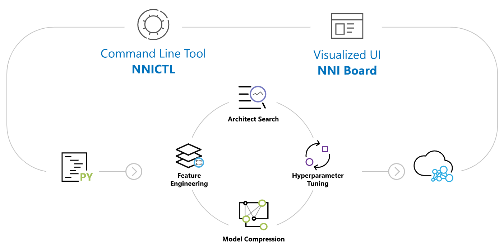
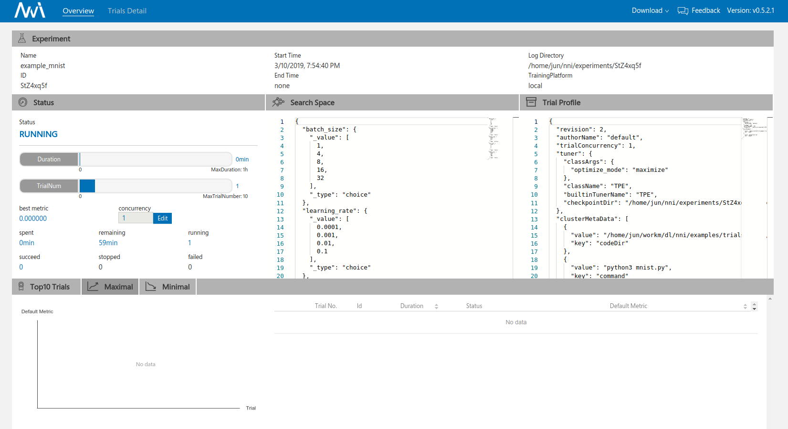

-----

| Title         | ML AutoML Tools NNI                                  |
| ------------- | ---------------------------------------------------- |
| Created @     | `2019-03-10T11:35:45Z`                               |
| Last Modify @ | `2022-12-24T13:23:49Z`                               |
| Labels        | \`\`                                                 |
| Edit @        | [here](https://github.com/junxnone/aiwiki/issues/16) |

-----

## Reference

  - \[[Docs - zh](https://nni.readthedocs.io/zh/latest/)\] \[[Code -
    Microsoft ](https://github.com/Microsoft/nni)\]

## Brief

  - NNI - Neural Network Intelligence
      - FE
      - HPO
      - NAS
      - Model Compression

-----

## Install

    python3 -m pip install --upgrade nni

**mnist example**

    nnictl create --config examples/trials/mnist/config.yml

    You can use these commands to get more information about the experiment
    -----------------------------------------------------------------------
             commands                       description
    1. nnictl experiment show        show the information of experiments
    2. nnictl trial ls               list all of trial jobs
    3. nnictl top                    monitor the status of running experiments
    4. nnictl log stderr             show stderr log content
    5. nnictl log stdout             show stdout log content
    6. nnictl stop                   stop an experiment
    7. nnictl trial kill             kill a trial job by id
    8. nnictl --help                 get help information about nnictl

