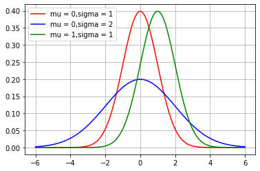
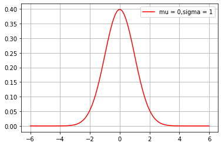
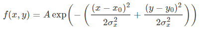
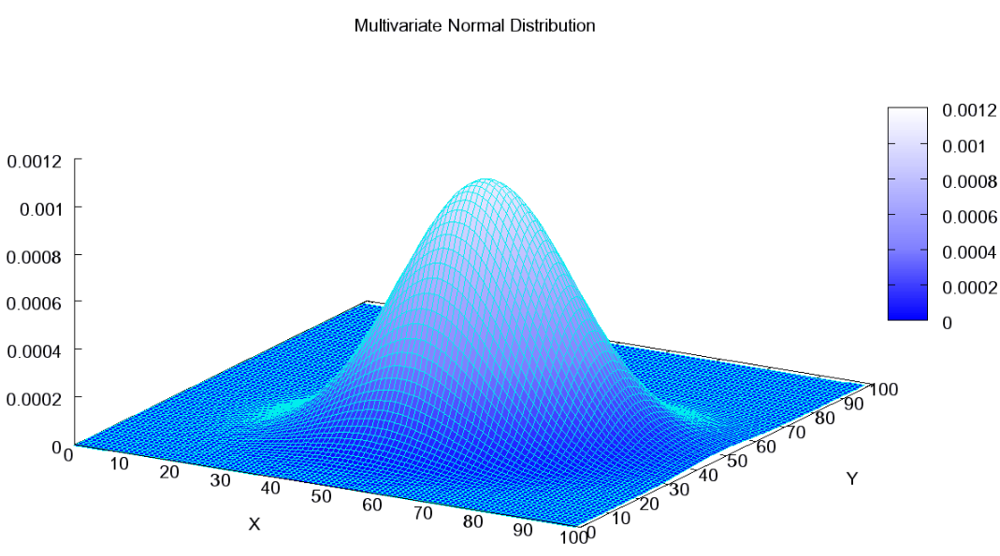

-----

| Title         | Math GaussianDistribution                            |
| ------------- | ---------------------------------------------------- |
| Created @     | `2021-03-22T08:23:37Z`                               |
| Last Modify @ | `2022-12-27T03:36:58Z`                               |
| Labels        | \`\`                                                 |
| Edit @        | [here](https://github.com/junxnone/aiwiki/issues/23) |

-----

# Gaussian Distribution 高斯分布

## Reference

  - [多元高斯分布（The Multivariate normal
    distribution）](https://www.cnblogs.com/bingjianing/p/9117330.html)

## Brief

  - 高斯分布 - 正态分布 - **X \~ (μ，σ2)**
  - **X \~ (0, 1) - N(0, 1)** - `μ=0 σ=1` 时为 **标准正态分布**

## 定义

若随机变量 X 密度函数为:

则称随机变量 X 服从正态分布 X \~ (μ，σ2)

## 多维高斯分布

| 分布     | 公式/概率密度函数                                                    | 曲线                                                           |
| ------ | ------------------------------------------------------------ | ------------------------------------------------------------ |
| 一维正态分布 |  |  |
| 标准正态分布 |  |  |
| 二维高斯分布 |  |  |
| 多维高斯分布 |  |                                                              |

## Python Code

    import numpy as np
    import matplotlib.pyplot as plt
    import math
     
     
    def normal_distribution(x, mu, sigma):
        return np.exp( -1 * ( (x-mu) ** 2) / ( 2 * (sigma ** 2)) ) / (math.sqrt( 2 * np.pi ) * sigma)
    
    mu, sigma = 0, 1
    x = np.linspace( mu - 6 * sigma, mu + 6 * sigma, 100)
    y = normal_distribution(x, mu, sigma)
    plt.plot(x, y, 'r', label='mu = 0,sigma = 1')
    
    y = normal_distribution(x, 0, 2)
    plt.plot(x, y, 'b', label='mu = 0,sigma = 2')
    
    y = normal_distribution(x, 1, 1)
    plt.plot(x, y, 'g', label='mu = 1,sigma = 1')
    
    plt.legend()
    plt.grid()
    plt.show()
