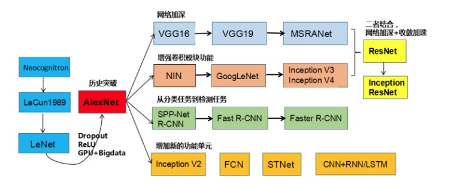

-----

| Title         | ML Tasks Image Classification LeNet                  |
| ------------- | ---------------------------------------------------- |
| Created @     | `2019-06-11T12:59:17Z`                               |
| Last Modify @ | `2022-12-24T12:38:04Z`                               |
| Labels        | \`\`                                                 |
| Edit @        | [here](https://github.com/junxnone/aiwiki/issues/24) |

-----

## Reference

  - 1998 **LeNet** Gradient-Based Learning Applied to Document
    Recognition
    \[[paper](http://yann.lecun.com/exdb/publis/pdf/lecun-01a.pdf)\]
    \[[code](https://github.com/junxnone/LeNet-5/blob/master/lenet.py#L5-L74)\]
  - [卷积神经网络之LeNet](https://www.cnblogs.com/wangguchangqing/p/10329402.html)
  - [卷积神经网络-进化史-从LeNet到AlexNet](https://zhuanlan.zhihu.com/p/21562756)
  - [神经网络的发展历史](https://blog.csdn.net/qq_30460949/article/details/100101983)

## Brief

  - LeNet诞生于1998年, 第一个卷积神经网络
  - 包含卷积/池化/全连接等Layers
      - 卷积核用 5x5
      - 池化使用 2x2

**解决的问题**

  - 感知机全连接网络参数多, 卷积网络可以有效降低参数量
      - 图像数据量较大，单个像素输入独立神经元中，需要很大的网络结构，训练参数过多
  - 图像的形变，形变引起的图像特征位置变化的问题
  - 卷积网络引入**局部感受野**使图像局部关联
  - **共享权值** - 卷积层中神经元对应权值共享
  - **池化** - 图像信息压缩可以减少计算量

## Arch

| Layer Name | Input    | Operation    | Output(Feature Map) | Comment |
| ---------- | -------- | ------------ | ------------------- | ------- |
| Input      | 32x32x1  |              |                     |         |
| 卷积         | 32x32x1  | 5x5x6 kernel | C1`@28x28x6`        |         |
| 池化         | 28x28x6  | 2x2          | S2`@14x14x6`        |         |
| 卷积         | 14x14x6  | 5x5x16       | C3`@10x10x16`       |         |
| 池化         | 10x10x16 | 2x2          | S4`@5x5x16`         |         |
| 卷积         | 5x5x16   | 5x5x120      | C5 `@1x1x120`       |         |
| 全连接        | 1x1x120  | 84           | F6`@1x1x84`         |         |
| 全连接        | 1x1x84   | 10           | Output`@1x1x10`     |         |

## 参数量&计算量计算

    ----------------------------------------------------------------
            Layer (type)               Output Shape         Param #
    ================================================================
                Conv2d-1            [-1, 6, 28, 28]             156
                  ReLU-2            [-1, 6, 28, 28]               0
             MaxPool2d-3            [-1, 6, 14, 14]               0
                    C1-4            [-1, 6, 14, 14]               0
                Conv2d-5           [-1, 16, 10, 10]           2,416
                  ReLU-6           [-1, 16, 10, 10]               0
             MaxPool2d-7             [-1, 16, 5, 5]               0
                    C2-8             [-1, 16, 5, 5]               0
                Conv2d-9           [-1, 16, 10, 10]           2,416
                 ReLU-10           [-1, 16, 10, 10]               0
            MaxPool2d-11             [-1, 16, 5, 5]               0
                   C2-12             [-1, 16, 5, 5]               0
               Conv2d-13            [-1, 120, 1, 1]          48,120
                 ReLU-14            [-1, 120, 1, 1]               0
                   C3-15            [-1, 120, 1, 1]               0
               Linear-16                   [-1, 84]          10,164
                 ReLU-17                   [-1, 84]               0
                   F4-18                   [-1, 84]               0
               Linear-19                   [-1, 10]             850
           LogSoftmax-20                   [-1, 10]               0
                   F5-21                   [-1, 10]               0
    ================================================================
    Total params: 64,122
    Trainable params: 64,122
    Non-trainable params: 0
    ----------------------------------------------------------------
    Input size (MB): 0.00
    Forward/backward pass size (MB): 0.16
    Params size (MB): 0.24
    Estimated Total Size (MB): 0.40
    ----------------------------------------------------------------

> params calcluate by
> [torchsummary](https://github.com/sksq96/pytorch-summary)

    +input = torch.randn(1, 1, 32, 32)
    +macs, params = thop.profile(net, inputs=(input, ))

    macs is 664544.0, params is 64122.0

> Flops calculate by
> [thop](https://github.com/Lyken17/pytorch-OpCounter/)

## 后续发展

