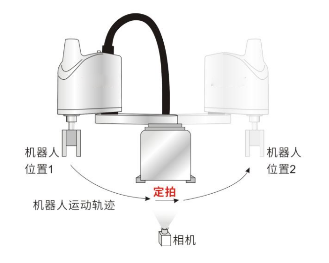
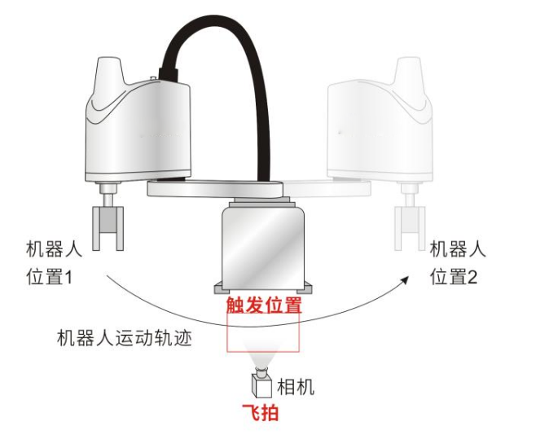
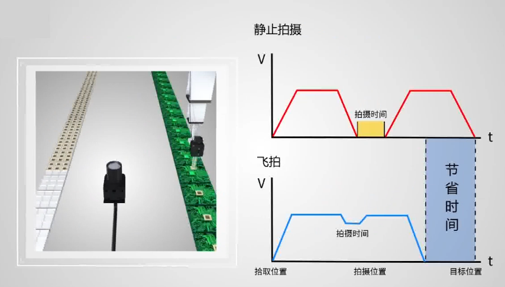
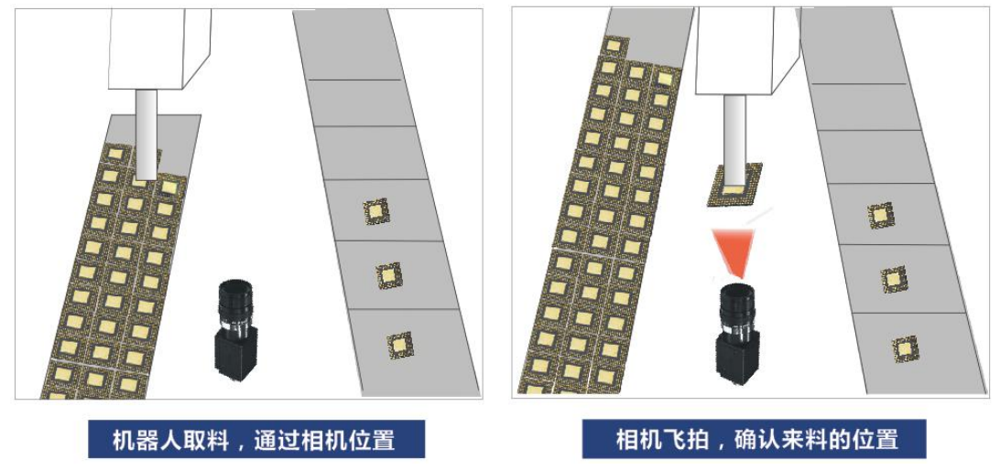
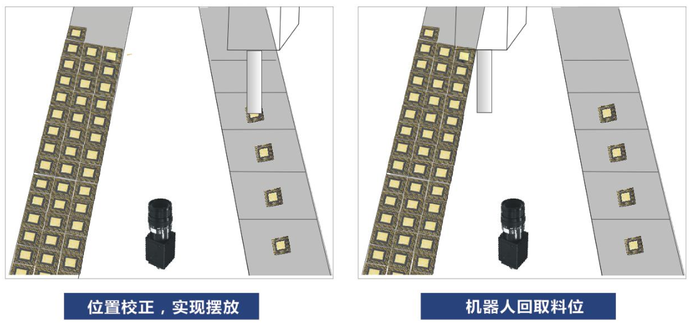

-----

| Title         | Media Image Camera 定拍飞拍                              |
| ------------- | ---------------------------------------------------- |
| Created @     | `2021-04-26T08:23:35Z`                               |
| Last Modify @ | `2022-12-25T04:33:48Z`                               |
| Labels        | \`\`                                                 |
| Edit @        | [here](https://github.com/junxnone/aiwiki/issues/38) |

-----

# 定拍 vs 飞拍

## Reference

  - [CCD视觉飞拍技术](http://www.julivision.com/news/436.html)

## Brief

| 模式     | Description                   | 优缺点                           |
| ------ | ----------------------------- | ----------------------------- |
| **定拍** | 轴运动到拍照位停下来相机拍照处理，然后把结果反馈给执行机构 | 有延时, 某些环境对延时要求高，不适合该模式 精度高 |
| **飞拍** | 轴运动到拍照位时运动不停完成拍照处理以及结果反馈      | 不需要停滞 精度比 定拍稍低             |

|       |       |
| ----------------------------------------------------------------- | ----------------------------------------------------------------- |
|  |  |

## 应用场景

  - 位置校正
  - 丝印检测
  - 缺陷检测
  - 错/漏检测
  - 堵孔检测
  - 尺寸检测
  - 标签检测

### 1 位置校正

