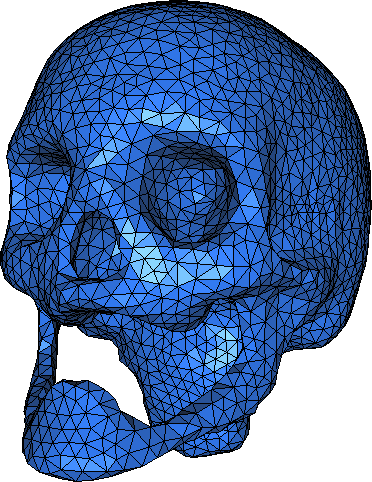
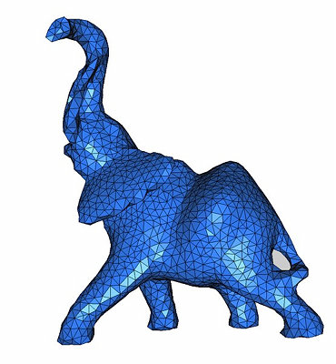
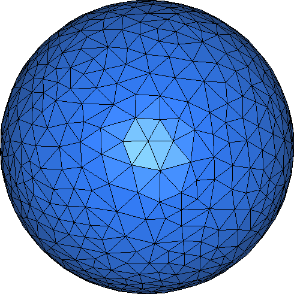

-----

| Title         | Media Image 3DImage                                  |
| ------------- | ---------------------------------------------------- |
| Created @     | `2021-07-30T06:51:51Z`                               |
| Last Modify @ | `2022-12-23T13:32:08Z`                               |
| Labels        | \`\`                                                 |
| Edit @        | [here](https://github.com/junxnone/aiwiki/issues/39) |

-----

# 3D 图像

## Reference

  - [Voxel - Wikipedia](https://en.wikipedia.org/wiki/Voxel)

## Brief

  - 3D 模型表示方式
      - \[Depth map/Image\]
      - \[Voxel\]
      - \[Point Cloud\]
      - \[Mesh\]

## 3D Images Format

| Name                                                                   | Description                                    |
| ---------------------------------------------------------------------- | ---------------------------------------------- |
| PLY                                                                    | developed at Stanford University by Turk et al |
| STL                                                                    | CAD Software                                   |
| OBJ                                                                    | developed by Wavefront Technologies            |
| X3D                                                                    | ISO standard XML-based file format             |
| [Others](https://en.wikipedia.org/wiki/Category:Graphics_file_formats) | Wikipedia                                      |

## Point Cloud

  - **点云格式分为有序点云/无序点云**
      - **有序点云** - 按照图方阵排列, 无效点使用 (0,0,0) 表示
      - **无序点云** - 点集合，点排列之间无关联

## Depth Map/Image

  - 用一个通道来表示距离

## Voxel

  - 立方体表示 ( 类比为2D Image 中的 Pixel)

## Mesh

  - 三角形组成的多边形网格
  - obj/stl

|  |  |  |
| ------------------------------------------------------------ | ------------------------------------------------------------ | ------------------------------------------------------------ |

### obj Format

    v x1 x2 x3 #顶点
    vn vn1 vn2 vn3 #法线坐标
    f v1/v2  v3/v4  v5/v6 #面 顶点索引/顶点索引

| Label | Description                                                                                            |
| ----- | ------------------------------------------------------------------------------------------------------ |
| v     | 顶点坐标                                                                                                   |
| vn    | 法线坐标                                                                                                   |
| vt    | 纹理坐标                                                                                                   |
| p     | Point                                                                                                  |
| l     | 线                                                                                                      |
| f     | 面 `v1 v2 v3` / `v1/vt1 v2/vt2 v3/vt3` / `v1//vn1 v2//vn2 v3//vn3` / `v1/vt1/vn1 v2/vt2/vn2 v3/vt3/vn3` |
