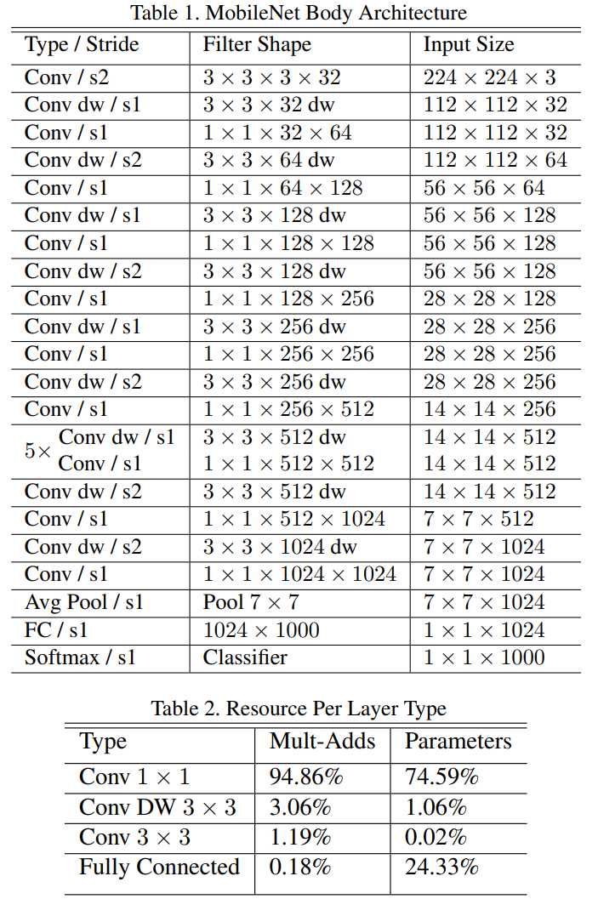
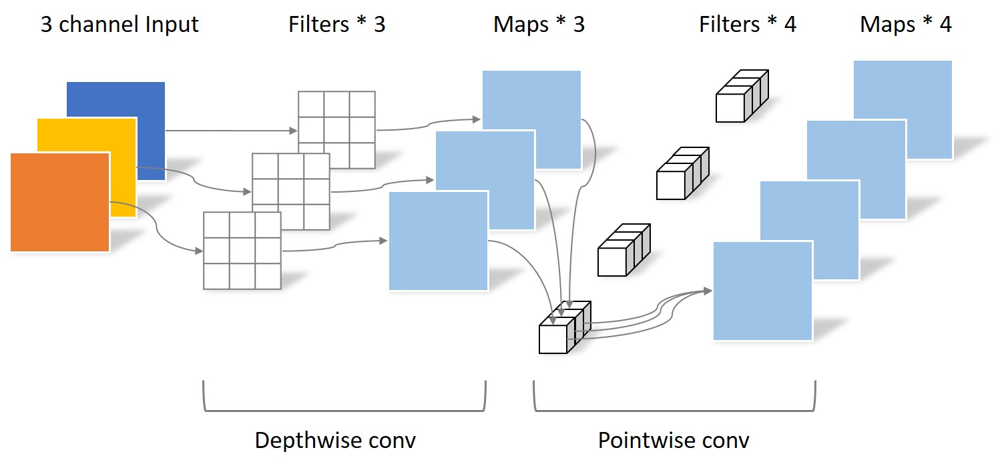
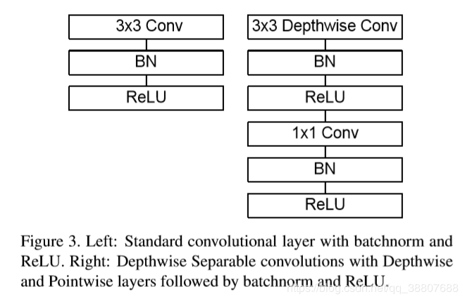
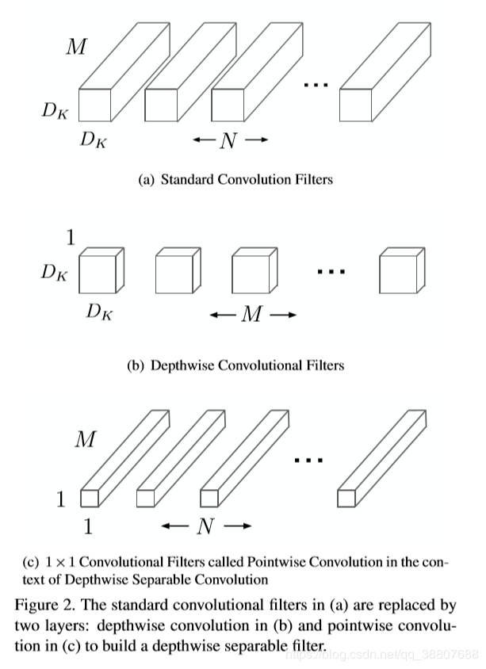
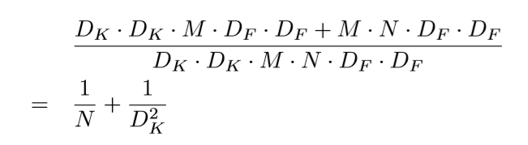
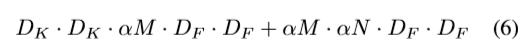
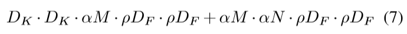
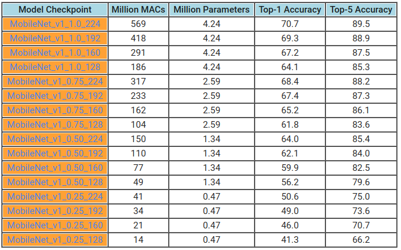

-----

| Title     | ML Tasks Image Classification MobileNet V1           |
| --------- | ---------------------------------------------------- |
| Created @ | `2020-02-25T10:14:26Z`                               |
| Updated @ | `2023-01-31T06:34:56Z`                               |
| Labels    | \`\`                                                 |
| Edit @    | [here](https://github.com/junxnone/aiwiki/issues/42) |

-----

# MobileNet V1

## Reference

  - 2017 **MobileNet V1** MobileNets: Efficient Convolutional Neural
    Networks for Mobile Vision Applications
    \[[paper](https://arxiv.org/pdf/1704.04861.pdf)\]
  - [MobileNets
    论文笔记](https://blog.csdn.net/Jesse_Mx/article/details/70766871)
  - [深度解读谷歌MobileNet](https://blog.csdn.net/T800GHB/article/details/78879612)
  - [Caffe Mobilenet](https://github.com/01org/caffe/wiki/Mobilenet)
  - [MobileNets: Open-Source Models for Efficient On-Device
    Vision](https://ai.googleblog.com/2017/06/mobilenets-open-source-models-for.html)
  - [论文记录\_MobileNets Efficient Convolutional Neural Networks for Mobile
    Vision
    Application](https://blog.csdn.net/u013082989/article/details/77970196)
  - [MobileNet论文详解](https://blog.csdn.net/qq_38807688/article/details/84590717)
  - [tensorflow/models - Mobilenet
    v1](https://github.com/tensorflow/models/blob/master/research/slim/nets/mobilenet_v1.md)

## Brief

  - 使用了 depthwise 和 pointwise 卷积分解 减少计算量，加快模型推理速度

## Arch

  - 网络结构 - 28 layers = 1+2x13+1

## depthwise & pointwise

  - MobileNet 主要概念是深度可分卷积，将标准卷积分解为：
      - **深度卷积** - `depthwise convolution` : 用于过滤通道, 宽度相当于是无穷的)
      - **逐点卷积** - `pointwise convolution` : 1\*1卷积, 用于组合通道
  - 标准卷积将过滤通道和组合通道、提取空间特征的作用组合在一起
  - 深度可分卷积具有大幅度减少计算和模型大小的效果

|  |  |
| ------------------------------------------------------------ | ------------------------------------------------------------ |

**计算量缩小的比例**

| 标准卷积 vs 可分卷积                                                 | 计算量                                                          |
| ------------------------------------------------------------ | ------------------------------------------------------------ |
|  |  |

| 卷积        | 计算量                                                                                              |
| --------- | ------------------------------------------------------------------------------------------------ |
| 标准卷积      | DF\*DF\*DK\*DK\*M\*N                                 |
| 分解卷积      | DF\*DF\*DK\*DK\*M+DF\*DF\*M\*N |
| depthwise | DF\*DF\*DK\*DK\*M                                    |
| pointwise | DF\*DF\*1\*1\*M\*N                                                         |

> feature map为DF\*DF\*N
> 如果卷积核大小为3\*3，那么差不多卷积操作的时间能降到原来的1/9左右

## 宽度乘数

构造这些更小，计算量更小的模型，引入了一个非常简单的参数α，称为宽度乘法器

  - 宽度乘数α的作用是在每层均匀地减薄网络。
  - 对于给定的层和宽度乘数α，输入通道M的数量变为αM，输出通道数量N变为αN。
  - 可分离卷积的计算量减小为：
    

> α的典型值设置为1，0.75，0.5和0.25

## 分辨率乘数ρ

  - 输入分辨率隐式设置ρ
  - 可分离卷积的计算量减小为：
    

> ρ 为隐式设置(1，6/7，5/7，4/7)，对应分辨率取值为 224, 192, 160, 128

## 参数&计算量&精度

> MACs Multiply-Accumulates

## 存在的问题

  - 结构是非常复古的直筒结构
  - Depthwise每个kernel dim相对于普通Conv要小得多，过小的kernel\_dim,
    加上ReLU的激活影响下，使得神经元输出很容易变为0，这个问题在定点化低精度训练的时候会进一步放大。
