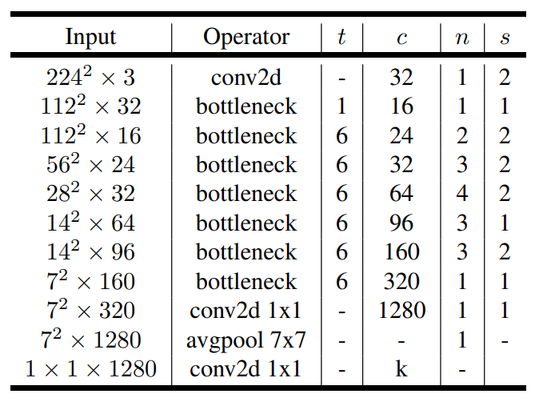
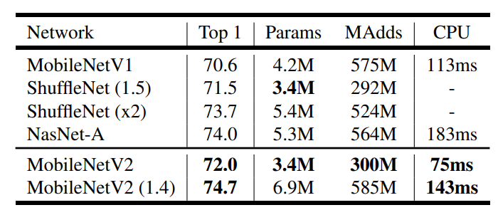
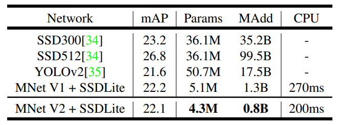

-----

| Title     | ML Tasks Image Classification MobileNet V2           |
| --------- | ---------------------------------------------------- |
| Created @ | `2020-02-25T10:15:57Z`                               |
| Updated @ | `2023-01-31T06:35:09Z`                               |
| Labels    | `index`                                              |
| Edit @    | [here](https://github.com/junxnone/aiwiki/issues/43) |

-----

# MobileNet V2

## Reference

  - 2018 **MobileNet V2** MobileNetV2: Inverted Residuals and Linear
    Bottlenecks \[[paper](https://arxiv.org/pdf/1801.04381.pdf)\]
  - [MobileNet V2 论文初读](https://zhuanlan.zhihu.com/p/33075914)
  - [轻量化网络：MobileNet-V2](https://blog.csdn.net/u011995719/article/details/79135818)
  - [tensorflow/models - Mobilenet
    v2](https://github.com/tensorflow/models/tree/master/research/slim/nets/mobilenet)

## Brief

  - Inverted Residual Blocks
  - Linear Bottleneck

## Inverted Residual Blocks

> 来源于 ResNet

  - ResNet 使用 标准卷积 提特征，MobileNet 始终使用 DW卷积 提特征
  - ResNet 先降维 (0.25倍)、卷积、再升维，而 MobileNet V2 则是 先升维 (6倍)、卷积、再降维

> 直观的形象上来看，ResNet 的微结构是沙漏形 `><`，而 MobileNet V2 则是纺锤形 `<>`，刚好相反。因此
> MobileNet V2 的结构被称为 **Inverted Residual Block**

## Linear Bottleneck

**对比 Mobilenet v1:**

  - 在每个DW前增加了PW
      - Depth-Wise 卷积由于本身的计算特性不能改变通道数, 上一层多少通道，只能输出多少通道。当上一层给的通道数很少时，DW
        只能在低维空间提特征，因此效果不够好。
      - 在每个 DW 之前增加一个 PW，用于升维，定义升维系数 `t = 6`, 这样不管输入通道数 `Cin` 是多是少，经过第一个
        PW 升维之后，DW 都在相对的更高维 `t*Cin`工作。
  - 去掉了第二个PW的激活函数
      - 激活函数在高维空间能够有效的增加非线性，而在低维空间时则会破坏特征，不如线性的效果好。
      - 第二个 PW 的主要功能是降维，降维之后就不宜再使用 ReLU6 。

> 此处被称为 `Linear Bottleneck`

## 网络结构 - 54 layers = 1 + 17\*3 + 2

  - t 是输入通道的倍增系数（即中间部分的通道数是输入通道数的多少倍）
  - n 是该模块重复次数
  - c 是输出通道数
  - s 是该模块第一次重复时的 stride（后面重复都是 stride 1）

## 性能对比

