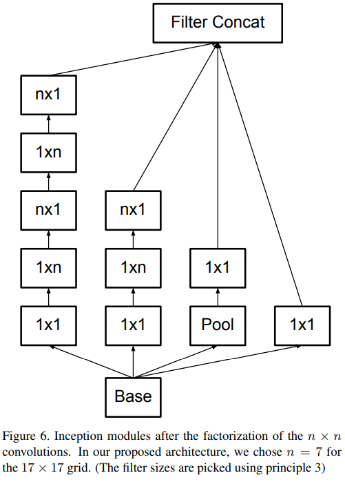

-----

| Title     | ML Tasks Image Classification Inception V2V3         |
| --------- | ---------------------------------------------------- |
| Created @ | `2019-12-04T09:37:22Z`                               |
| Updated @ | `2023-01-31T06:34:33Z`                               |
| Labels    | \`\`                                                 |
| Edit @    | [here](https://github.com/junxnone/aiwiki/issues/46) |

-----

# Inception V2V3

## Reference

  - 2015 **Inception V2 & V3** Rethinking the Inception Architecture for
    Computer Vision \[[paper](https://arxiv.org/pdf/1512.00567.pdf)\]
  - [Inception结构](https://baike.baidu.com/item/Inception%E7%BB%93%E6%9E%84/22761220?fr=aladdin)
  - [一文概览Inception家族的「奋斗史」](https://www.chainnews.com/articles/727946354364.htm)
  - [深入浅出——网络模型中Inception的作用与结构全解析](https://blog.csdn.net/u010402786/article/details/52433324)
  - [图像分类丨Inception家族进化史「GoogleNet、Inception、Xception」](https://www.cnblogs.com/vincent1997/p/10920036.html)

## Brief

  - Inception V2 和 V3 是同一篇 paper 提出，各种 Improve 最终版的 V2 即 V3
  - Inception Module 设计准则
      - 避免大kernel 导致的表达瓶颈
      - 高维特征更易处理
      - 低维空间聚合无需担心丢失信息
      - 平衡网络宽度和深度
  - **使用了Batch Normalization**
  - **分解卷积 - Factorizing Convolutions**
      - 使用包括 2 个 3x3 的 卷积 Mini-network 替换 5x5 的卷积
      - 任意nxn的卷积都可以通过1xn卷积后接nx1 非对称卷积来替代
  - RMSProp优化器
  - 使用了Label Smoothing

## Factorizing Convolutions - Mini-network

  - 2个 3x3 的 卷积替换 5x5 的卷积

  - 任意nxn的卷积都可以通过1xn卷积后接nx1 非对称卷积来替代

| Original Inception module |  |
| ------------------------------- | ------------------------------------------------------------ |
| Mini-network                    |  |
| Mini-network 1xn/nx1         |  |
| \--                             |  |

## 减小特征图大小的方法

  - 先 Pooling 会导致特征表示遇到瓶颈（特征缺失）
  - 后 Pooling 会导致计算量很大

-----

-----

**解决方案**

  - 使用并行化的 module 来降低减小特征图大小，并降低计算量

## Label smoothing

  - softmax loss过于注重使模型学习分类出正确的类别, 当在新数据集扩展时, 容易过拟合,
    可以使用label的先验分布信息对其loss进行校正

## 网络结构图

## 测试结果

> BN-auxiliary:在辅助层的全连接层后面也进行BN操作, 此model被命名为 `Inception V3`
