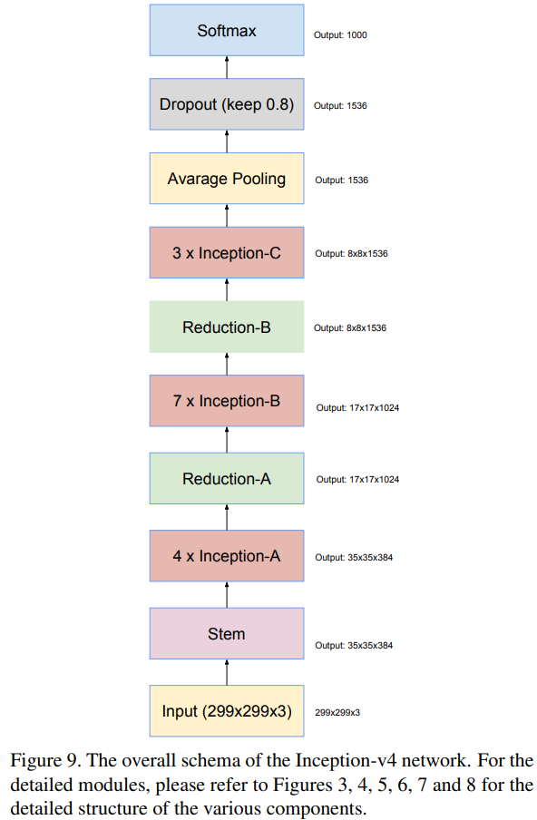

-----

| Title     | ML Tasks Image Classification Inception V4           |
| --------- | ---------------------------------------------------- |
| Created @ | `2019-12-04T10:51:56Z`                               |
| Updated @ | `2023-01-31T06:34:42Z`                               |
| Labels    | \`\`                                                 |
| Edit @    | [here](https://github.com/junxnone/aiwiki/issues/47) |

-----

# Inception V4

## Reference

  - 2016 **Inception V4 & Inception-ResNet** Inception-v4,
    Inception-ResNet and the Impact of Residual Connections on Learning
    \[[paper](https://arxiv.org/pdf/1602.07261.pdf)\]

## Brief

  - Inception V4 和 Inception-ResNet 是同一篇 paper 提出
  - 修改了Inception的Stem
  - 添加了Reduction Block
  - 添加了 ResNet

## Inception V4

  - Stem
  - Inception-A Block
  - Inception-B Block
  - Inception-C Block
  - Reduction Module A
  - Reduction Module B

### Stem Block

### Inception and Reduction Blocks

| Name        | Block                                                        |
| ----------- | ------------------------------------------------------------ |
| Inception-A |  |
| Inception-B |  |
| Inception-C |  |
| Reduction-A |  |
| Reduction-B |  |

## Inception-ResNet

### Stem Block

  - Inception-ResNet-V2 同 Inception V4
  - Inception-ResNet-V1 如下

-----

### ResNet v1 Inception and Reduction Blocks

| Name               | Block                                                        |
| ------------------ | ------------------------------------------------------------ |
| Inception-ResNet-A |  |
| Inception-ResNet-B |  |
| Inception-ResNet-C |  |
| Reduction-A        | 同 Inception V4                                               |
| Reduction-B        |  |

### ResNet v2 Inception and Reduction Blocks

| Name               | Block                                                        |
| ------------------ | ------------------------------------------------------------ |
| Inception-ResNet-A |  |
| Inception-ResNet-B |  |
| Inception-ResNet-C |  |
| Reduction-A        | 同 Inception V4                                               |
| Reduction-B        |  |

> Reduction-B 中的 `wider Inception-ResNet-v1` 应该就是指 `Inception-ResNet-v2`

## Test Result

