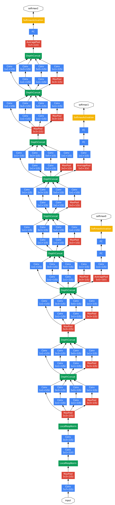

-----

| Title     | ML Tasks Image Classification Inception V1           |
| --------- | ---------------------------------------------------- |
| Created @ | `2019-12-04T09:27:53Z`                               |
| Updated @ | `2023-01-31T06:34:19Z`                               |
| Labels    | \`\`                                                 |
| Edit @    | [here](https://github.com/junxnone/aiwiki/issues/48) |

-----

# Inception V1

## Reference

  - 2014 **Inception V1 / GoogleNet** Going deeper with convolutions
    \[[paper](https://arxiv.org/pdf/1409.4842.pdf)\]
  - [深度学习---GoogLeNet](https://blog.csdn.net/qq_38906523/article/details/80061075)
  - [Going deeper with
    convolutions](https://arxiv.org/pdf/1409.4842v1.pdf)
  - [Inception结构](https://baike.baidu.com/item/Inception%E7%BB%93%E6%9E%84/22761220?fr=aladdin)
  - [一文概览Inception家族的「奋斗史」](https://www.chainnews.com/articles/727946354364.htm)
  - [深入浅出——网络模型中Inception的作用与结构全解析](https://blog.csdn.net/u010402786/article/details/52433324)
  - [图像分类丨Inception家族进化史「GoogleNet、Inception、Xception」](https://www.cnblogs.com/vincent1997/p/10920036.html)
  - [GoogLeNet系列解读](https://blog.csdn.net/shuzfan/article/details/50738394)
  - [Hebbian theory -
    赫布理论](https://zh.wikipedia.org/wiki/%E8%B5%AB%E5%B8%83%E7%90%86%E8%AE%BA)

## Brief

  - `GoogLeNet` 是对 `Yann LeCuns` 的 `LeNet` 致敬, 代号为Inception
  - 获得了 `ILSVRC14` 比赛的冠军, 刷新了**图像分类与检测**的性能记录
  - 用的参数比ILSVRC2012的冠军AlexNet少12倍，但准确率更高
  - **图像尺度变化大的问题:** 全局信息使用大卷积核, 局部信息使用小卷积核
  - **Inception Module**
      - 基于Hebbian法则, 稀疏连接有可能保持神经网络的性能
      - 1x1, 3x3, 5x5 Conv 并行结构
  - 使用了辅助分类器

## GoogLeNet 网络结构

## Inception module

  - naive : 5x5 卷积核计算量较大
  - with dimension reductions: 为了降低特征图厚度，每层之前增加了 1x1 Conv

| Name                      | Module                                                       |
| ------------------------- | ------------------------------------------------------------ |
| naive version             |  |
| with dimension reductions |  |
