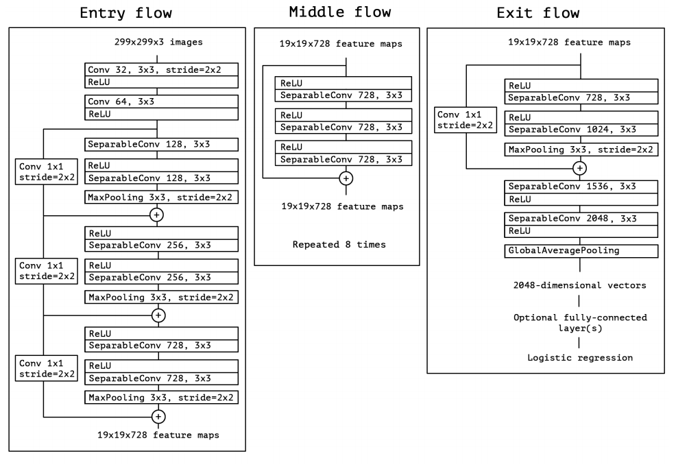
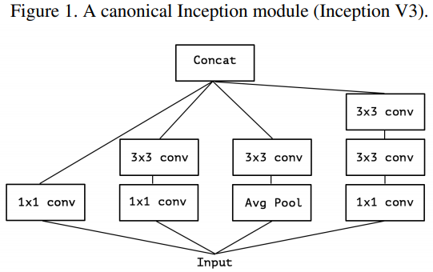
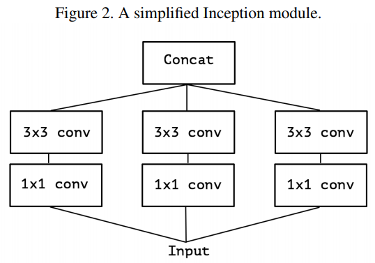
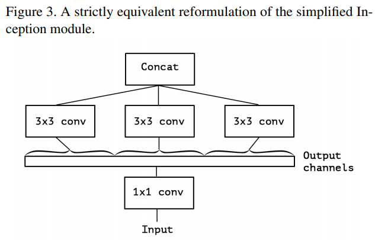
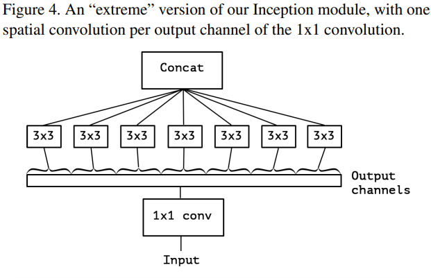

-----

| Title         | ML Tasks Image Classification Xception               |
| ------------- | ---------------------------------------------------- |
| Created @     | `2019-12-04T05:29:11Z`                               |
| Last Modify @ | `2022-12-25T17:15:10Z`                               |
| Labels        | \`\`                                                 |
| Edit @        | [here](https://github.com/junxnone/aiwiki/issues/50) |

-----

# Xception

## Reference

  - 2016 **Xception** Xception: Deep Learning with Depthwise Separable
    Convolutions \[[paper](https://arxiv.org/abs/1610.02357)\]
  - [Xception 分析](https://blog.csdn.net/lk3030/article/details/84847879)

## Brief

Xception 网络是 Inception v3 的改进, 由 `François Chollet` 于 2016
年发表，后用于MobileNet

  - 提出深度可分离卷积 - depthwise separable convolutions

## 网络结构

## Module Improve

| Name                         | Module                                                       |
| ---------------------------- | ------------------------------------------------------------ |
| 经典 Inception V3              |  |
| 简化 Inception                 |  |
| 提取 1x1 Conv                  |  |
| Xception - extreme Inception |  |

-----

**Diff with Depthwise Separable Conv**

  - Depthwise Separable Conv
      - 先对通道进行卷积再 1x1 卷积
      - 两个卷积间不带激活函数
  - Xception
      - 先1x1卷积，再对通道卷积
      - ReLU 激活
