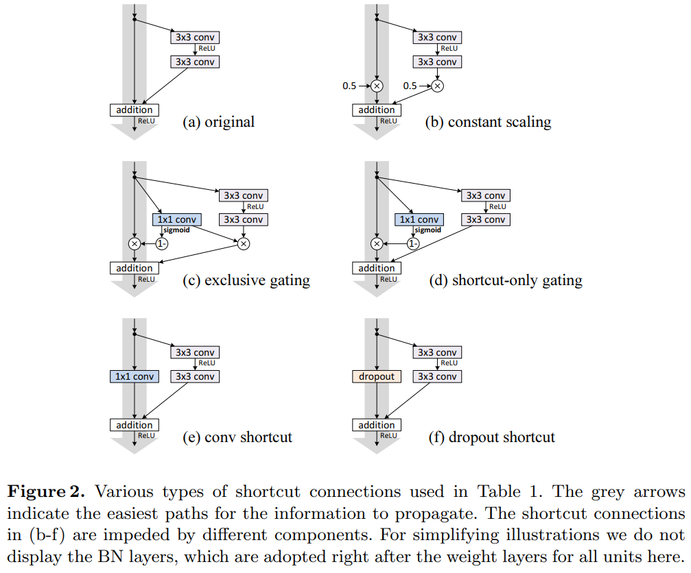

-----

| Title         | ML Tasks Image Classification ResNet                 |
| ------------- | ---------------------------------------------------- |
| Created @     | `2019-02-12T01:59:44Z`                               |
| Last Modify @ | `2022-12-24T12:43:14Z`                               |
| Labels        | \`\`                                                 |
| Edit @        | [here](https://github.com/junxnone/aiwiki/issues/51) |

-----

## Reference

  - 2015 **ResNet** Deep Residual Learning for Image Recognition
    \[[paper](https://arxiv.org/abs/1512.03385)\]
  - 2016 Identity Mappings in Deep Residual Networks
    \[[paper](https://arxiv.org/pdf/1603.05027.pdf)\]
  - [ResNet 解析](https://blog.csdn.net/lanran2/article/details/79057994)
  - [paper - Wide Residual
    Networks](https://arxiv.org/pdf/1605.07146.pdf)
  - [ResNet详解](https://www.jianshu.com/p/23c73b90657f)
  - [大话深度残差网络（DRN）ResNet网络原理](https://my.oschina.net/u/876354/blog/1622896)
  - [ResNet 分析](https://www.jianshu.com/p/d63ac154c8fc)
  - [深度学习网络篇——ResNet](https://blog.csdn.net/weixin_43624538/article/details/85049699)
  - [一文简述ResNet及其多种变体](http://baijiahao.baidu.com/s?id=1598536455758606033&wfr=spider&for=pc)
  - [极深网络（ResNet/DenseNet）: Skip
    Connection为何有效及其它](https://blog.csdn.net/malefactor/article/details/67637785)
  - [netscope -
    ResNet-50](http://ethereon.github.io/netscope/#/gist/8a6783850bd61e657234afce5196d772)

## Brief

  - ResNet - Residual Network - 残差网络
  - ResNet 提出于 2015 年，在 ImageNet 比赛 Classification 任务上获得第一名
  - 解决的问题
      - 简单地增加网络层数会导致梯度消失和梯度爆炸，表现为收敛变慢，准确率变差
      - 正则化初始化和中间的正则化层(Batch Normalization) 会导致退化问题
      - 精度下降并不是由过拟合导致的
  - 网络中增加直连通道 - shortcut connection
      - 让深度网络实现和浅层网络一样的性能，即让深度网络后面的层至少实现恒等映射的作用
  - 很多其他网络借鉴了 ResNet: Alpha zero/MobileNetv2

| 梯度消失 精度下降 |  |
| ------------ | ------------------------------------------------------------ |

## Net

-----

**ResNet 101 - 101 Layers = 1 + 33 x 3 + 1**

  - 7x7x64 卷积
  - 3x3 max poool
  - 经过3 + 4 + 23 + 3 = 33个building block，每个block为3层，所以有33 x 3 = 99层
  - 最后有个fc层(用于分类)

> 101层网络仅仅指卷积或者全连接层，而激活层或者Pooling层并没有计算在内

-----

**ResNet 34**

### shortcut connection

  - 来源于 Highway Network 的思想: 允许原始输入信息直接传到后面的层中
  - 残差：观测值与估计值之间的差。
      - 

-----

  - 
      - H(x) : 观测值
      - x : 估计值, 称为identity mapping
      - F(x) : residual mapping
  - 在极端情况下如果 identity mapping 就能达到最佳了, 则另 F(x) = 0

### building block

  - ResNet34 `buildingblock`
  - ResNet50/101/152 `bottleneck` building block\`
      - 1x1x64 到 64 channel 的 featuremap
      - 3x3x64 的卷积计算
      - 1x1x256 恢复 256 channel
      - 目的：缩小计算量，减小 training 时间
        

## Residual Network Improve

> paper - Identity Mappings in Deep Residual Networks

## 不同的 shortcut connections

-----

Result

  - 还是 `original` 比较好点

## 不同的 activation 用法

-----

Result

  - pre-activation 有所提升
      - 把 BN 和 ReLU 放在卷积的前面

