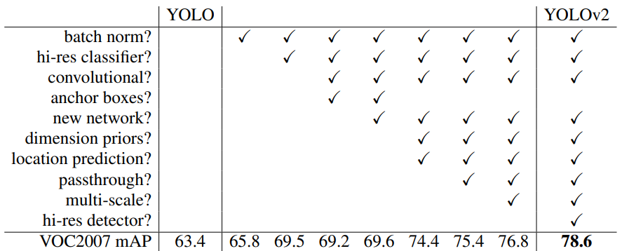
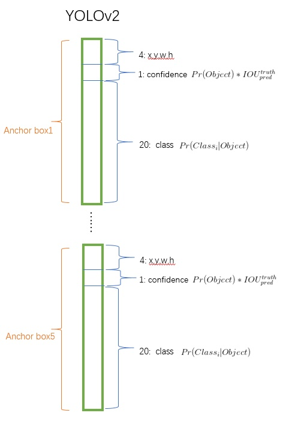
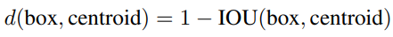
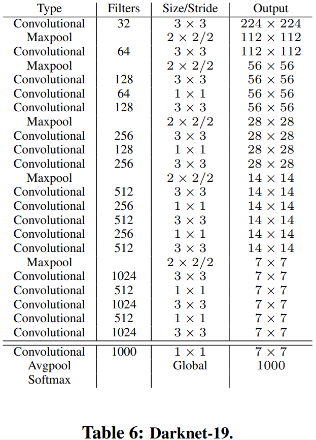
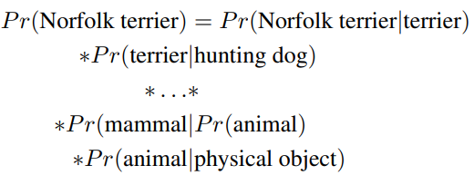
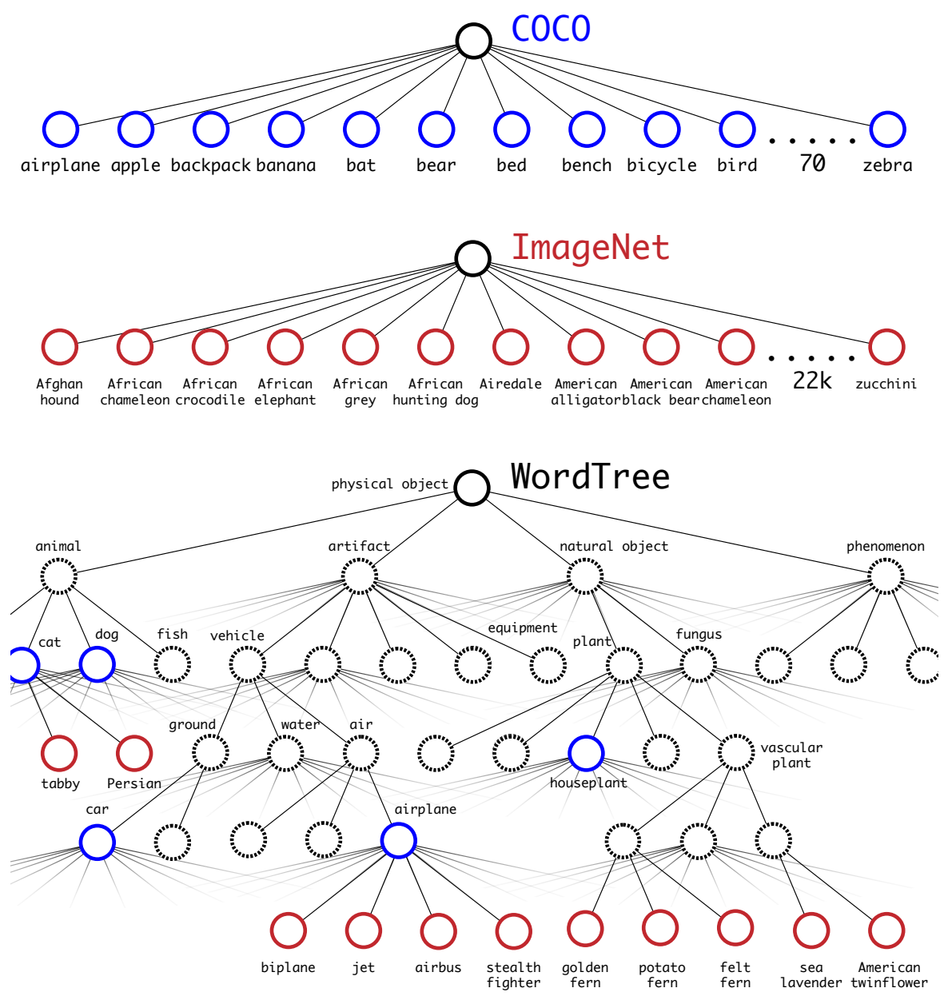
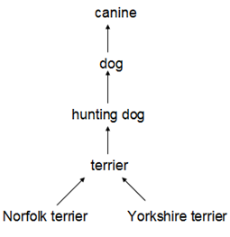

-----

| Title     | ML Tasks Image Detection YOLO V2                     |
| --------- | ---------------------------------------------------- |
| Created @ | `2020-01-14T06:37:42Z`                               |
| Updated @ | `2023-01-31T06:32:18Z`                               |
| Labels    | \`\`                                                 |
| Edit @    | [here](https://github.com/junxnone/aiwiki/issues/55) |

-----

# YOLO V2

## Reference

  - 2015 **YOLO V1** You Only Look Once: Unified, Real-Time Object
    Detection \[[paper](https://arxiv.org/pdf/1506.02640.pdf)\]
    \[[netscope](http://ethereon.github.io/netscope/#/gist/96209c6940e02b17c34009f6c3fee75e)\]
    \[[Code](https://pjreddie.com/darknet/yolo/)\] \[[Code2 -
    AlexeyAB](https://github.com/AlexeyAB/darknet)\]
  - 2016 **YOLO V2** YOLO9000: Better, Faster, Stronger
    \[[paper](https://arxiv.org/pdf/1612.08242.pdf)\]
    \[[netscope](http://ethereon.github.io/netscope/#/gist/8826fef24ed0b5086affdb6e65db26b7)\]
    \[[Code](https://pjreddie.com/darknet/yolo/)\] \[[Code2 -
    AlexeyAB](https://github.com/AlexeyAB/darknet)\]
  - [kmeans-anchor-boxes](https://github.com/lars76/kmeans-anchor-boxes)
  - [Yolo9000](https://pjreddie.com/publications/yolo9000/)
  - [Yolo V2](https://pjreddie.com/darknet/yolov2/)
  - [目标检测（九）--YOLO
    v1,v2,v3](https://blog.csdn.net/App_12062011/article/details/77554288)
  - [Yolo9000算法分析](https://blog.csdn.net/small_munich/article/details/79548149)
  - [pjreddie Publications](https://pjreddie.com/publications/)
  - [YOLO
    v2算法详解+YOLO9000介绍](https://blog.csdn.net/Chunfengyanyulove/article/details/80860870)
  - [YOLOv2 YOLOv3 如何选择先验框（priors
    anchor）（自用）](https://blog.csdn.net/Pattorio/article/details/80095511)
  - [yoloV1，看过好多篇，这篇感觉讲的最通俗易懂](https://blog.csdn.net/m0_37192554/article/details/81092514)
  - [目标检测之YOLO V2
    V3](http://www.cnblogs.com/wangguchangqing/p/10480995.html)
  - [从yolov1到yolov3](https://shartoo.github.io/2019/03/12/yolo-v123/)
  - [YOLOv1，YOLOv2，YOLOv3解读](https://blog.csdn.net/hancoder/article/details/87994678)
  - [YOLO900
    Slides](https://docs.google.com/presentation/d/14qBAiyhMOFl_wZW4dA1CkixgXwf0zKGbpw_0oHK8yEM/edit#slide=id.p)

## Brief

  - YOLO v2 Better Faster - 各种 `Tricks` 集合
  - YOLO 9000 Stronger - 联合训练
  - 分类和检测的联合训练策略

| Trick                      | Details                                                                          | Improve      |
| -------------------------- | -------------------------------------------------------------------------------- | ------------ |
| 3x3 Conv Layers            |                                                                                  |              |
| BN Layers                  | 每层卷积加入 BN Layer 去掉 Dropout                                                       | \+2% mAP     |
| 高分辨率分类器                    | 先在 ImageNet 上 使用 448x448 分辨率 fine tune 10 epochs , 再 fine tune detection on COCO | \+ 4% mAP    |
| Anchor Box                 | 使用 Anchor Boxes 替换 FC Layers predict BBox                                        | \+ 7% Recall |
| Dimension Clusters         | k-mean 聚类 BBox 获取先验值                                                             |              |
| Direct location prediction | sigmoid 约束偏移值在当前 cell 中                                                          |              |
| Fine-Grained Features      | 不同特征图融合 concat - 26x26x512 -\> 13x13x2048                                        | \+1%mAP      |
| Multi-Scale Training       | 每 10 batches 更换 输入大小 \[320, 352...608\]                                          |              |

> Anchor Box 使用了手动选择候选框, 后续的tricks 使用 Dimension Cluster 选择候选框

## Preprocessing

  - augmentation
      - random crop
      - color shifting
  - K-mean distance metric
    

## Model

### Darknet-19 - Classification

  - 移除最后一层卷积
  - 添加 3 个 3x3 的 Conv Layers - 1024 filters
  - 添加一个 1x1 的卷积 - filters = 5x(5+20) =\> (VOC)

## Training

### Training for Classification

  - initial traning
      - 160 epoch
      - input 224x224
      - 初始学习率 0.1
      - 权重衰减 0.0005
      - 动量 0.9
      - augmentation : random/crops/rotations/hue,/saturation/exposure
        shifts
  - fine tune
      - input 448x448
      - 20 epoch
      - lr 0.003

### Training for Detection

## Joint classification and detection - YOLO 9000

  - 同时使用 COCO 和 ImageNet 训练
      - ImageNet 中学习 Classification
      - COCO 中学习 Detection
  - 使用 WordTree 的方式组织 Labels
  - Oversampling 采样 COCO 数据集 达到和 ImageNet 平衡 - 比例 4:1
  - 对 COCO 中已有的类别有较好的的泛化能力，一些比较新的类别则比较差
  - anchor box 5 --\> 3
  - 反向传播
      - COCO 检测数据样本 - 正常传播
      - ImageNet 分类数据样本 - 只反向传播类别损失

### WordTree - multi-label model

  - COCO数据集的所有类别之间是互不包含的
  - ImageNet 包含从属关系的 Labels
  - ImageNet 类别来源于 WordNet

小类别概率的计算： 

  - 蓝色的是COCO数据集的类别
  - 红色的是imageNet的类别

