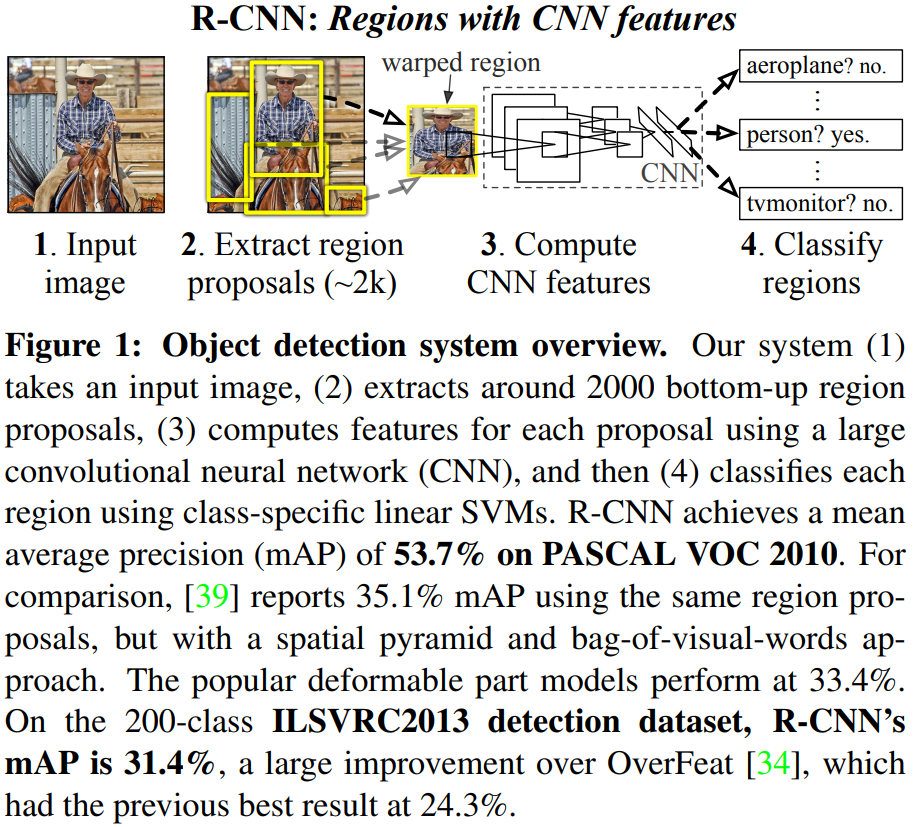

-----

| Title         | ML Tasks Image Detection RCNN                        |
| ------------- | ---------------------------------------------------- |
| Created @     | `2019-12-11T05:17:38Z`                               |
| Last Modify @ | `2022-12-24T12:44:42Z`                               |
| Labels        | \`\`                                                 |
| Edit @        | [here](https://github.com/junxnone/aiwiki/issues/57) |

-----

## Reference

  - 2014 **R-CNN** Rich feature hierarchies for accurate object
    detection and semantic segmentation
    \[[paper](https://arxiv.org/pdf/1311.2524.pdf)\]
    \[[Code](https://github.com/rbgirshick/rcnn)\]
  - [Ross Girshick blog - 一作](http://www.rossgirshick.info/)

## Brief

  - **RCNN** - `Region-based Convolutional Neural Networks`
      - Object Detection
      - Semantic Segmentation
  - 目标检测 = 目标定位 + 目标分类
  - 滑动窗口 - 提取候选框
  - ImageNet 预训练的权重在 PASCAL VOC 上 fine-tune
  - **Pipeline**
      - Region Proposals - 使用 Selective Search 方法提取 `2000 候选框`
      - Feature extraction - 提取每个候选框的特征向量 `4096 vector`
      - CNN + SVM 对每个候选框进行分类
      - NMS 去重复

-----

## 提取候选框 - Region Proposal

  - Selective Search 方法提取 Region Proposal
  - 膨胀处理 认为添加边框 - 16 pixels
  - 所有的框预处理直接 resize 到 227 x 227 作为 特征提取的输入 (CNN要求的Input)

## 提取特征向量

  - AlexNet 提取 4096 维特征向量

## 目标分类

  - SVM
  - IoU 非极大性抑制
      - 剔除重叠区域
  - SGD - lr 0.001 - mini-batch 128 = 32 positive + 96 background

## Bounding Box Regression - BBox 回归

## Semantic Segmentation

  - CPMC regions
  - full + fg

## Test Result

## Tips

  - UVA System - UVA 指 `University of Amsterdam` , 整体指论文 `Selective
    Search for Object Recognition` 中的的实现
