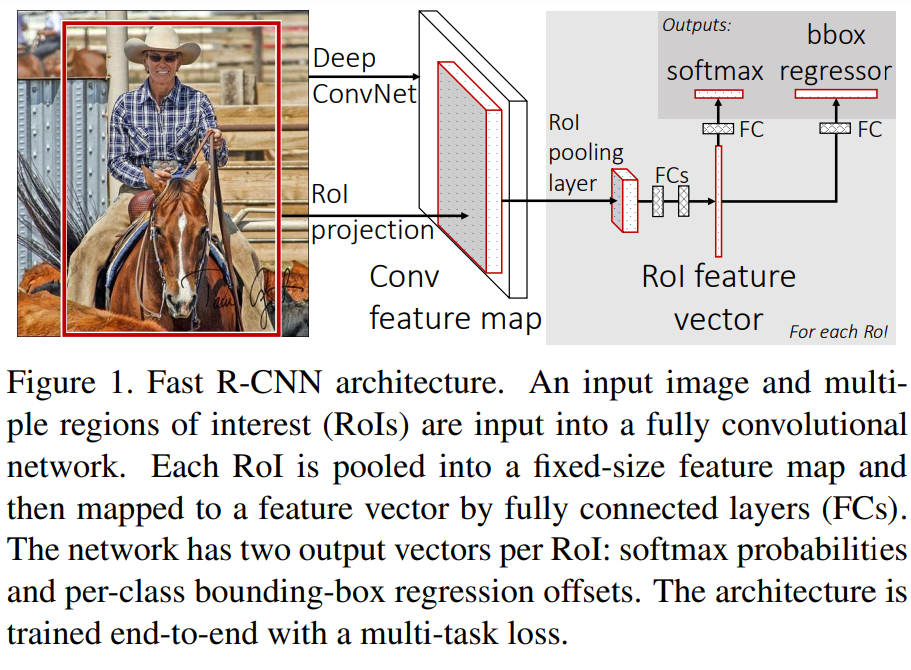
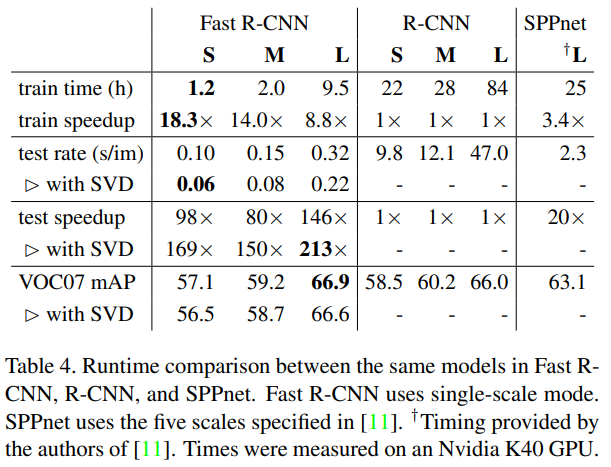

-----

| Title         | ML Tasks Image Detection FastRCNN                    |
| ------------- | ---------------------------------------------------- |
| Created @     | `2019-12-11T05:18:12Z`                               |
| Last Modify @ | `2022-12-24T12:44:55Z`                               |
| Labels        | \`\`                                                 |
| Edit @        | [here](https://github.com/junxnone/aiwiki/issues/58) |

-----

## Reference

  - 2014 **R-CNN** Rich feature hierarchies for accurate object
    detection and semantic segmentation
    \[[paper](https://arxiv.org/pdf/1311.2524.pdf)\]
    \[[Code](https://github.com/rbgirshick/rcnn)\]
  - 2015 **Fast RCNN** \[[paper](https://arxiv.org/pdf/1504.08083.pdf)\]

## Brief

  - 共享卷积层
      - 提取候选框 --\> CNN --\> 每个候选框的特征 --\> 分类+回归
      - 输入图片 --\> CNN --\> 每张候选框的特征 --\> 分类+回归
  - SVM --\> Softmax

**Steps** 　　

  - 1.在图像中确定约1000-2000个候选框 (Selective search)
  - 2.对整张图片输进CNN，得到feature map
  - 3.找到每个候选框在feature map上的映射patch，将此patch作为每个候选框的卷积特征输入到SPP layer和之后的层
  - 4.对候选框中提取出的特征，使用分类器判别是否属于一个特定类
  - 5.对于属于某一特征的候选框，用回归器进一步调整其位置

## Fast R-CNN architecture

## ROI Pooling

根据region proposals的位置坐标在特征图中将相应区域池化为固定尺寸的特征图，以便进行后续的分类和输出回归框操作

  - Input
      - CNN 输出特征图
      - Selective search ROI
  - Output
      - region\_nums x channels x W x H的向量

> **ROI Align**
> 
>   - ROI Pooling 在池化的时会对浮点数边界取整, 精度损失映射到原始图片上有可能存在很大的像素点差别。
>   - ROI Align 使用双线性内插的方法替换取整, 获得坐标浮点数的像素点上的图像数值。

## Test Result

