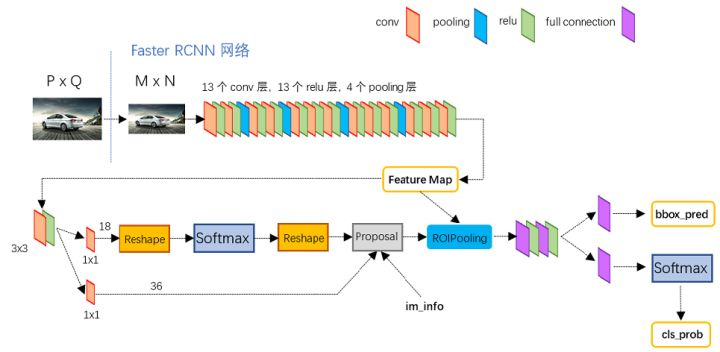
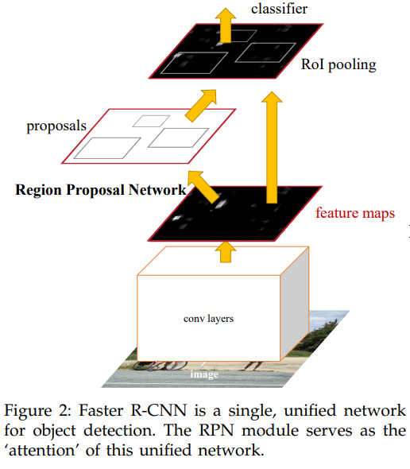
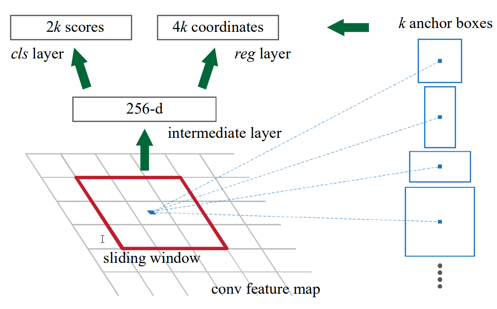

-----

| Title         | ML Tasks Image Detection FasterRCNN                  |
| ------------- | ---------------------------------------------------- |
| Created @     | `2019-06-22T08:56:17Z`                               |
| Last Modify @ | `2022-12-24T12:45:11Z`                               |
| Labels        | \`\`                                                 |
| Edit @        | [here](https://github.com/junxnone/aiwiki/issues/59) |

-----

## Reference

  - 2014 **R-CNN** Rich feature hierarchies for accurate object
    detection and semantic segmentation
    \[[paper](https://arxiv.org/pdf/1311.2524.pdf)\]
    \[[Code](https://github.com/rbgirshick/rcnn)\]
  - 2015 **Fast RCNN** \[[paper](https://arxiv.org/pdf/1504.08083.pdf)\]
  - 2016 **Faster R-CNN** Towards Real-Time Object Detection with Region
    Proposal Networks \[[paper](https://arxiv.org/pdf/1506.01497.pdf)\]
  - [Faster-rcnn实现目标检测](https://www.cnblogs.com/ywheunji/p/10375890.html)
  - [Fast
    R-CNN中的边框回归](https://www.cnblogs.com/wangguchangqing/p/10393934.html)

## Brief

  - faster-rcnn把获取feature map，候选区域选取，回归和分类等操作全部融合在一个深层网络当中，效率较前两种提升了很多。
  - **Pipeline**
      - 对整张图片输进CNN，得到feature map
      - 卷积特征输入到RPN，得到候选框的特征信息
      - 对候选框中提取出的特征，使用分类器判别是否属于一个特定类
      - 对于属于某一特征的候选框，用回归器进一步调整其位置
  - [RCNN VS Fast RCNN VS Faster
    RCNN](/RCNN_VS_Fast_RCNN_VS_Faster_RCNN)

## Arch

## RPN - Region Proposal Networks

## 

  - 3X3 卷积滑动窗口，映射到低维特征
      - ZF model - 256-d
      - VGG model - 512-d
  - ReLU
  - box-regression layer
      - 4k coordinates \[default k = 9\]
  - box-classification layer
      - 2k scores \[是否为目标\]

-----

## Output

