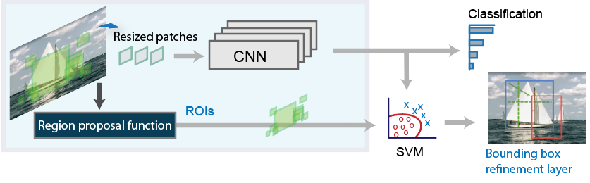
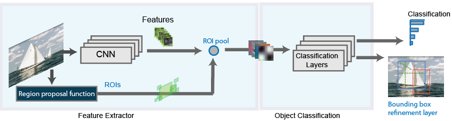
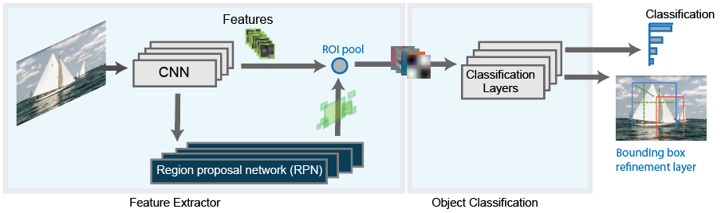

-----

| Title         | ML Tasks Image Detection RCNNs                       |
| ------------- | ---------------------------------------------------- |
| Created @     | `2019-01-28T05:36:24Z`                               |
| Last Modify @ | `2022-12-25T17:15:44Z`                               |
| Labels        | \`\`                                                 |
| Edit @        | [here](https://github.com/junxnone/aiwiki/issues/60) |

-----

# RCNN VS Fast RCNN VS Faster RCNN

## Reference

  - [基于深度学习的目标检测技术演进：R-CNN、Fast R-CNN、Faster
    R-CNN](https://www.cnblogs.com/skyfsm/p/6806246.html)
  - [CVPR 2019 |
    天秤座R-CNN：全面平衡的目标检测器](https://www.jiqizhixin.com/articles/2019-04-26-12)
  - [Getting Started with R-CNN, Fast R-CNN, and Faster
    R-CNN](https://in.mathworks.com/help/vision/ug/getting-started-with-r-cnn-fast-r-cnn-and-faster-r-cnn.html)
  - [Object Detection for Dummies Part 3: R-CNN
    Family](https://lilianweng.github.io/lil-log/2017/12/31/object-recognition-for-dummies-part-3.html)

## Diff

| Pipeline                                                     |
| ------------------------------------------------------------ |
| R-CNN                                                        |
|  |
| Fast R-CNN                                                   |
|  |
| Faster R-CNN                                                 |
|  |

## RCNN

1.在图像中确定约1000-2000个候选框 (使用选择性搜索)  
2\. 每个候选框内图像块缩放至相同大小，并输入到CNN内进行特征提取  
3.对候选框中提取出的特征，使用分类器判别是否属于一个特定类  
4.对于属于某一特征的候选框，用回归器进一步调整其位置

## Fast RCNN

1.在图像中确定约1000-2000个候选框 (使用选择性搜索)  
2.对整张图片输进CNN，得到feature map  
3.找到每个候选框在feature map上的映射patch，将此patch作为每个候选框的卷积特征输入到SPP layer和之后的层  
4.对候选框中提取出的特征，使用分类器判别是否属于一个特定类  
5.对于属于某一特征的候选框，用回归器进一步调整其位置

## Faster RCNN

1.对整张图片输进CNN，得到feature map  
2.卷积特征输入到RPN，得到候选框的特征信息  
3.对候选框中提取出的特征，使用分类器判别是否属于一个特定类  
4.对于属于某一特征的候选框，用回归器进一步调整其位置
