-----

| Title         | CV Edge                                              |
| ------------- | ---------------------------------------------------- |
| Created @     | `2020-11-12T07:09:54Z`                               |
| Last Modify @ | `2022-12-23T14:39:44Z`                               |
| Labels        | \`\`                                                 |
| Edit @        | [here](https://github.com/junxnone/aiwiki/issues/65) |

-----

# 边缘

## Reference

  - [Prewitt operator](https://en.wikipedia.org/wiki/Prewitt_operator)
  - [梯度与Roberts、Prewitt、Sobel、Lapacian算子](https://blog.csdn.net/swj110119/article/details/51777422)
  - 1970 [Object enhancement and
    extraction](http://web.eecs.utk.edu/~hqi/ece472-572/reference/edge-Prewitt70.pdf)
  - [数字图像处理:边缘检测(Edge detection)](https://zhuanlan.zhihu.com/p/59640437)
  - [Awesome-Edge-Detection-Papers](https://github.com/MarkMoHR/Awesome-Edge-Detection-Papers)
  - [传统实现 - prewitt/laplace/sobel/scharr/Canny
    ](https://github.com/butub1/Edge-detection)

## Brief

  - Roberts
  - Prewitt
  - Sobel
  - Scharr
  - [Canny](/Edge_Detection_Canny)
  - Marr-Hildreth

> DL 中一般使用 `Object Contour Detection` & `Semantic Segmentation` 检测边缘

## Roberts

  - 用于图像锐化
  - 计算量小
  - 结果边缘不平滑

| Original     | Vertical - Positive                                          | Horizontal - Negative                                        |
| ------------ | ------------------------------------------------------------ | ------------------------------------------------------------ |
| Computations | 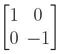 | 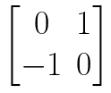 |
| Pixel 权重     |  | 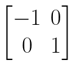 |

## Prewitt

| Original                                                     | Vertical                                                     | Horizontal                                                   |
| ------------------------------------------------------------ | ------------------------------------------------------------ | ------------------------------------------------------------ |
| Computations                                                 | 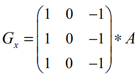 | 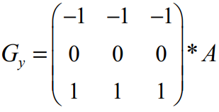 |
| Pixel 权重                                                     | 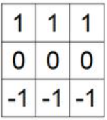 | 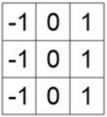 |
| 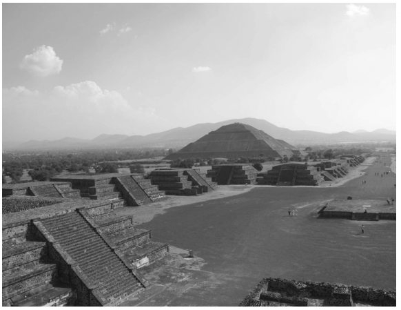 | 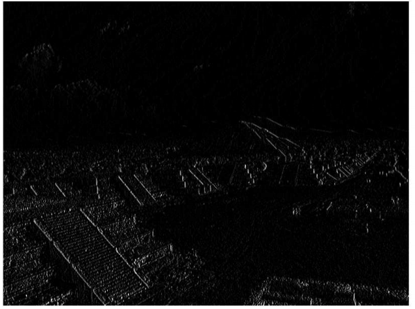 | 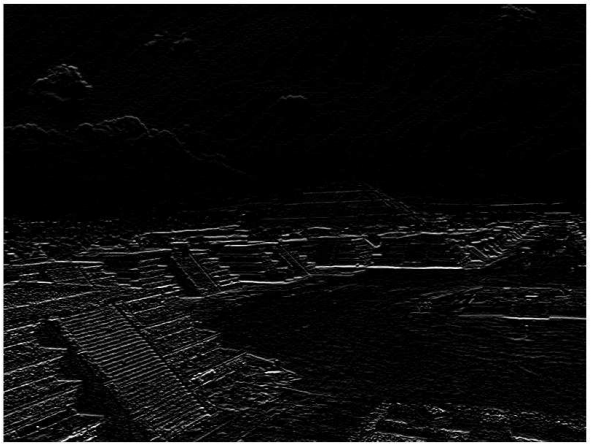 |

## Sobel

  - 相比 `prewitt` 增加了权重

| Direction    | Vertical - Gx                                                | Horizontal - Gy                                              |
| ------------ | ------------------------------------------------------------ | ------------------------------------------------------------ |
| Computations | 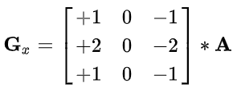 | 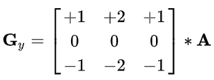 |
| Pixel 权重     | 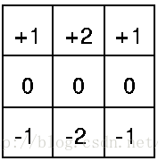 | 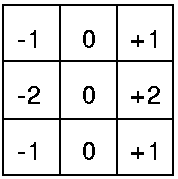 |

## Scharr

  - 使用了更大的权重

| Direction    | Vertical - Gx                                                | Horizontal - Gy                                              |
| ------------ | ------------------------------------------------------------ | ------------------------------------------------------------ |
| Computations | 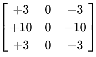 | 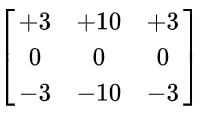 |
| Pixel 权重     | 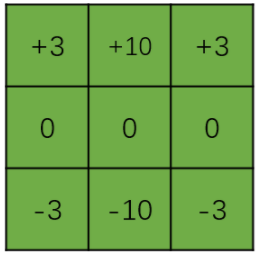 | 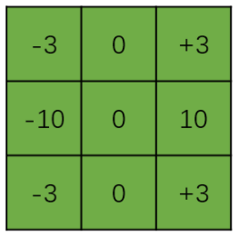 |

## Prewitt vs Sobel vs Scharr

| Original                                                     | Roberts                                                      | Prewitt                                                      | Sobel                                                        | Scharr                                                       |
| ------------------------------------------------------------ | ------------------------------------------------------------ | ------------------------------------------------------------ | ------------------------------------------------------------ | ------------------------------------------------------------ |
|  | 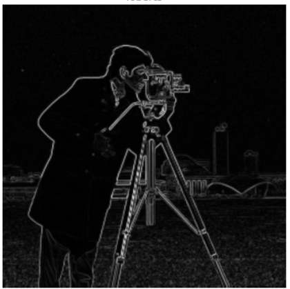 | 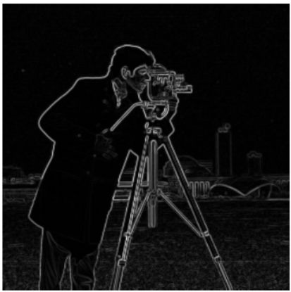 | 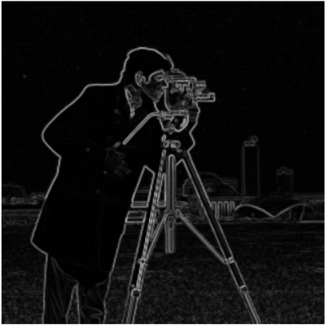 | 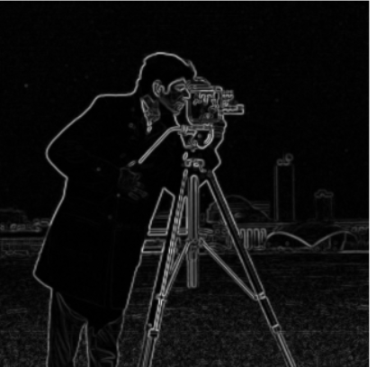 |
