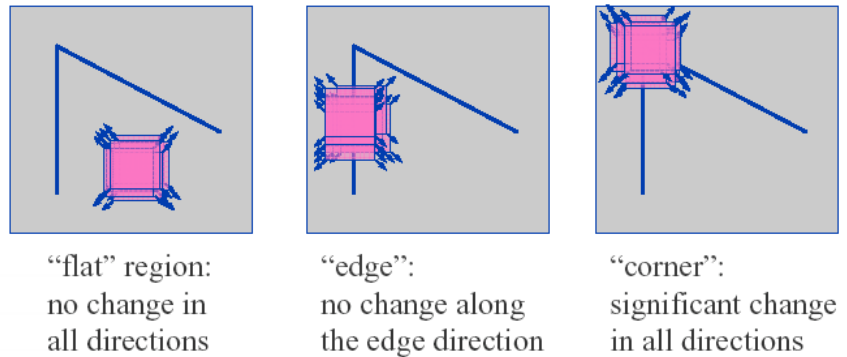

-----

| Title         | CV Feature Harris                                    |
| ------------- | ---------------------------------------------------- |
| Created @     | `2020-11-06T10:24:21Z`                               |
| Last Modify @ | `2022-12-23T14:42:02Z`                               |
| Labels        | \`\`                                                 |
| Edit @        | [here](https://github.com/junxnone/aiwiki/issues/67) |

-----

# Harris Corner

## Reference

  - 1988 [A COMBINED CORNER AND EDGE
    DETECTOR](https://web.stanford.edu/class/cs231m/references/harris-stephens.pdf)
  - [Harris Corner Detector -
    wikipedia](https://en.wikipedia.org/wiki/Harris_Corner_Detector)
  - [图像处理特征不变算子系列之Harris算子](https://blog.csdn.net/kezunhai/article/details/11265167)
  - [Harris Corner Detection -
    OpenCV](https://www.docs.opencv.org/4.0.0/dc/d0d/tutorial_py_features_harris.html)
  - [An Analysis and Implementation of the Harris Corner
    Detector](https://ipolcore.ipol.im/demo/clientApp/demo.html?id=229)
  - [slides - Harris Corner
    Detector](https://www.slideshare.net/shihweihuang39/harris-corner-detector-and-face-recognition)
  - [A Comparative Study between Moravec and Harris Corner Detection of
    Noisy Images Using Adaptive Wavelet Thresholding
    Technique](https://arxiv.org/ftp/arxiv/papers/1209/1209.1558.pdf)
  - [feature -
    ppt](https://www.csie.ntu.edu.tw/~cyy/courses/vfx/07spring/lectures/handouts/lec04_feature_4up.pdf)
  - [Harris 角点 - 计算机视觉 北京邮电大学
    鲁鹏](https://www.bilibili.com/video/BV1nz4y197Qv?p=6)
  - [The Shi-Tomasi Corner
    Detector](https://aishack.in/tutorials/shitomasi-corner-detector/)
  - [Subpixel Corners: Increasing
    accuracy](https://aishack.in/tutorials/subpixel-corners-increasing-accuracy/)
  - [亚像素角点的求法](https://xueyayang.github.io/pdf_posts/%E4%BA%9A%E5%83%8F%E7%B4%A0%E8%A7%92%E7%82%B9%E7%9A%84%E6%B1%82%E6%B3%95.pdf)

## Brief

  - 1988 Harris Corner Detector Harris\&Stephens

| 检测原理                                                         |
| ------------------------------------------------------------ |
|  |

-----

**公式推导**

| 响应公式 |  |
| ---- | ------------------------------------------------------------ |
| 窗口函数 |  |

| 窗口图解 |  |  |
| ---- | ------------------------------------------------------------ | ------------------------------------------------------------ |

**通过 `泰勒展开式` 简化 为 u,v 相关的函数**

|  |  |  |
| ------------------------------------------------------------ | ------------------------------------------------------------ | ------------------------------------------------------------ |

|  |                                                                                                                                     |
| ------------------------------------------------------------ | ----------------------------------------------------------------------------------------------------------------------------------------------------------------------------------------------- |
|  |       |
|  |                                                                                                                                     |

## Pipelines

1.  Compute Gaussian derivatives at each pixel
2.  Compute second moment matrix M in a Gaussian window around each
    pixel
3.  Compute corner response function R
4.  Threshold R
5.  Find local maxima of response function(NMS)

## 扩展

### Shi-Tomasi

  - 减少计算量
  -  ==\>
    

|  |
| ------------------------------------------------------------ |
|  |

-----

**Harris vs Shi-Tomasi**

### Subpixel Corners

  - 增加精确度
  - Pixel - (56, 120)
      - Subpixel - (56.768, 120.1432)
