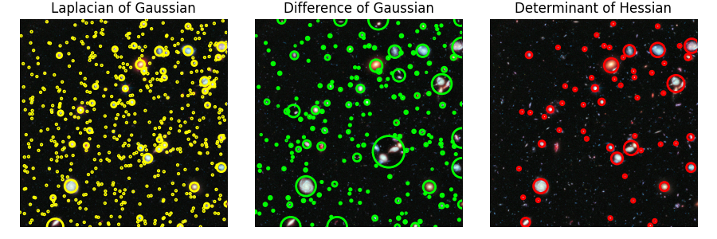
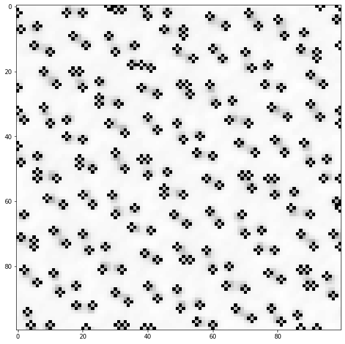

-----

| Title         | CV Blob                                              |
| ------------- | ---------------------------------------------------- |
| Created @     | `2020-11-10T07:04:47Z`                               |
| Last Modify @ | `2022-12-23T14:43:23Z`                               |
| Labels        | \`\`                                                 |
| Edit @        | [here](https://github.com/junxnone/aiwiki/issues/68) |

-----

# Blob Detection

## Reference

  - [Blob detection
    -Wikipedia](https://en.wikipedia.org/wiki/Blob_detection)
  - [Blob Detection -
    scikit-image](https://scikit-image.org/docs/dev/auto_examples/features_detection/plot_blob.html#sphx-glr-auto-examples-features-detection-plot-blob-py)
  - [Blob-Detect](https://www.cnblogs.com/brt3/p/11421191.html)

## Brief

  - LoG - `Laplacian of Gaussian`
  - DoG - `Difference of Gaussian`
  - DoH - `Determinant of Hessian`

| 应用           | Examples                                                     |
| ------------ | ------------------------------------------------------------ |
| 应用于 Counting |  |
