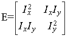
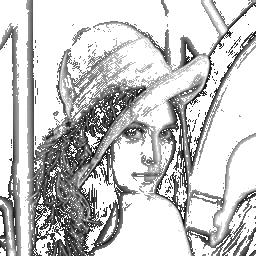
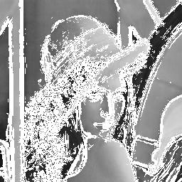
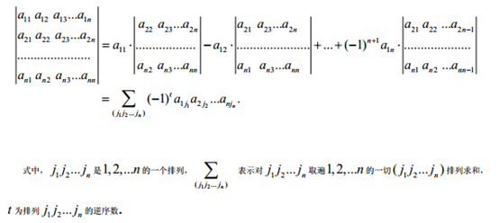
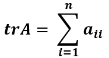

-----

| Title         | CV StructureTensor                                   |
| ------------- | ---------------------------------------------------- |
| Created @     | `2020-11-08T06:53:20Z`                               |
| Last Modify @ | `2022-12-23T14:45:43Z`                               |
| Labels        | \`\`                                                 |
| Edit @        | [here](https://github.com/junxnone/aiwiki/issues/70) |

-----

# Structure Tensor 结构张量

## Reference

  - [Structure tensor -
    wikipedia](https://en.wikipedia.org/wiki/Structure_tensor)
  - [结构张量structure
    tensor](https://blog.csdn.net/u011596455/article/details/71809311)

## Brief

  - 区分图像的`平坦区域/边缘区域/角点区域`
  - 矩阵

|  | Ix - x 方向的梯度 Iy - y 方向的梯度              |
| ------------------------------------------------------------ | ----------------------------------------- |
| 矩阵 E 的 迹 H = trace(E)                                     | `H =0` 为平坦区域                              |
| 矩阵 E 的 行列式 K = det(E)                                     | `K=0 & H > 0` 为边缘区域  `H>0 & K>0` 为角点区域 |

| 原图                                                           | 平坦区域                                                         | 边缘区域                                                         | 角点                                                           |
| ------------------------------------------------------------ | ------------------------------------------------------------ | ------------------------------------------------------------ | ------------------------------------------------------------ |
|  |  |  |  |

## Others

| 矩阵的行列式          |               |
| --------------- | ------------------------------------------------------------------------- |
| **矩阵的迹(trace)** | 对角线元素的总和   |
