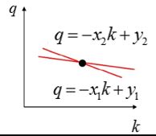
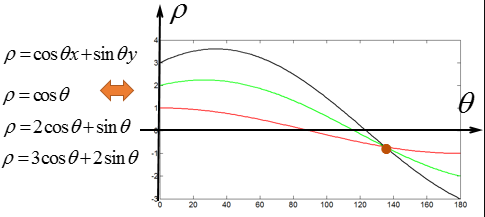

-----

| Title         | CV HoughTransform                                    |
| ------------- | ---------------------------------------------------- |
| Created @     | `2020-11-10T06:34:44Z`                               |
| Last Modify @ | `2022-12-27T02:37:29Z`                               |
| Labels        | \`\`                                                 |
| Edit @        | [here](https://github.com/junxnone/aiwiki/issues/71) |

-----

# Hough Transform 霍夫变换

## Reference

  - [Hough transform -
    Wikipedia](https://en.wikipedia.org/wiki/Hough_transform)
  - [Generalised Hough transform -
    Wikipedia](https://en.wikipedia.org/wiki/Generalised_Hough_transform)
  - [霍夫变换](https://www.cnblogs.com/php-rearch/p/6760683.html)
  - [Hough Transform](http://homepages.inf.ed.ac.uk/rbf/HIPR2/hough.htm)
  - [【OpenCV入门教程之十四】OpenCV霍夫变换：霍夫线变换，霍夫圆变换合辑](https://blog.csdn.net/poem_qianmo/article/details/26977557/)

## Brief

  - 霍夫变换于1962年由PaulHough首次提出
  - 将在一个空间中具有相同形状的曲线或直线映射到另一个坐标空间的一个点上形成峰值，从而把检测任意形状的问题转化为统计峰值问题
  - 霍夫线
  - 霍夫圆

| Line Detection                                               | Circle Detection                                             |
| ------------------------------------------------------------ | ------------------------------------------------------------ |
|  |  |

## 霍夫线变换原理

  - 如果笛卡尔坐标系的点共线，这些点在霍夫空间对应的直线交于一点
  - 找到图像中每个点对应的直线，多条直线的交点对应图像中的直线

| Name  | 笛卡尔坐标                                                        | 霍夫空间                                                         |
| ----- | ------------------------------------------------------------ | ------------------------------------------------------------ |
| 公式    | `y = kx + q`                                                 |  |
| 相应线点  |  |  |
| 两个点   |  |  |
| k = ∞ |  | :? ==\> 使用极坐标系                                               |
| 极坐标系  |  |  |

  - **k = ∞**

> 

-----

  - [ OpenCV Examples](https://github.com/junxnone/aiwiki/issues/340)
