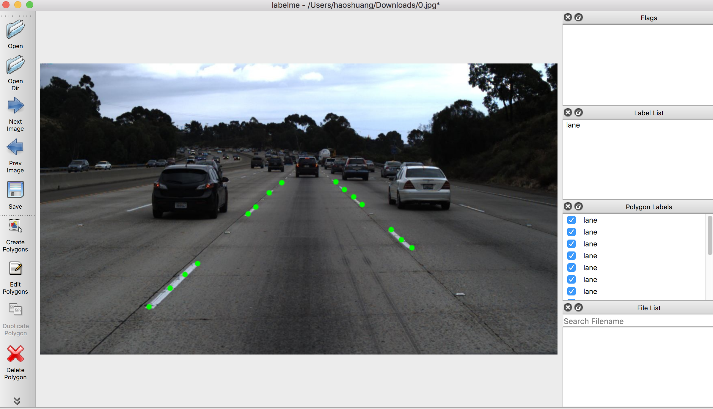
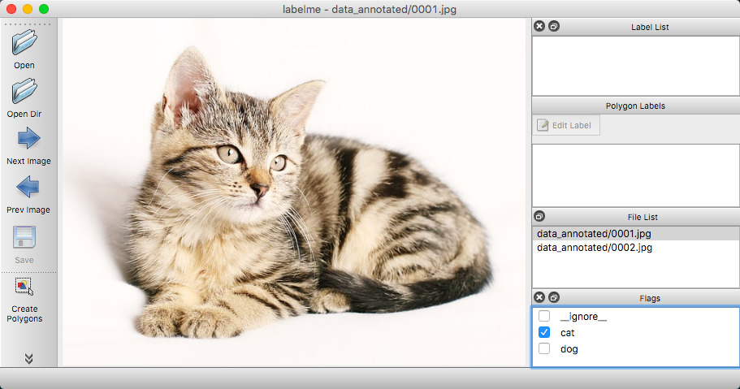
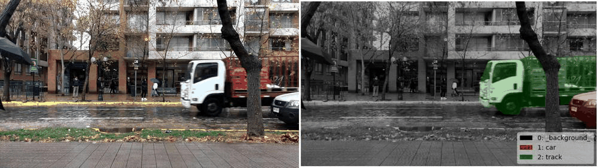
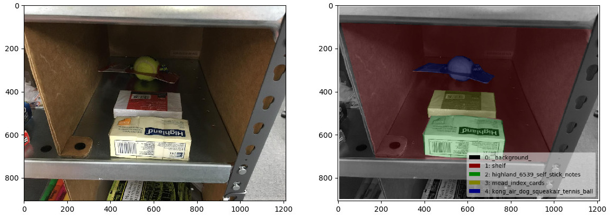

-----

| Title         | Tools Label Labelme                                  |
| ------------- | ---------------------------------------------------- |
| Created @     | `2020-04-15T05:50:14Z`                               |
| Last Modify @ | `2022-12-25T04:16:35Z`                               |
| Labels        | \`\`                                                 |
| Edit @        | [here](https://github.com/junxnone/aiwiki/issues/74) |

-----

## Reference

  - [Github repo](https://github.com/wkentaro/labelme)
  - [pylabelme - mpitid --\>
    labelme\_python](https://github.com/mpitid/pylabelme)

## Brief

  - Label Classification/ObjectDetection/Segmentation/KeyPoint
  - Label Image/Video
  - Label Polygon/Rectange/Circle/Line/Point
  - Export COCO/VOC format

| Label          | Image                                                                                                |
| -------------- | ---------------------------------------------------------------------------------------------------- |
| circle/polygon |  |
| rectangle      |  |
| point          |                                             |

## Install

  - host - pip/brew
  - docker

## UseCase

### [Calssification](https://github.com/wkentaro/labelme/tree/master/examples/classification)

    labelme data_annotated --flags flags.txt --nodata

### Detection BBox

    labelme data_annotated --labels labels.txt --nodata --autosave

### Segmentation

  - Semantic

<!-- end list -->

    labelme data_annotated --labels labels.txt --nodata --validatelabel exact --config '{shift_auto_shape_color: -2}'

  - Instance

<!-- end list -->

    labelme data_annotated --labels labels.txt --nodata --validatelabel exact --config '{shift_auto_shape_color: -2}'
    labelme data_annotated --labels labels.txt --nodata --labelflags '{.*: [occluded, truncated], person-\d+: [male]}'

### [Video](https://github.com/wkentaro/labelme/tree/master/examples/video_annotation)

    labelme data_annotated --labels labels.txt --nodata --keep-prev --config '{shift_auto_shape_color: -2}'

## Visualization

    labelme_draw_json apc2016_obj3.json

## Convert VOC/COCO

  - Instance Segmentation to VOC

<!-- end list -->

    ./labelme2voc.py data_annotated data_dataset_voc --labels labels.txt

  - Instance Segmentation to COCO

<!-- end list -->

    ./labelme2coco.py data_annotated data_dataset_coco --labels labels.txt
