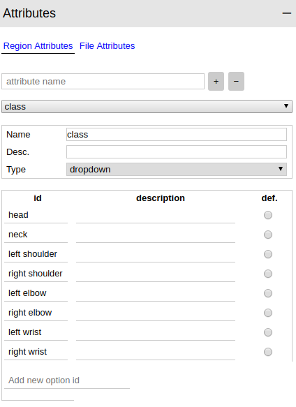

-----

| Title         | Tools Label VGG                                      |
| ------------- | ---------------------------------------------------- |
| Created @     | `2019-01-18T02:14:53Z`                               |
| Last Modify @ | `2022-12-25T04:17:14Z`                               |
| Labels        | \`\`                                                 |
| Edit @        | [here](https://github.com/junxnone/aiwiki/issues/75) |

-----

# VIA VGG Image Annotator

# Reference

  - [VGG Image Annotator
    (VIA)](http://www.robots.ox.ac.uk/~vgg/software/via/)
  - [Gitlab repo](https://gitlab.com/vgg/via/tags/via-2.0.5)

# Brief

  - VIA - VGG Image Annotator

## Download

    wget https://gitlab.com/vgg/via/-/archive/via-2.0.5/via-via-2.0.5.zip

# UseCase

## Start

Open the file via.html to start the app.

## Attributes

