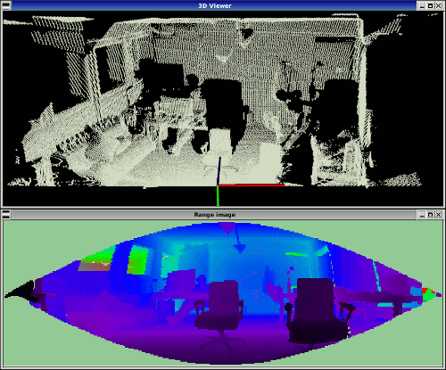

-----

| Title         | 3D Tools PCL RangeImage                              |
| ------------- | ---------------------------------------------------- |
| Created @     | `2021-05-24T02:19:25Z`                               |
| Last Modify @ | `2022-12-25T17:21:16Z`                               |
| Labels        | \`\`                                                 |
| Edit @        | [here](https://github.com/junxnone/aiwiki/issues/84) |

-----

# Range Image

## Reference

  - [Range Image -
    pcl](https://pcl.readthedocs.io/en/latest/walkthrough.html?highlight=range%20image#range-image)

## Brief

> A range image (or depth map) is an image whose pixel values represent
> a distance or depth from the sensor’s origin

  - Range Image \<--\> Point Cloud
  - 视角 - Camera 作为 原点

  - Green - `-INFINITY` - 不可见区域
  - Blue - 远程

## UseCase
