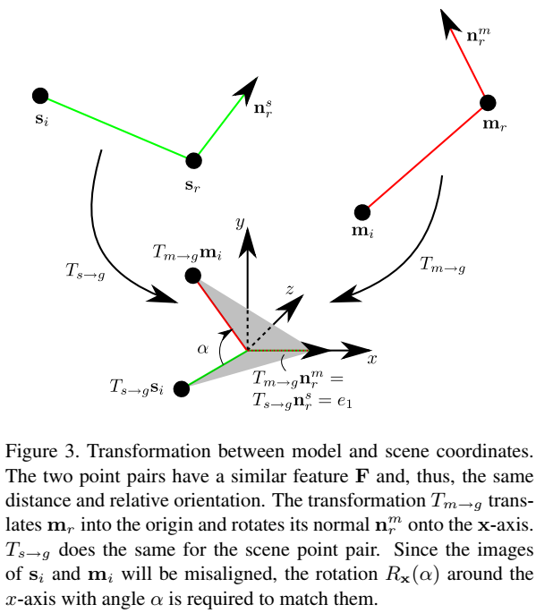
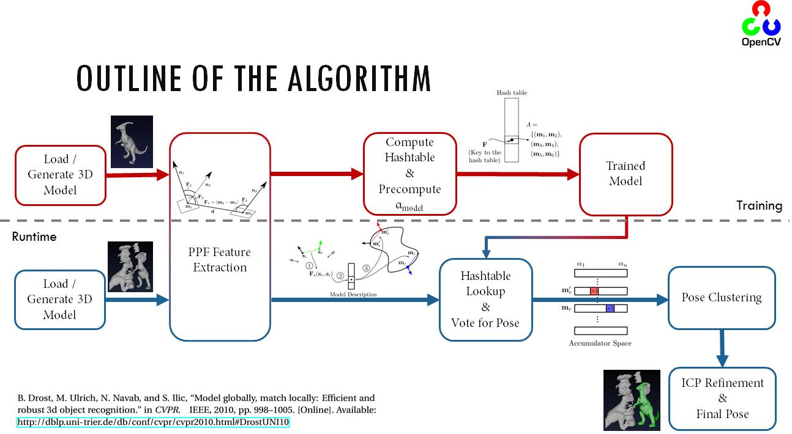
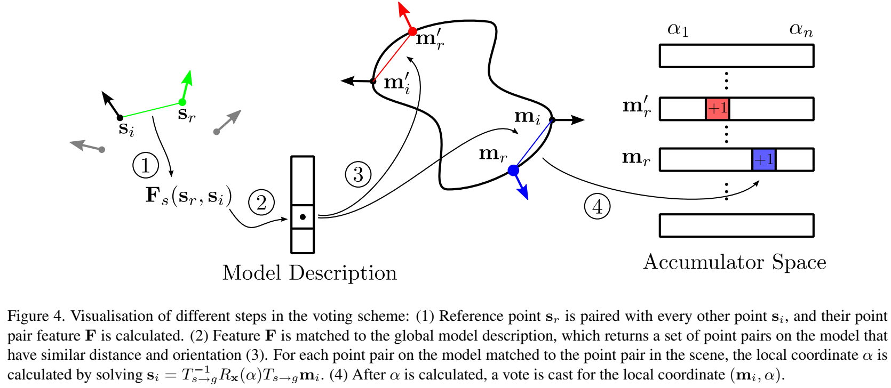

-----

| Title         | 3D Algos Registration PPF                            |
| ------------- | ---------------------------------------------------- |
| Created @     | `2021-04-29T02:09:42Z`                               |
| Last Modify @ | `2022-12-25T03:42:56Z`                               |
| Labels        | \`\`                                                 |
| Edit @        | [here](https://github.com/junxnone/aiwiki/issues/85) |

-----

# PPF 粗配准

## Reference

  - 2010 **\[xxx\]** Model Globally, Match Locally: Efficient and Robust
    3D Object
    Recognition\[[Paper](http://campar.in.tum.de/pub/drost2010CVPR/drost2010CVPR.pdf)\]
    \[[Code]()\]
  - [【6D位姿估计】Point Pair Feature
    (PPF)](https://zhuanlan.zhihu.com/p/94952276)
  - [Surface Matching Algorithm Through 3D Features -
    OpenCV](https://docs.opencv.org/3.0-beta/modules/surface_matching/doc/surface_matching.html)
  - [刚性物体6D位姿估计方法简述](https://www.hanchine.com/newInfo_131.html)

## Brief

  - PPF - `Point Pair Feature`
  - Global Model Description (F-PP Hash Table)

## Motivation

  - 背景/存在的问题
  - 做了什么尝试/分别有什么效果
  - 应用领域

## PPF

| PPF                         | $F(m\_{1},m\_{2})=(F\_{1}, F\_{2}, F\_{3}, F\_{4})=(\\left|\\left| d \\right| \\right|*{2}, \\angle (n*{1},d), \\angle (n\_{2},d), \\angle (n\_{1},n\_{2}))$ |
| --------------------------- | ------------------------------------------------------------------------------------------------------------------------------------------------------------ |
| m1/m2                       | 两个点                                                                                                                                                          |
| n1/n2                       | 法向量                                                                                                                                                          |
| d = m2-m1                   | m1 到 m2 的距离                                                                                                                                                  |
| $\\angle (n\_{x},d/n\_{y})$ | `法向量` 和 `两点连线`的夹角/ 法向量的夹角                                                                                                                                    |

| 图解 (F1, F2, F3, F4) |  |
| ------------------- | ---------------------------------------------------------------------------------------------------------------------------- |

### 通过 PPF 计算转换矩阵

  - Sence 中存在点 $(s\_{i}, s\_{r})$ 与 Model 中点 $(m\_{i}, m\_{r})$ 存在相似的
    PPF
  - 将 $m\_{r}$ 经过矩阵 $T\_{m \\to g}$ 平移到原点, 并旋转法向量 $n\_{r}^{m}$ 到 x 轴
  - 将 $s\_{r}$ 经过矩阵 $T\_{s \\to g}$ 平移到原点, 并旋转法向量 $n\_{r}^{s}$ 到 x 轴
  - 令 $\\alpha$ 为 $s\_{i}$ 围绕 x 轴旋转到 $m\_{i}$ 的角度
  - $s\_{i} = T\_{s \\to g}^{-1}R\_{x}(\\alpha)T\_{m \\to g}m\_{i}$

| 图解 |  |
| -- | ------------------------------------------------------------ |

## Pipeline

  - 选取 3D 模型中的参考点
      - 设定搜索半径, 搜索参考点周围区域内的点对
      - `选择离参考点最近的几个点`
  - 构建 PPF 特征
      - 计算 点对 (mi, mj) 的 PPF
  - 构建 **Global Model Description** `Hash Table` - `key = F` / `Value =
    Point Pair`
  - **Voting** 对于 (sr, si) 查找对应的 (mr, mi) 计算出 α, 取最大投票的 (mr, α)

## Voting

  - 定义一个 （Nm, Nα）的矩阵用来记录投票
    

# Evaluation

# Tricks

  - Efficient Voting Loop - 减少计算量
  - Pose Clustering - 增加算法稳定性
      - 多个 voting 结果一致，先做聚类，取最多的，然后取均值
