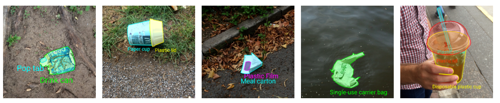
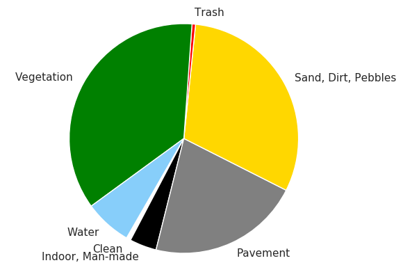
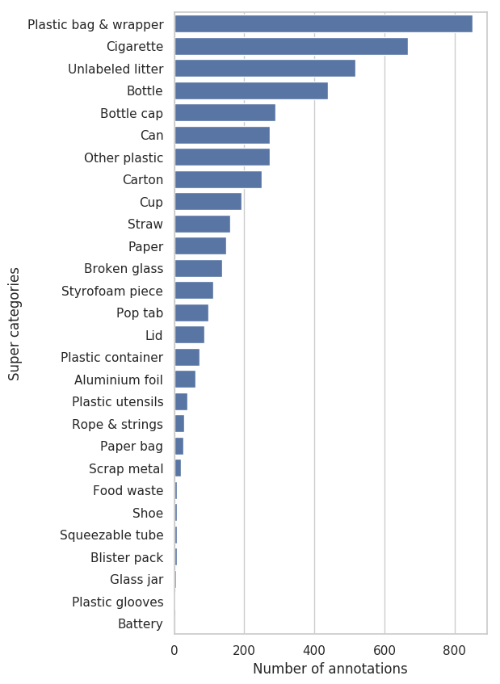
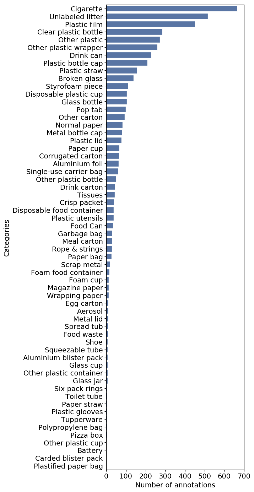

-----

| Title         | Datasets Image2D Segmentation TACO                   |
| ------------- | ---------------------------------------------------- |
| Created @     | `2020-04-15T08:05:46Z`                               |
| Last Modify @ | `2022-12-25T17:25:59Z`                               |
| Labels        | \`\`                                                 |
| Edit @        | [here](https://github.com/junxnone/aiwiki/issues/89) |

-----

  - Trash Segmentation

## Reference

  - [Github repo](https://github.com/pedropro/TACO)
  - [online annootation tools](http://tacodataset.org/annotate)

## Brief

## stats

> stas `@2020.04.15`

  - 1500 images
  - 4784 annotations
  - 28 super (top) categories
  - 60 categories

| Scene proportion                                             | super category                                               | category                                                     |
| ------------------------------------------------------------ | ------------------------------------------------------------ | ------------------------------------------------------------ |
|  |  |  |
