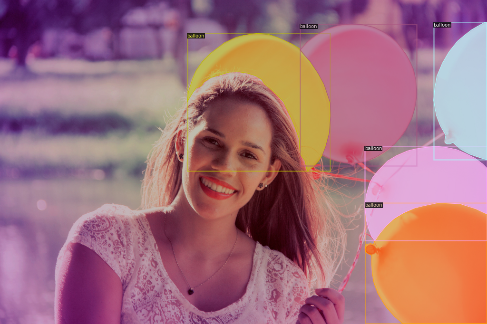

-----

| Title         | Datasets Image2D Segmentation Balloon                |
| ------------- | ---------------------------------------------------- |
| Created @     | `2020-04-15T08:30:13Z`                               |
| Last Modify @ | `2022-12-25T17:24:02Z`                               |
| Labels        | \`\`                                                 |
| Edit @        | [here](https://github.com/junxnone/aiwiki/issues/90) |

-----

## Reference

  - [Github
    Download 37MB](https://github.com/matterport/Mask_RCNN/releases)

## Brief

  - Images
      - Train - `61 images`
      - Val - `13 images`
  - Annotations
      - VIA label format json - `polygon`
  - 有单个/多个/重叠 balloon

-----

