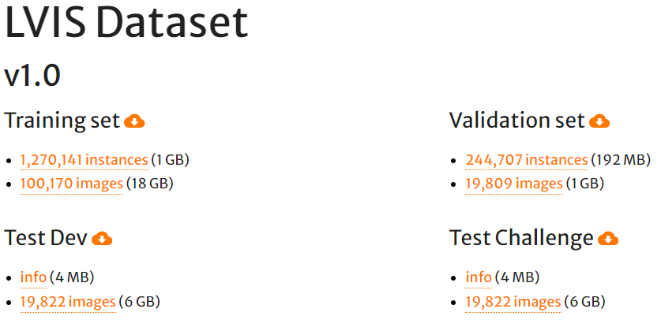
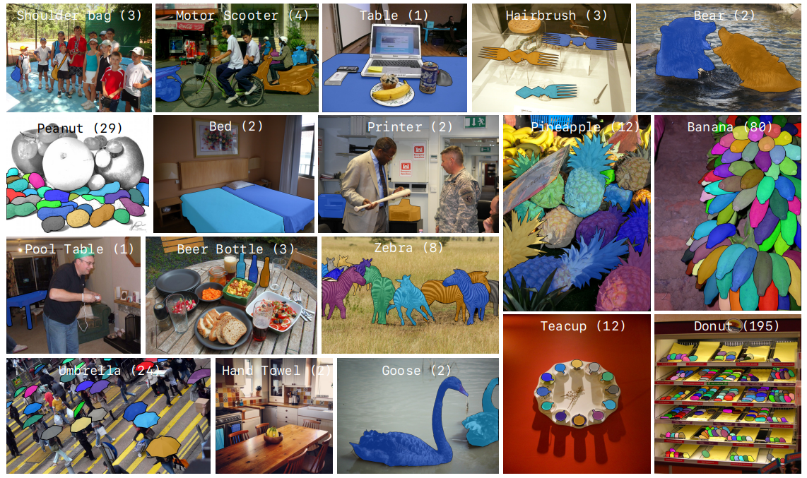
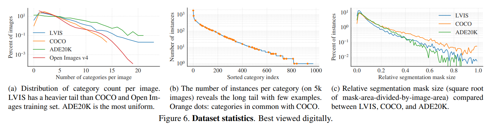

-----

| Title     | Datasets Image2D Segmentation LVIS                   |
| --------- | ---------------------------------------------------- |
| Created @ | `2020-04-22T09:05:35Z`                               |
| Updated @ | `2024-10-14T06:35:52Z`                               |
| Labels    | \`\`                                                 |
| Edit @    | [here](https://github.com/junxnone/aiwiki/issues/94) |

-----

# LVIS

  - 1000+ categories
  - 164k images
  - LVIS 使用 COCO 2017 images, 只是使用了 LVIS 自己的 annotations.
  - 使用 `WordNet` 定义类别
  - annotations 类似 `COCO format`
      - 只使用 `polygons`
  - 使用 [LVIS-API](https://github.com/lvis-dataset/lvis-api) 访问数据





## Data

  - “**Train**” 子集包含 10 万张图像，用于训练对象检测、分割和字幕模型。
  - “**Val**” 子集有 2 万张图像，在模型训练期间用于验证目的。
  - “**Minival**” 子集与 COCO val2017 集完全相同，其中有 5000 张图像在模型训练期间用于验证目的。
  - “**Test**” 子集由 2 万张图像组成，用于测试和对训练后的模型进行基准测试。该子集的真实标注不公开，测试结果提交到 LVIS
    评估服务器进行性能评估。



  - Heavier tail - 尾部类别数量比 COCO 和 Open Images 更多
  - Long tail - 在 5k 张图像上实例数量呈长尾分布
  - Relative segmentation mask size - 更合理地比较不同数据集中对象分割掩码相对于整个图像的大小情况

## Annotations Format

``` 
  {  
         info : info
         images : [images],
         annotations : [annotations],
         licenses  : [licenses],
  }  

  info{  
         year : int
         version : str,
         description : str,
         contributor : str,
         url : str,
         date_created : datetime,
  }  

  license{  
         id : int
         name : str,
         url : str,
  }  
```

``` 
  image{  
         id  : int
         width  : int,
         height  : int,
         license  : int,
         flickr_url  : str,
         coco_url  : str,
         date_captured  : datetime,
         not_exhaustive_category_ids  : [int],
         neg_category_ids  : [int],
  }  
```

``` 
  categories{  
         id  : int
         synset  : str,
         synonyms  : [str],
         def  : str,
         instance_count  : int,
         image_count  : int,
         frequency  : str,
  }  
```

``` 
 annotation{  
         id  : int
         image_id  : int,
         category_id  : int,
         segmentation  : [polygon],
         area  : float,
         bbox  : [x,y,w,h],
  }  
```

## Reference

  - [LVIS Dataset](https://www.lvisdataset.org/dataset)
  - [paper - 2019 - LVIS: A Dataset for Large Vocabulary Instance
    Segmentation](https://arxiv.org/abs/1908.03195)
