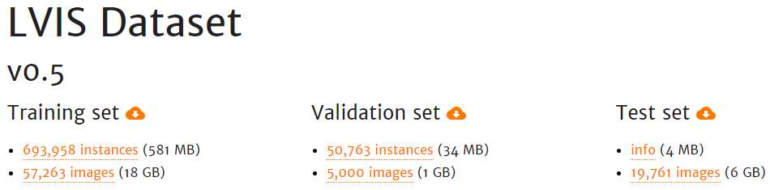

-----

| Title         | Datasets Image2D Segmentation LVIS                   |
| ------------- | ---------------------------------------------------- |
| Created @     | `2020-04-22T09:05:35Z`                               |
| Last Modify @ | `2022-12-25T17:25:09Z`                               |
| Labels        | \`\`                                                 |
| Edit @        | [here](https://github.com/junxnone/aiwiki/issues/94) |

-----

## Reference

  - [LVIS Dataset](https://www.lvisdataset.org/dataset)
  - [paper - 2019 - LVIS: A Dataset for Large Vocabulary Instance
    Segmentation](https://arxiv.org/abs/1908.03195)

## Brief

  - 1000+ categories
  - 164k images
  - LVIS 使用 COCO 2017 images, 只是使用了 LVIS 自己的 annotations.
  - 使用 `WordNet` 定义类别
  - annotations 类似 `COCO format`
      - 只使用 `polygons`

