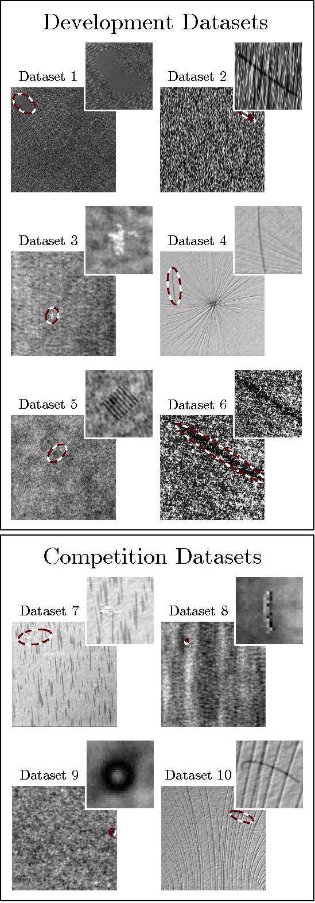

-----

| Title         | Datasets Image2D Segmentation DAGM                   |
| ------------- | ---------------------------------------------------- |
| Created @     | `2020-02-26T05:13:20Z`                               |
| Last Modify @ | `2022-12-25T17:23:15Z`                               |
| Labels        | \`\`                                                 |
| Edit @        | [here](https://github.com/junxnone/aiwiki/issues/95) |

-----

## Reference

  - [DAGM 2007](http://resources.mpi-inf.mpg.de/conference/dagm/2007/prizes.html)

## Brief

## Defect ROI Distribution

| Data\\Areas | Max   | Min   | Mean     | Median  | Large | Medium | Small |
| ----------- | ----- | ----- | -------- | ------- | ----- | ------ | ----- |
| All         | 32072 | 2     | 5804.54  | 3616.5  | 391   | 1322   | 384   |
| Class1      | 24972 | 3886  | 9595.72  | 8045.5  | 63    | 87     | 0     |
| Class2      | 16421 | 607   | 2797.79  | 2209.0  | 5     | 126    | 19    |
| Class3      | 12377 | 1103  | 3667.43  | 3117.0  | 1     | 149    | 0     |
| Class4      | 13721 | 2260  | 7243.84  | 7021.5  | 29    | 121    | 0     |
| Class5      | 9107  | 1447  | 5082.99  | 4694.5  | 0     | 150    | 0     |
| Class6      | 24523 | 12426 | 21598.93 | 22315.5 | 150   | 0      | 0     |
| Class7      | 32072 | 3845  | 9954.49  | 8434.5  | 135   | 165    | 0     |
| Class8      | 18743 | 2     | 1410.09  | 924.5   | 1     | 139    | 160   |
| Class9      | 1250  | 724   | 968.65   | 954.5   | 0     | 93     | 204   |
| Class10     | 12669 | 959   | 3305.22  | 2719.0  | 7     | 292    | 1     |

> Area is pixel level, calculate by cv2.countNonZero()
> Large/Medium/Small as COCO defined Small \< 32\*32 \< Medium \< 96\*96
> \< Large
