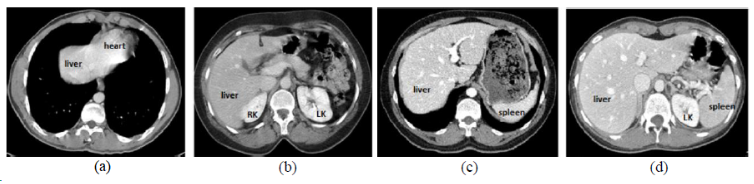
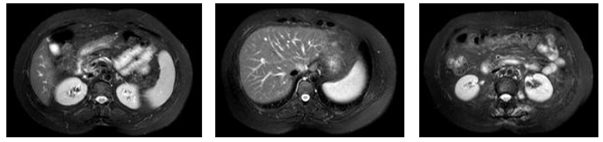
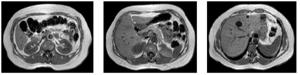

-----

| Title         | Datasets Image2D Segmentation CHAOS                  |
| ------------- | ---------------------------------------------------- |
| Created @     | `2020-07-28T08:59:49Z`                               |
| Last Modify @ | `2022-12-25T17:25:40Z`                               |
| Labels        | \`\`                                                 |
| Edit @        | [here](https://github.com/junxnone/aiwiki/issues/96) |

-----

## Reference

  - [Challenge](https://chaos.grand-challenge.org/Combined_Healthy_Abdominal_Organ_Segmentation/)
  - [Download Train and Test
    Data](https://chaos.grand-challenge.org/Download/)
  - [Data Info](https://chaos.grand-challenge.org/Data/)
  - [DICOM](http://dicom.nema.org/Dicom/supps/sup30_lb.pdf)
  - [医学图像之DICOM格式解析](https://www.cnblogs.com/XDU-Lakers/p/9863114.html)

## Brief

  - CHAOS - `Combined (CT-MR) Healthy Abdominal Organ Segmentation`

## Data

  - CT
  - MRI
      - T1-DUAL
          - In-Phase
          - Out-Phase
      - T2-SPIR
  - DICOM Format - Digital Imaging and Communications in Medicine

| Name                           | Image                                                        |
| ------------------------------ | ------------------------------------------------------------ |
| Abdominal CT                   |  |
| abdominal MRI T2-SPIR          |  |
| abdominal MRI T1-DUAL In-Phase |  |

## Task

| Task                                        | Description |
| ------------------------------------------- | ----------- |
| Liver Segmentation (CT & MRI)               |             |
| Liver Segmentation (CT only)                |             |
| Liver Segmentation (MRI only)               |             |
| Segmentation of abdominal organs (CT & MRI) |             |
| Segmentation of abdominal organs (MRI only) |             |
