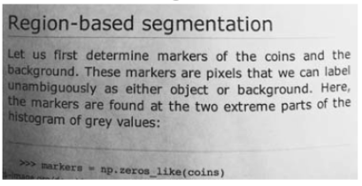

-----

| Title         | CV BIN                                               |
| ------------- | ---------------------------------------------------- |
| Created @     | `2020-11-11T04:02:36Z`                               |
| Last Modify @ | `2022-12-23T14:36:55Z`                               |
| Labels        | \`\`                                                 |
| Edit @        | [here](https://github.com/junxnone/aiwiki/issues/99) |

-----

# Thresholding 二值化

## Reference

  - [Thresholding (image
    processing)](https://en.wikipedia.org/wiki/Thresholding_%28image_processing%29)
  - [auto threshold](https://imagej.net/Auto_Threshold.html)
  - [十三种基于直方图的图像全局二值化算法原理、实现、代码及效果](https://www.cnblogs.com/adas/p/5430793.html)
  - [Survey over image thresholding techniques and quantitative
    performance
    evaluation](https://fei.edu.br/~psergio/VisaoComputacional/Artigos%20para%20Estudo/Threshold_survey.pdf)
  - [Picture thresholding using an iterative selection method]()
  - 1986 [Minimum Error Thresholding - J.Kittler]()
  - [Otsu's method -
    Wikipedia](https://en.wikipedia.org/wiki/Otsu%27s_method)
      - [A Threshold Selection Method from Gray-Level
        Histograms](http://raw.githubusercontent.com/jinglou/p2016-rss-small-target/master/refs/Otsu.pdf)
  - [Otsu
    Thresholding](http://www.labbookpages.co.uk/software/imgProc/otsuThreshold.html)
    -- [CN](https://blog.csdn.net/felix86/article/details/38684465)
  - [图像二值化方法介绍](https://blog.csdn.net/JJBOOM425/article/details/100645594)

## Brief

  - Image Thresholding - 图像二值化(非黑即白的简化问题)
  - Global thresholding - 使用同一阈值二值化
  - Local(dynamic ) thresholding - 动态阈值二值化
  - Multilevel thresholding - 类似于分割图像
      - [Multi-Otsu
        Thresholding](https://scikit-image.org/docs/dev/auto_examples/segmentation/plot_multiotsu.html#multi-otsu-thresholding)
  - 其他分类方法
      - Histogram shape-based
      - Clustering-based
      - Entropy-based
      - Object-attribute-based
      - Spatial

| Global thresholding | Description                                            |
| ------------------- | ------------------------------------------------------ |
| Otsu                | 取 `前景/背景` 最大类间方差作为阈值                                   |
| ISODATA             | `threshold = (average background + average objects)/2` |
| Mean                | mean(image)                                            |
| Triangle            |                                                        |
| Minimum             |                                                        |
| InterModes          |                                                        |
| Yen                 |                                                        |
| Li                  |                                                        |
| Huang               |                                                        |
| MaxEntropy          |                                                        |
| MinError            |                                                        |
| Moments             |                                                        |
| Percentile          |                                                        |
| RenyiEntropy        |                                                        |
| Shanbhag            |                                                        |

| Local thresholding | Description |
| ------------------ | ----------- |
| Niblack            |             |
| Sauvola            |             |

## OTSU

  - 把图像 `pixel` 分为两类 `前景/背景`
  - 计算最小类内方差作为最佳阈值
  - 对于二分类，最小化类内方差等价于最大化类间方差

| 类内方差 |  |
| ---- | ------------------------------------------------------------ |
| 类间方差 |  |

| source image           |  |
| ---------------------- | ------------------------------------------------------------ |
| between class variance |  |
| target image           |  |

## Local thresholding

| Original                                                     | Global thresholding                                          | Local thresholding                                           |
| ------------------------------------------------------------ | ------------------------------------------------------------ | ------------------------------------------------------------ |
|  |  |  |

### Local + OTSU

| Original                                                     | Local OTSU                                                   | Original \>= Local OTSU                                      |
| ------------------------------------------------------------ | ------------------------------------------------------------ | ------------------------------------------------------------ |
|  |  |  |

## Some API

  - [scikit-image
    Thresholding](https://github.com/junxnone/aiwiki/issues/331)
  - [OpenCV Threshold](https://github.com/junxnone/aiwiki/issues/330)
