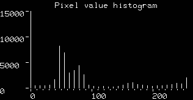

-----

| Title         | CV HE                                                 |
| ------------- | ----------------------------------------------------- |
| Created @     | `2020-11-27T08:47:37Z`                                |
| Last Modify @ | `2022-12-23T14:31:53Z`                                |
| Labels        | \`\`                                                  |
| Edit @        | [here](https://github.com/junxnone/aiwiki/issues/100) |

-----

# Histogram Equalization 直方图均衡

## Reference

  - [直方图均衡化](https://zhuanlan.zhihu.com/p/44918476)
  - 1974 [Image enhancement techniques for cockpit
    displays](https://apps.dtic.mil/dtic/tr/fulltext/u2/a014928.pdf)
  - 1987 [Adaptive Histogram Equalization and Its Variations]()
  - [Histogram Equalization -
    opencv](https://docs.opencv.org/3.4/d4/d1b/tutorial_histogram_equalization.html)
  - [Histogram equalization -
    wikipedia](https://en.wikipedia.org/wiki/Histogram_equalization)
  - [直方图均衡化原理](https://www.cnblogs.com/tianyalu/p/5687782.html)
  - [原理公式推导](https://blog.csdn.net/qq_15971883/article/details/88699218)
  - [Contrast
    Stretching](http://homepages.inf.ed.ac.uk/rbf/HIPR2/stretch.htm)
  - [Histogram
    Equalization](http://homepages.inf.ed.ac.uk/rbf/HIPR2/histeq.htm)
  - [Local Histogram Equalization -
    scikit-image](https://scikit-image.org/docs/dev/auto_examples/color_exposure/plot_local_equalize.html)

## Brief

  - 图像直方图均匀分布
  - 增强图像 - 更好的对比度
  - CDF - [cumulative distribution
    function](https://en.wikipedia.org/wiki/Cumulative_distribution_function)
    - 累积分布函数
  - HE - `Histogram Equalization`
  - AHE - `Adaptive Hisogram Equalization`
  - CLAHE - `Contrast Limited Adaptive Hitogram Equalization`

-----

## Contrast Stretching

  - 8 bit image 最小值 `Vmin = 0` `Vmax = 255`
  - image 中 Pixel 最小值 `Pmin`, 最大值 `Pmax`
  - `cutoff fraction` - 小于 `Pmin = histogram_peak * cutoff_fraction`
    的值忽略掉

| Process                                                                    | Image                                                        | Histogram                                                    |
| -------------------------------------------------------------------------- | ------------------------------------------------------------ | ------------------------------------------------------------ |
| Original                                                                   |  |  |
| Contrast Stretching `Pmin=79` `Pmax=136`                             |  |  |
| Histogram Equalizing                                                       |  |                                                              |
| Histogram Equalizing + Contrast Stretching  cutoff\_fraction = 0.03  |  |  |
| Histogram Equalizing + Contrast Stretching  cutoff\_fraction = 0.125 |  |  |

`Pout = (Pin - Pmin)(Vmax-Vmin)/(Pmax-Pmin) + Vmin`

## HE - Histogram Equalization

  - 单调非线性

| 公式                                                           | Description                       |
| ------------------------------------------------------------ | --------------------------------- |
|  | Image `A(x,y)` =\> Image `B(x,y)` |
|  |                                   |
|  |                                   |
|  | 对应区间内像素点总数不变                      |
|  |                                   |
|  | A0 像素点个数 L 灰度阶数                   |

| Input Image `DA` =\> Output Image `DB` 映射图                   |
| ------------------------------------------------------------ |
|  |

## AHE - Adaptive Hisogram Equalization

  - 自适应直方图均衡化
  - 考虑到局部图像区域 - `WxW` 窗口
  - LAHE - Local Area HE

## CLAHE - Contrast Limited Adaptive Hitogram Equalization

  - 限制对比度自适应直方图均衡化
  - 将直方图中超过阈值的部分平均分配到各灰度级

