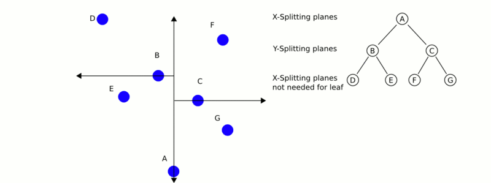

-----

| Title         | ML NNS KDTree                                         |
| ------------- | ----------------------------------------------------- |
| Created @     | `2021-05-24T06:32:35Z`                                |
| Last Modify @ | `2022-12-23T15:09:34Z`                                |
| Labels        | \`\`                                                  |
| Edit @        | [here](https://github.com/junxnone/aiwiki/issues/104) |

-----

# KDTree

## Reference

  - [详解KDTree](https://blog.csdn.net/silangquan/article/details/41483689)
  - [k-d tree - wikipedia](https://en.wikipedia.org/wiki/K-d_tree)

## Brief

  - KD - `k-dimensional`
      - [BSTree](https://github.com/junxnone/aiwiki/issues/332) -
        `Binary Sort Tree/Binary Search Tree`
      - 1970s 由 Jon Bentley 提出
  - 分割 K 维数据空间的数据结构
  - **用途**: 搜索感兴趣数据
      - 搜索最近邻点
          - 搜索半径 R 内的点
          - 搜索最近的 N 个点
  - **构建 Pipeline**
      - 选取方差较大的轴作为分割轴顺序 - (`x->y->z`)
      - 取分割轴的中位数为根节点
  - **搜索 Pipeline**

## 复杂度

| Steps | 复杂度                                    |
| ----- | -------------------------------------- |
| 构建    | O(log2 n)                   |
| 插入    | O(log n)                               |
| 删除    | O(log n)                               |
| 查询    | O(n1-1/k + k)  k - 搜索的点数 |

## Libraries

  - [FLANN](/FLANN)
  - [nanoflann](/nanoflann)
  - [libkdtree++](https://github.com/nvmd/libkdtree)
  - [OpenCV -
    FLANN](https://docs.opencv.org/4.0.0/dc/de2/classcv_1_1FlannBasedMatcher.html)
  - [ANN \~2010](http://www.cs.umd.edu/~mount/ANN/)
  - [fastann \~2009](https://github.com/philbinj/fastann)

## UseCase

  - 三维点云中点的检索

| K = 2 |  |  |
| ----- | ------------------------------------------------------------ | ------------------------------------------------------------ |
| K=3   |  |  |
