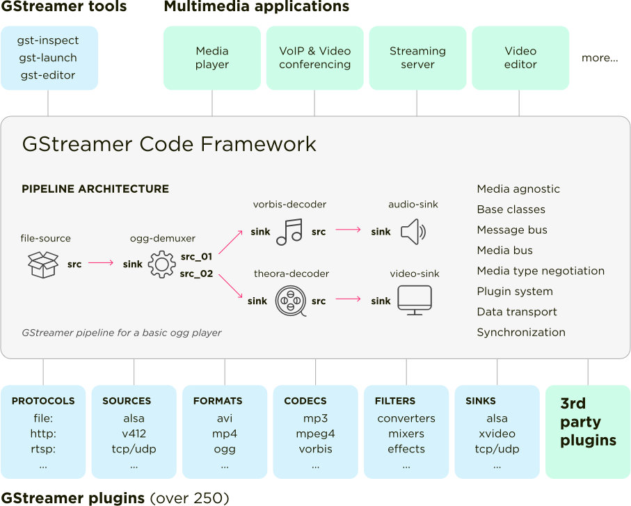
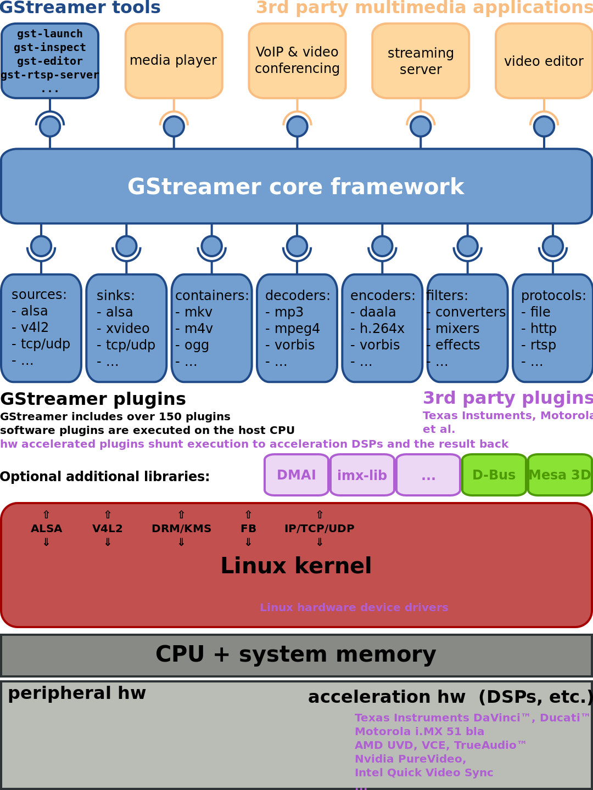
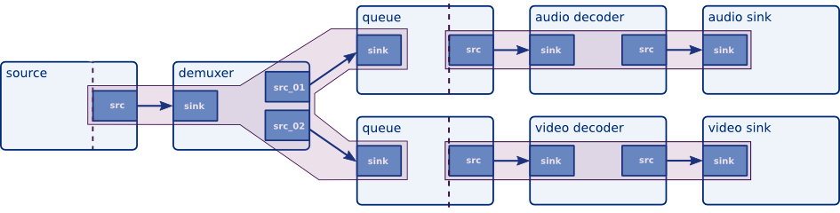
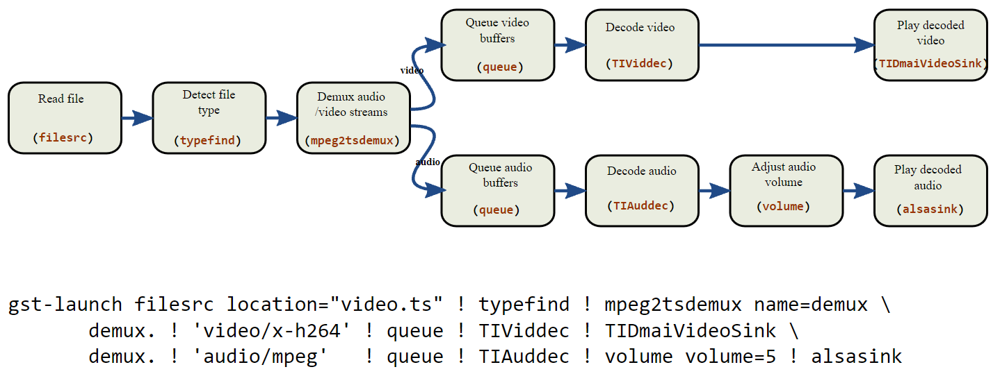

-----

| Title     | Media Tools GStreamer                                 |
| --------- | ----------------------------------------------------- |
| Created @ | `2018-11-27T15:44:49Z`                                |
| Updated @ | `2023-06-17T15:28:07Z`                                |
| Labels    | \`\`                                                  |
| Edit @    | [here](https://github.com/junxnone/aiwiki/issues/109) |

-----

# GStreamer 流媒体应用框架

  - Gstreamer 是一个通用跨平台的流媒体应用框架, 可以处理 Audio/Video/其他数据流
  - [Gstreamer Install](/Gstreamer_Install)
  - [Command Line Tools](#Command-Line-Tools)
  - [Gstreamer Concepts](/Gstreamer_Concepts)
  - [Gstreamer Plugins](/Gstreamer_Plugins)

## Command Line Tools

| Tools                                                | Description                                            |
| ---------------------------------------------------- | ------------------------------------------------------ |
| [gst-inspect-1.0](gstreamer_tools_gst_inspect)       | 查看 elements 信息 - src/sink/pad/Capabilities/...         |
| [gst-launch-1.0](/gstreamer_tools_gst_launch)        | 创建 pipeline                                            |
| \[gst-device-monitor-1.0\]                           | 查看当前设备上的 `Device`                                      |
| [gst-discoverer-1.0](gstreamer_tools_gst_discoverer) | 查看 media 相关信息 - codec/Channels/Sample rate/Bitrate/... |
| ges-launch-1.0                                       | 控制 timeline 开始时间/间隔/...                                |

## Arch

-----

## Pipeline

  - 数据流通的定义(定义组件的顺序)
  - source - file/http/rtp/...
  - demux - 分离数据 audio/video/...
  - decoder - `xxx format -> yuv/pcm`
  - sink - 数据输出

## Reference

  - [gstreamer
    blog](https://blog.csdn.net/knowledgebao/article/category/8053683)
  - [Gstreamer的安装](https://blog.csdn.net/knowledgebao/article/details/83993255)
  - [Docs](https://thiblahute.github.io/GStreamer-doc/index.html?gi-language=c)
  - [wiki -
    wdv4758h](https://wdv4758h.github.io/notes/multimedia/gstreamer.html#)
