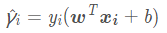
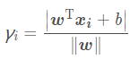
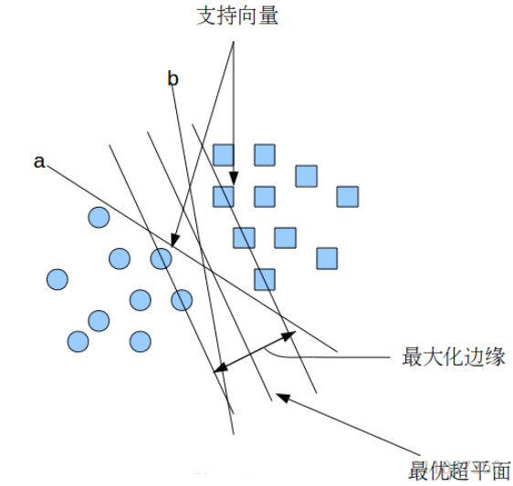
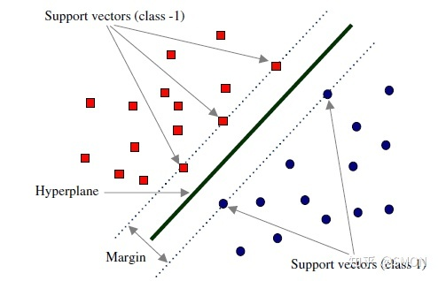
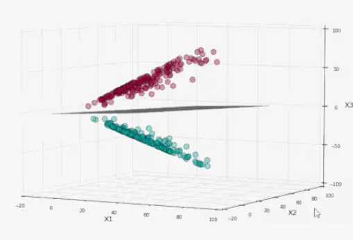
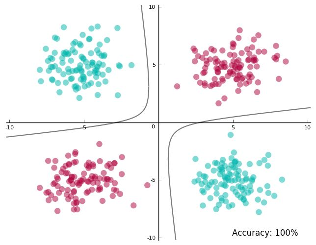

-----

| Title     | ML OML SVM                                            |
| --------- | ----------------------------------------------------- |
| Created @ | `2019-05-11T13:48:41Z`                                |
| Updated @ | `2023-02-02T08:56:42Z`                                |
| Labels    | \`\`                                                  |
| Edit @    | [here](https://github.com/junxnone/aiwiki/issues/115) |

-----

# SVM 支持向量机

## Reference

  - [SVM 简介](https://blog.csdn.net/liugan528/article/details/79448379)
  - [我所理解的 SVM（支持向量机）- 1](https://zhuanlan.zhihu.com/p/22400898)
  - [SVM教程：支持向量机的直观理解](https://zhuanlan.zhihu.com/p/40857202)
  - [sklearn - 1.4. Support Vector
    Machines](http://scikit-learn.sourceforge.net/stable/modules/svm.html#svm)
  - implement
      - [libsvm](https://www.csie.ntu.edu.tw/~cjlin/libsvm/)
      - [sklearn.svm](http://scikit-learn.sourceforge.net/stable/modules/classes.html#module-sklearn.svm)

## Brief

  - SVM - Support Vector Machine - 支持向量机
  - [SVM 原理推导](/SVM_原理推导)
  - 监督式学习
      - 统计分类
      - 回归分析
  - **支持向量** - 数据线性可分, 与超平面距离最近的点被称为 `支持向量(support vector)`
      - 超平面的决定只有支持向量起作用，其他数据无影响
  - 通过一个核映射 φ 将数据从原始输入空间映射到一个高维特征空间, 使之在高维空间线性可分
  - **Margin** - 超平面到支持向量的距离
  - 超平面 vs 最大间隔超平面
      - 可以分开数据
      - 到支持向量间隔最大

| SVM Details | Description                |
| ----------- | -------------------------- |
| SVM 核心理念    |                            |
| SVM 复杂度     |                            |
| SVM Kernel  | 用于处理非线性问题, k() = 特征变换函数的点乘 |

| 间隔/Margin Details | Description                                                  |
| ----------------- | ------------------------------------------------------------ |
| 函数间隔              |  |
| 几何间隔              |  |
| 硬间隔               | 问题线性可分                                                       |
| 软间隔               | 问题线性不可分, 近似线性可分                                              |

-----

|  |  |
| ------------------------------------------------------------ | ------------------------------------------------------------ |

## SVM 分类

  - 线性可分 SVM
  - 线性 SVM
  - 非线性 SVM

### 线性可分 SVM

  - 训练数据线性可分
  - 通过硬间隔(hard margin)最大化可以学习得到一个线性分类器

### 线性 SVM

  - 训练数据线性不可分，但近似线性可分
  - 通过软间隔(soft margin)最大化可以学习得到一个线性分类器
  - 使用 hinge 损失来优化使不可分的数据尽可能少

### 非线性 SVM

| 线性不可分二维数据   |  |
| ----------- | ------------------------------------------------------------ |
| 投影到三维空间进行分割 |  |
| 分割平面投影回二维空间 |  |

### Kernel trick 核技巧

## SVM 优缺点

**优点**

  - SVM是一个凸优化问题，所以求得的解一定是全局最优而不是局部最优
  - 不仅适用于线性线性问题还适用于非线性问题
  - 也适合高维样本空间的数据
  - 理论基础比较完善(对比于NN)

-----

**缺点**

  - 不适用于超大数据集

## 其他

### ProbSVM

### 多分类支持向量机

### SVR

## History

  - 1963 年原始 SVM
  - 1992 年 `kernel trick` 应用于最大限度的超平面上创建非线性分类器
  - 1993-1995 年 `soft margin`
  - 1996 年 支持回归 - SVR
  - 2011年 `Bayesian SVM`
