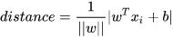

-----

| Title     | ML OML SVM 原理                                         |
| --------- | ----------------------------------------------------- |
| Created @ | `2021-03-29T05:16:05Z`                                |
| Updated @ | `2023-02-02T08:56:48Z`                                |
| Labels    | \`\`                                                  |
| Edit @    | [here](https://github.com/junxnone/aiwiki/issues/116) |

-----

# SVM 原理推导

## Reference

  - [SVM公式推导](https://zhuanlan.zhihu.com/p/72971967)
  - [SVM推导](https://blog.csdn.net/weixin_43804251/article/details/107224506)

## SVM 推导

| Steps    | Description                                                                                                                                                                                                                                                        |
| -------- | ------------------------------------------------------------------------------------------------------------------------------------------------------------------------------------------------------------------------------------------------------------------ |
| 超平面      |                                                                                                                                                                                                        |
| 分类问题     |  ==\>     ==\>  |
| 点到超平面的距离 |                                                                                                                                                                                                        |
