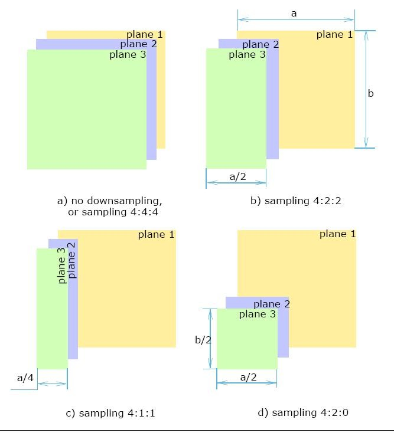

-----

| Title         | Media Image Camera PixelFormat                        |
| ------------- | ----------------------------------------------------- |
| Created @     | `2021-10-21T17:44:24Z`                                |
| Last Modify @ | `2022-12-23T13:32:17Z`                                |
| Labels        | \`\`                                                  |
| Edit @        | [here](https://github.com/junxnone/aiwiki/issues/119) |

-----

# 像素格式

## Reference

  - [Pixel Format Naming Convention -
    GenICam](https://www.emva.org/wp-content/uploads/GenICam_PFNC_2_1.pdf)
  - [GenICam Pixel Format Names and
    Values](https://www.emva.org/wp-content/uploads/GenICamPixelFormatValues.pdf)
  - [Pixel and Planar Image
    Formats](https://www.intel.com/content/www/us/en/develop/documentation/ipp-dev-reference/top/volume-2-image-processing/image-color-conversion/pixel-and-planar-image-formats.html)

## Brief

  - Pixel Format - Camera 输出图像的格式
      - Packed(Pixel-Order)/Planar
      - `Monochromatic Formats` - 单色灰度/`Color Formats` - 彩色
  - [YUV](/YUV)

## Packed

  - Packed - Pixel-Order

| Format    | Channel Values Order          |
| --------- | ----------------------------- |
| RGB       | `R0 G0 B0 R1 G1 B1 R2 G2 B2`  |
| RGBA      | `R0 G0 B0 A0 R1 G1 B1 A1`     |
| BGR       | `B0 G0 R0 A0 B1 G1 R1 A1`     |
| YUV       | `Y0 U0 V0 Y1 U1 V1 Y2 U2 V2`  |
| YUV 422   | `Y0 U0 V0 A0 Y1 U1 V1 A1`     |
| YCbCr     | `Y0 Cb0 Cr0 Y1 Cb1 Cr1`       |
| YCbCr 422 | `Y0 Cb0 Y1 Cr0 Y2 Cb1 Y3 Cr1` |

## Planar

  - 按平面排列像素, 几个平面合成一个 `Pixel`

| Images          | Plane size & Layout                                          |
| --------------- | ------------------------------------------------------------ |
| 3-palnes Images |  |
| 2-palnes Images |  |

## 常见相关格式

| 大类      | 小类                                                      |
| ------- | ------------------------------------------------------- |
| Mono    | 8/8s/10/10Packed/12/12Packed/16                         |
| Bayer   | GR8/RG8/GB8/BG8/GR10/RG10/GB10/BG10/GR12/RG12/GB12/BG12 |
| RGB/BGR | 8/a8/10/12/10v1Packed/10p32                             |
| YUV     | 422/411 - 8/                                            |
| YCbcr   | 422/411 - 8                                             |

  - **YUV vs YCbCr ?**
      - YUV - 用于模拟信号
      - YCbCr - 用于数字信号 - 方便压缩？？
