-----

| Title         | Media Image Color Model YUV                           |
| ------------- | ----------------------------------------------------- |
| Created @     | `2021-02-07T03:28:00Z`                                |
| Last Modify @ | `2022-12-23T13:32:38Z`                                |
| Labels        | \`\`                                                  |
| Edit @        | [here](https://github.com/junxnone/aiwiki/issues/121) |

-----

# YUV Color Model

## Reference

  - [详解 YUV
    格式（I420/YUV420/NV12/NV12/YUV422）](https://www.jianshu.com/p/358bf8b7eacc)
  - [YUV pixel formats](https://www.fourcc.org/yuv.php)
  - [YUV - videolan-wiki](https://wiki.videolan.org/YUV#Semi-planar)
  - [Recommended 8-Bit YUV Formats for Video
    Rendering](https://docs.microsoft.com/en-us/windows/win32/medfound/recommended-8-bit-yuv-formats-for-video-rendering)
  - [一文理解 YUV](https://zhuanlan.zhihu.com/p/75735751)

## Brief

  - YUV Color Space - 用于模拟信号彩色电视广播
      - Y - Luminance/Luma - 明亮度/灰度 - `[0,1] [0,255]`
      - UV - Chrominance/Chroma - 色度 - `[-0.5, 0.5] [-128, 127]`
      - Y 与 UV 分开 解决 彩色电视 和 黑白电视 兼容问题
  - YCbCr 来源于 YUV, 用于处理数字视频(一些编码标准中提到的 `YUV` 其实是指 `YCbCr`)
      - Cb - 蓝色分量
      - Cr - 红色分量
  - 采样格式 - 444/422/411/420
  - 存储格式
      - Packed - YUV 打包在一起
      - Planar - YUV 分离

## 采样格式 - Downsampling

  - `4:4:4` / `4:2:2` / `4:2:0` /`4:1:1`
  - 几个 Y 共享 UV - 节约带宽

| Pattern | 码流                                         | 像素点                                                                                           |
| ------- | ------------------------------------------ | --------------------------------------------------------------------------------------------- |
| 444     | `Y0 U0 V0 Y1 U1 V1 Y2 U2 V2 Y3 U3 V3`      | `[Y0 U0 V0] [Y1 U1 V1] [Y2 U2 V2] [Y3 U3 V3]`                                                 |
| 422     | `Y0 U0 Y1 V1 Y2 U2 Y3 V3`                  | `[Y0 U0 V1] [Y1 U0 V1] [Y2 U2 V3] [Y3 U2 V3]`                                                 |
| 411     | `Y0 U0 Y1 Y2 V2 Y3`                        | `[Y0 U0 V2] [Y1 U0 V2] [Y2 U0 V2] [Y3 U0 V2]`                                                 |
| 420     | `Y0 U0 Y1 Y2 U2 Y3` `Y5 V5 Y6 Y7 V7 Y8` | `[Y0 U0 V5] [Y1 U0 V5] [Y2 U2 V7] [Y3 U2 V7]` `[Y5 U0 V5] [Y6 U0 V5] [Y7U2 V7] [Y8 U2 V7]` |

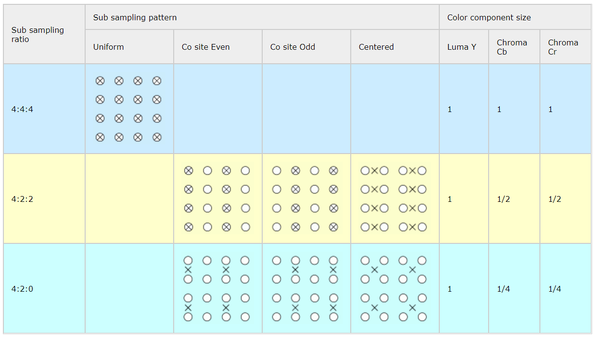

| Sub Sampling ratio | Format                   |
| ------------------ | ------------------------ |
| 444                | AYUV                     |
| 422                | I422/J422/UYVY/YUYV      |
| 420                | I420/YU12/YV12/NV12/NV21 |

| Format  | Description                                                  |
| ------- | ------------------------------------------------------------ |
| I420    | YU12/IYUV 属于 YUV420P - `4:2:0` 12 Bit/Pixel 3 Planars(Y/U/V) |
| YV12    | 同 YU12 仅改变UV顺序                                               |
| NV12    | 属于 YUV420P - `4:2:0` 12 Bit/Pixel 2 Planars(Y/UV)            |
| NV21    | 同 NV21 仅 UV 排序改变                                             |
| YUV 422 |                                                              |

## Pixel Format

| Format | Figure                                                       |
| ------ | ------------------------------------------------------------ |
| AYUV   | 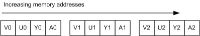 |
| YUY2   | 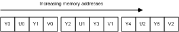 |
| UYVY   | 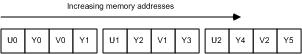 |
| IMC1   | 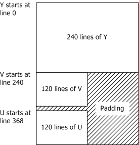 |
| IMC2   | 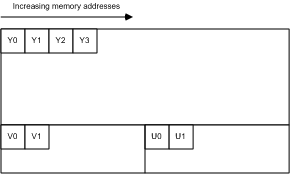 |
| IMC3   | 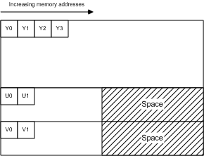 |
| IMC4   |  |
| YV12   | 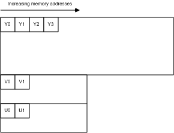 |
| NV12   | 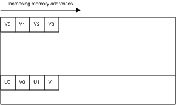 |

## YUV \<--\> RGB

    Y'= 0.299*R' + 0.587*G' + 0.114*B'
    U'= -0.147*R' - 0.289*G' + 0.436*B' = 0.492*(B'- Y')
    V'= 0.615*R' - 0.515*G' - 0.100*B' = 0.877*(R'- Y')
    R' = Y' + 1.140*V'
    G' = Y' - 0.394*U' - 0.581*V'
    B' = Y' + 2.032*U'

| YUV                                                                       | YCbCr                                                        |
| ------------------------------------------------------------------------- | ------------------------------------------------------------ |
| 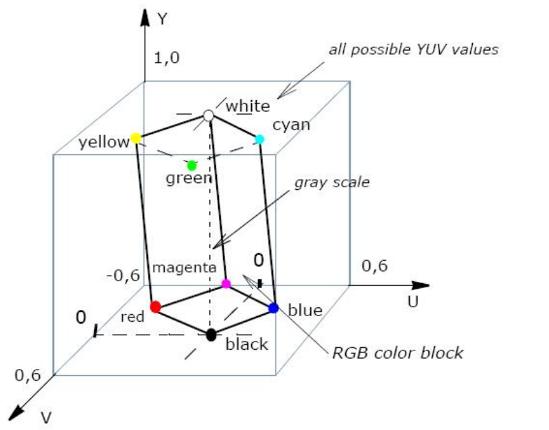 | 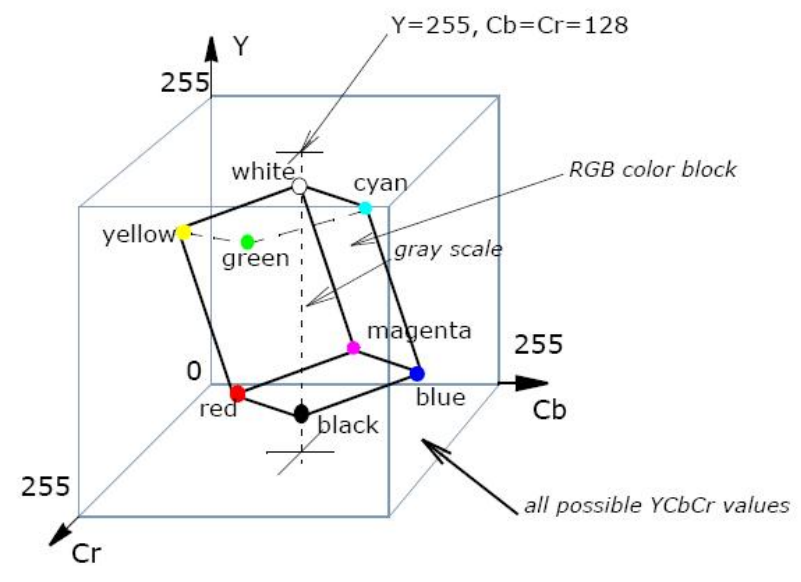 |
