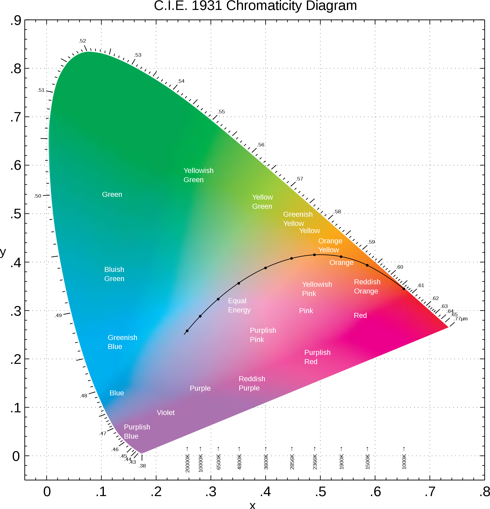
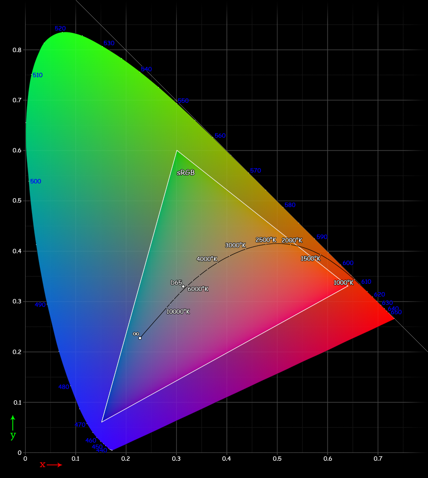
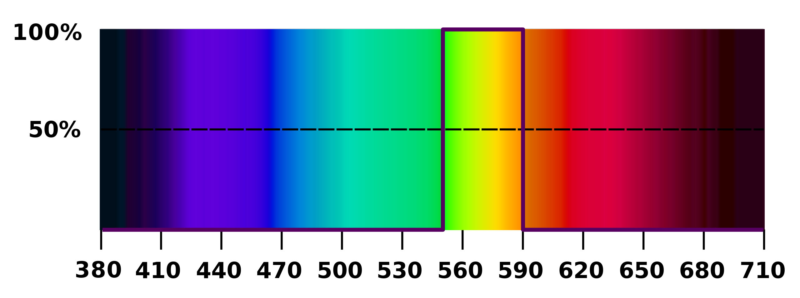
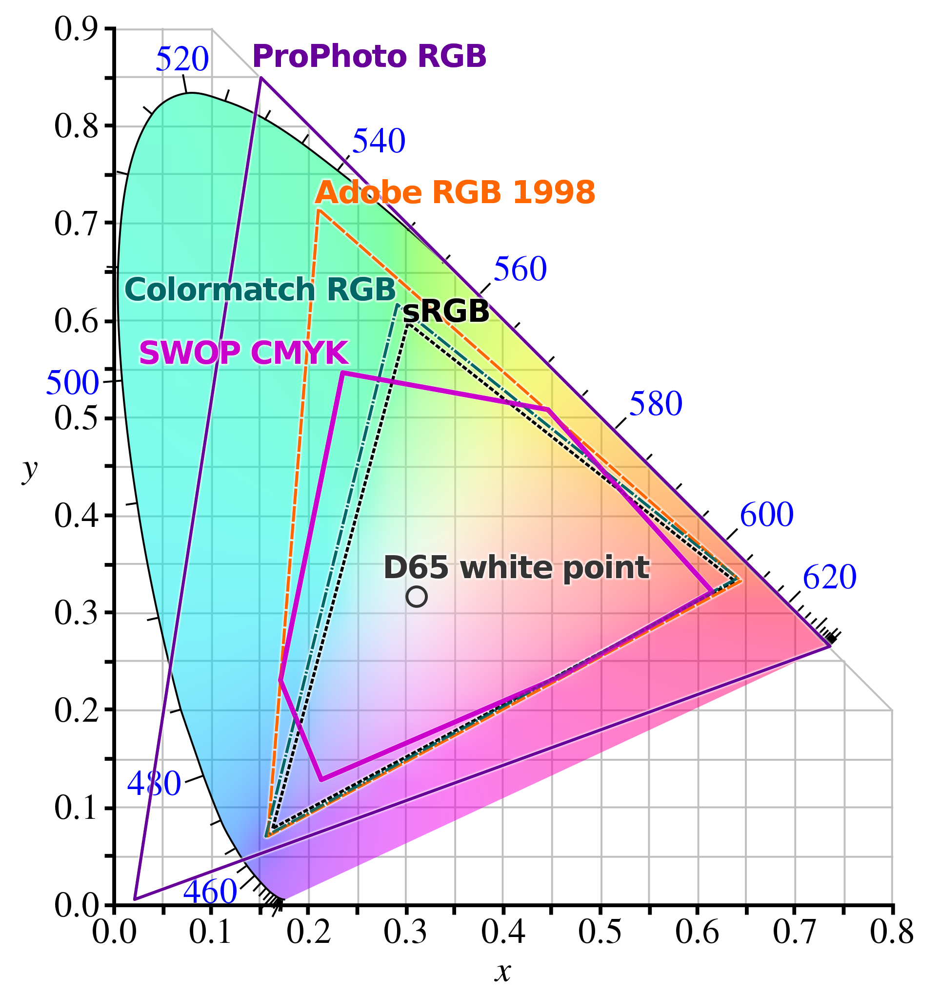

-----

| Title         | Media Image Color Gamut                               |
| ------------- | ----------------------------------------------------- |
| Created @     | `2021-10-25T02:39:07Z`                                |
| Last Modify @ | `2022-12-23T13:32:30Z`                                |
| Labels        | \`\`                                                  |
| Edit @        | [here](https://github.com/junxnone/aiwiki/issues/124) |

-----

# Gamut 色域

## Reference

  - [Gamut - wikipedia](https://en.wikipedia.org/wiki/Gamut)

## Brief

  - Gamut
  - CIE 1931 chromaticity diagram

## CIE 1931 chromaticity diagram

  - x - 红色色系
  - y - 绿色色系
  - 曲线边沿都是纯色(饱和色)
      - 从 380 --\> 710 nm
      - 内部点是混合色
  - D65 white point
      - 等能量点
      - 饱和度为0

|  |
| ------------------------------------------------------------ |
|  |

## 颜色空间色域比较

  - `ProPhoto RGB` \> `Adobe RGB` \> `Colormatch RGB` \> `sRGB`

